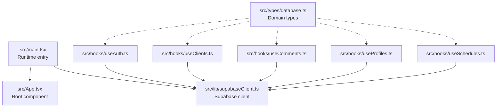
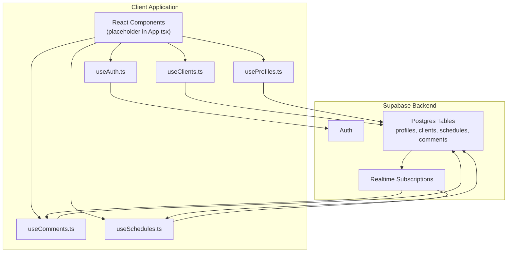
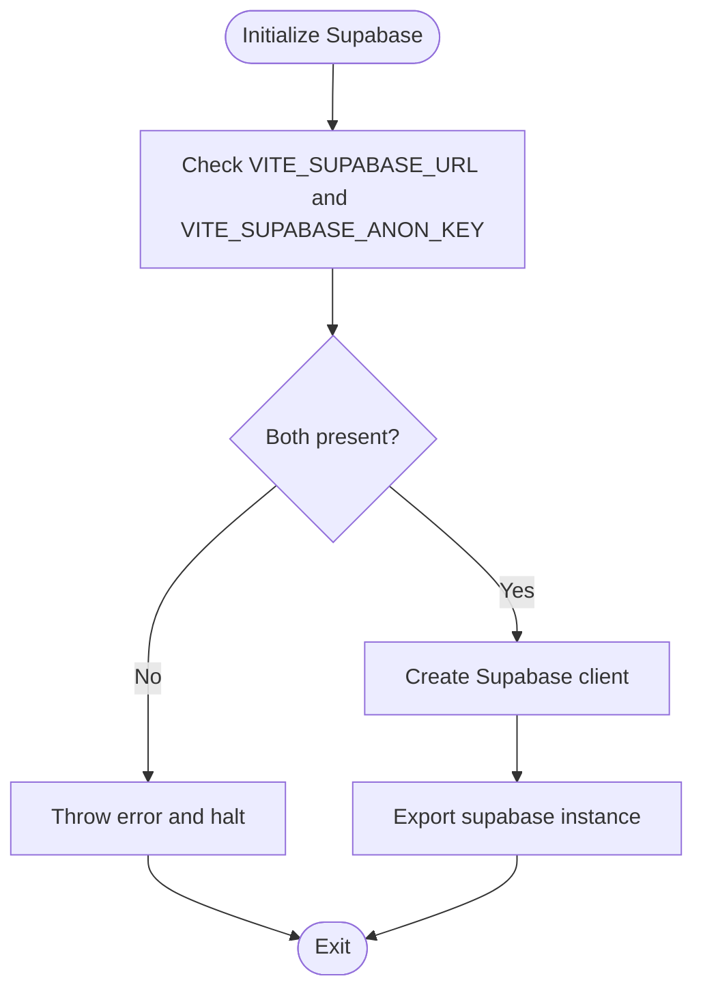
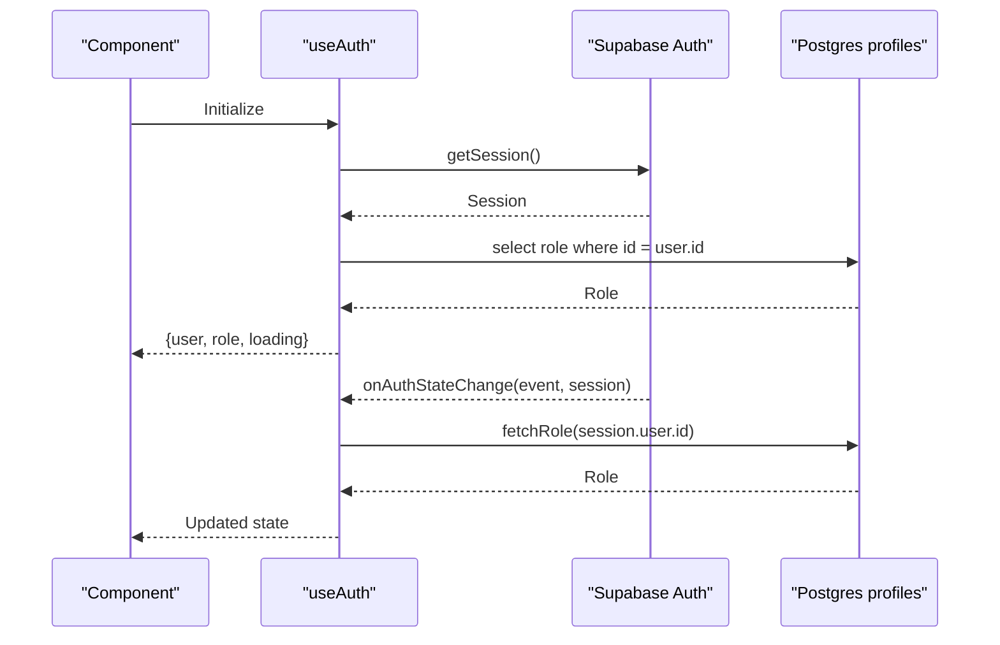
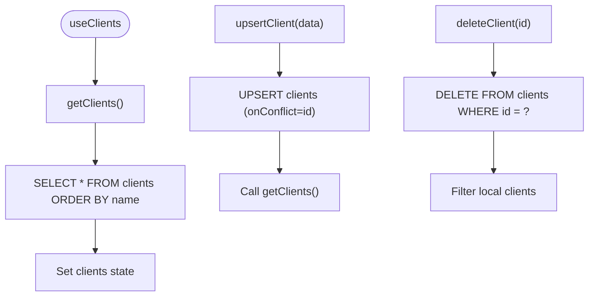
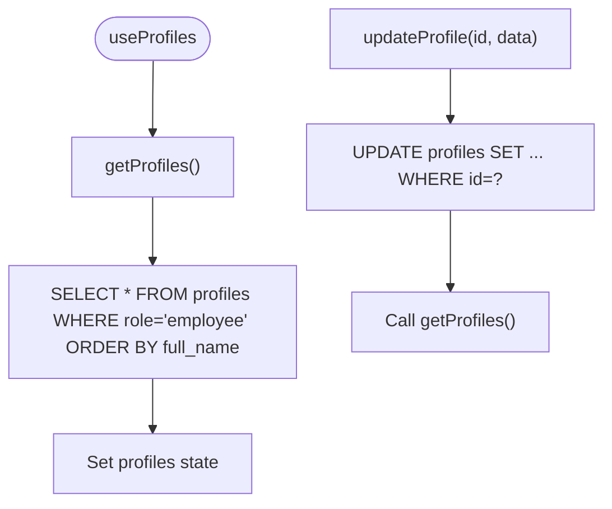
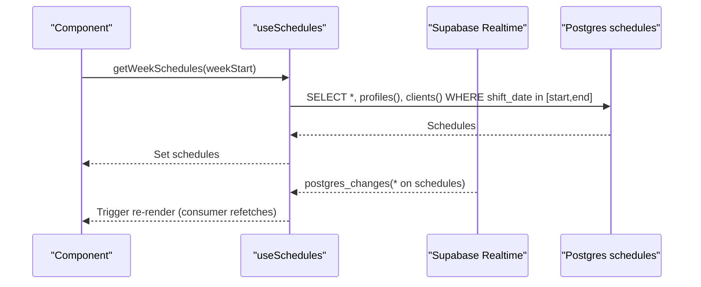
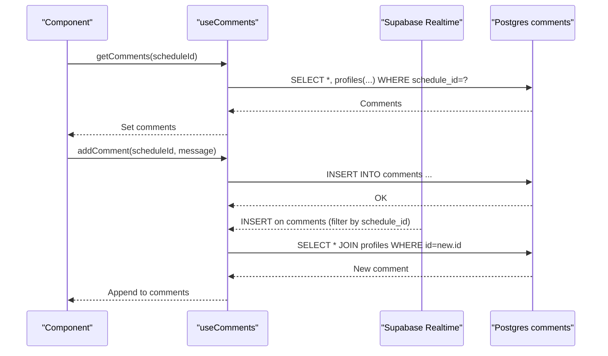
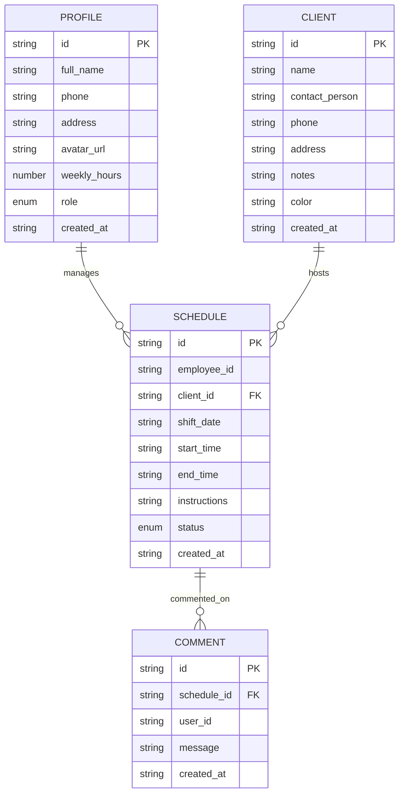
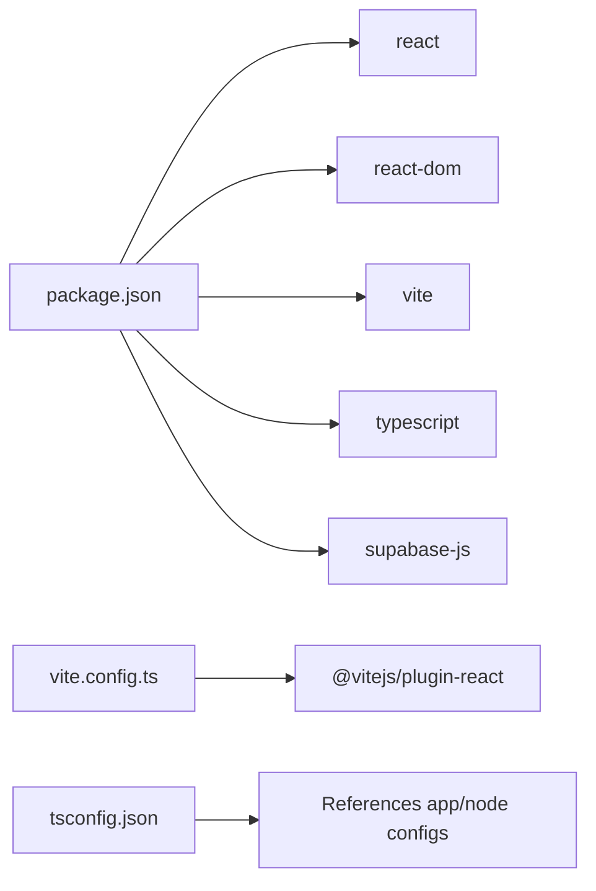

# Architecture Overview

<cite>
**Referenced Files in This Document**
- [src/main.tsx](file://src/main.tsx)
- [src/App.tsx](file://src/App.tsx)
- [src/lib/supabaseClient.ts](file://src/lib/supabaseClient.ts)
- [src/hooks/useAuth.ts](file://src/hooks/useAuth.ts)
- [src/hooks/useClients.ts](file://src/hooks/useClients.ts)
- [src/hooks/useComments.ts](file://src/hooks/useComments.ts)
- [src/hooks/useProfiles.ts](file://src/hooks/useProfiles.ts)
- [src/hooks/useSchedules.ts](file://src/hooks/useSchedules.ts)
- [src/types/database.ts](file://src/types/database.ts)
- [package.json](file://package.json)
- [vite.config.ts](file://vite.config.ts)
- [tsconfig.json](file://tsconfig.json)
- [README.md](file://README.md)
</cite>

## Table of Contents
1. [Introduction](#introduction)
2. [Project Structure](#project-structure)
3. [Core Components](#core-components)
4. [Architecture Overview](#architecture-overview)
5. [Detailed Component Analysis](#detailed-component-analysis)
6. [Dependency Analysis](#dependency-analysis)
7. [Performance Considerations](#performance-considerations)
8. [Troubleshooting Guide](#troubleshooting-guide)
9. [Conclusion](#conclusion)

## Introduction
This document describes the architecture of the M_Sharif application, a React-based frontend leveraging Supabase for backend services and real-time synchronization. The system follows a client-only approach using Supabase Auth, Postgres, and Realtime. It emphasizes a hooks-centric design to encapsulate data fetching, mutations, and subscriptions, enabling clean separation of concerns and reusable logic across components.

## Project Structure
The project is organized around a small set of entry points and a modular hooks library. The runtime entry renders the root React component, which currently serves as a placeholder. Supabase is initialized once and shared across hooks. TypeScript types define the domain models for profiles, clients, schedules, and comments.

**Diagram sources**
- [src/main.tsx:1-11](file://src/main.tsx#L1-L11)
- [src/App.tsx:1-123](file://src/App.tsx#L1-L123)
- [src/lib/supabaseClient.ts:1-14](file://src/lib/supabaseClient.ts#L1-L14)
- [src/hooks/useAuth.ts:1-81](file://src/hooks/useAuth.ts#L1-L81)
- [src/hooks/useClients.ts:1-74](file://src/hooks/useClients.ts#L1-L74)
- [src/hooks/useComments.ts:1-113](file://src/hooks/useComments.ts#L1-L113)
- [src/hooks/useProfiles.ts:1-63](file://src/hooks/useProfiles.ts#L1-L63)
- [src/hooks/useSchedules.ts:1-153](file://src/hooks/useSchedules.ts#L1-L153)
- [src/types/database.ts:1-55](file://src/types/database.ts#L1-L55)

**Section sources**
- [src/main.tsx:1-11](file://src/main.tsx#L1-L11)
- [src/App.tsx:1-123](file://src/App.tsx#L1-L123)
- [src/lib/supabaseClient.ts:1-14](file://src/lib/supabaseClient.ts#L1-L14)
- [src/types/database.ts:1-55](file://src/types/database.ts#L1-L55)
- [package.json:1-32](file://package.json#L1-L32)
- [vite.config.ts:1-8](file://vite.config.ts#L1-L8)
- [tsconfig.json:1-8](file://tsconfig.json#L1-L8)
- [README.md:1-74](file://README.md#L1-L74)

## Core Components
- Runtime entry: Initializes the React root and mounts the App component.
- Root component: Placeholder UI demonstrating assets and interactive elements.
- Supabase client: Centralized initialization with environment validation and export.
- Custom hooks: Encapsulate CRUD operations, authentication state, and real-time subscriptions for clients, comments, profiles, and schedules.

Key architectural decisions:
- Supabase for backend services: Provides Auth, Postgres, and Realtime in a single client SDK.
- TypeScript for type safety: Strongly typed domain models and hook return contracts.
- Hooks pattern: Encapsulates data access, mutation, and subscriptions to keep components declarative and testable.

**Section sources**
- [src/main.tsx:1-11](file://src/main.tsx#L1-L11)
- [src/App.tsx:1-123](file://src/App.tsx#L1-L123)
- [src/lib/supabaseClient.ts:1-14](file://src/lib/supabaseClient.ts#L1-L14)
- [src/hooks/useAuth.ts:1-81](file://src/hooks/useAuth.ts#L1-L81)
- [src/hooks/useClients.ts:1-74](file://src/hooks/useClients.ts#L1-L74)
- [src/hooks/useComments.ts:1-113](file://src/hooks/useComments.ts#L1-L113)
- [src/hooks/useProfiles.ts:1-63](file://src/hooks/useProfiles.ts#L1-L63)
- [src/hooks/useSchedules.ts:1-153](file://src/hooks/useSchedules.ts#L1-L153)
- [src/types/database.ts:1-55](file://src/types/database.ts#L1-L55)

## Architecture Overview
The system boundary is client-only. Supabase provides:
- Authentication: Session and user state management with auth state change listeners.
- Database: Postgres tables for profiles, clients, schedules, and comments.
- Realtime: Postgres changes subscriptions for live updates.

**Diagram sources**
- [src/App.tsx:1-123](file://src/App.tsx#L1-L123)
- [src/hooks/useAuth.ts:1-81](file://src/hooks/useAuth.ts#L1-L81)
- [src/hooks/useClients.ts:1-74](file://src/hooks/useClients.ts#L1-L74)
- [src/hooks/useComments.ts:1-113](file://src/hooks/useComments.ts#L1-L113)
- [src/hooks/useProfiles.ts:1-63](file://src/hooks/useProfiles.ts#L1-L63)
- [src/hooks/useSchedules.ts:1-153](file://src/hooks/useSchedules.ts#L1-L153)

## Detailed Component Analysis

### Supabase Client Initialization
- Validates presence of Supabase URL and anonymous key from environment variables.
- Creates and exports a singleton Supabase client instance for use across hooks.

**Diagram sources**
- [src/lib/supabaseClient.ts:1-14](file://src/lib/supabaseClient.ts#L1-L14)

**Section sources**
- [src/lib/supabaseClient.ts:1-14](file://src/lib/supabaseClient.ts#L1-L14)

### Authentication Hook (useAuth)
- Manages user session and role resolution from the profiles table.
- Exposes methods to get current user, sign in, and sign out.
- Subscribes to auth state changes and cleans up on unmount.

**Diagram sources**
- [src/hooks/useAuth.ts:1-81](file://src/hooks/useAuth.ts#L1-L81)
- [src/lib/supabaseClient.ts:1-14](file://src/lib/supabaseClient.ts#L1-L14)

**Section sources**
- [src/hooks/useAuth.ts:1-81](file://src/hooks/useAuth.ts#L1-L81)

### Clients Hook (useClients)
- Loads clients ordered by name.
- Upserts client records with conflict handling.
- Deletes clients and updates local state.

**Diagram sources**
- [src/hooks/useClients.ts:1-74](file://src/hooks/useClients.ts#L1-L74)

**Section sources**
- [src/hooks/useClients.ts:1-74](file://src/hooks/useClients.ts#L1-L74)

### Profiles Hook (useProfiles)
- Lists employees by role and orders by full name.
- Updates profile fields and refreshes the list.

**Diagram sources**
- [src/hooks/useProfiles.ts:1-63](file://src/hooks/useProfiles.ts#L1-L63)

**Section sources**
- [src/hooks/useProfiles.ts:1-63](file://src/hooks/useProfiles.ts#L1-L63)

### Schedules Hook (useSchedules)
- Computes ISO week range for a given date.
- Loads schedules for a week with joined profile and client data.
- Supports create, update, delete operations.
- Subscribes to Realtime events on the schedules table to trigger refetch.

**Diagram sources**
- [src/hooks/useSchedules.ts:1-153](file://src/hooks/useSchedules.ts#L1-L153)

**Section sources**
- [src/hooks/useSchedules.ts:1-153](file://src/hooks/useSchedules.ts#L1-L153)

### Comments Hook (useComments)
- Loads comments for a schedule with a join to profiles for author metadata.
- Adds new comments and relies on Realtime to append new rows.
- Manages a Realtime channel scoped to the active schedule ID and cleans up on unmount.

**Diagram sources**
- [src/hooks/useComments.ts:1-113](file://src/hooks/useComments.ts#L1-L113)

**Section sources**
- [src/hooks/useComments.ts:1-113](file://src/hooks/useComments.ts#L1-L113)

### Domain Types
- Strongly typed entities for profiles, clients, schedules, and comments.
- Includes joined fields for relational data exposure in queries.

**Diagram sources**
- [src/types/database.ts:1-55](file://src/types/database.ts#L1-L55)

**Section sources**
- [src/types/database.ts:1-55](file://src/types/database.ts#L1-L55)

## Dependency Analysis
- Runtime and build dependencies: React, React DOM, Vite, TypeScript, and Supabase JS client.
- Project configuration: Vite plugin for React, TypeScript project references, and ESLint configuration guidance.

**Diagram sources**
- [package.json:1-32](file://package.json#L1-L32)
- [vite.config.ts:1-8](file://vite.config.ts#L1-L8)
- [tsconfig.json:1-8](file://tsconfig.json#L1-L8)

**Section sources**
- [package.json:1-32](file://package.json#L1-L32)
- [vite.config.ts:1-8](file://vite.config.ts#L1-L8)
- [tsconfig.json:1-8](file://tsconfig.json#L1-L8)
- [README.md:1-74](file://README.md#L1-L74)

## Performance Considerations
- Realtime subscriptions: Efficiently propagate server-side changes to the UI with minimal client-side polling.
- Selective joins: Queries fetch only required fields to reduce payload sizes.
- Memoization: Hooks use callbacks and refs to avoid unnecessary re-renders and redundant subscriptions.
- Environment validation: Early failure prevents misconfiguration overhead.

## Troubleshooting Guide
- Missing environment variables: The Supabase client throws an error if URL or anonymous key are missing. Verify environment configuration.
- Auth state changes: Ensure cleanup of subscriptions to prevent memory leaks during navigation or component unmount.
- Realtime channels: Always remove channels on unmount and re-subscribe when active identifiers change (e.g., schedule ID).
- Error propagation: Hooks surface errors from Supabase operations; callers should render appropriate feedback.

**Section sources**
- [src/lib/supabaseClient.ts:1-14](file://src/lib/supabaseClient.ts#L1-L14)
- [src/hooks/useAuth.ts:1-81](file://src/hooks/useAuth.ts#L1-L81)
- [src/hooks/useComments.ts:1-113](file://src/hooks/useComments.ts#L1-L113)
- [src/hooks/useSchedules.ts:1-153](file://src/hooks/useSchedules.ts#L1-L153)

## Conclusion
M_Sharif adopts a client-only architecture powered by Supabase, delivering a cohesive solution for authentication, data persistence, and real-time collaboration. The hooks pattern centralizes Supabase interactions, ensuring predictable data flows, strong typing, and maintainable UI components. The modular structure supports scalable feature development while preserving simplicity and developer productivity.