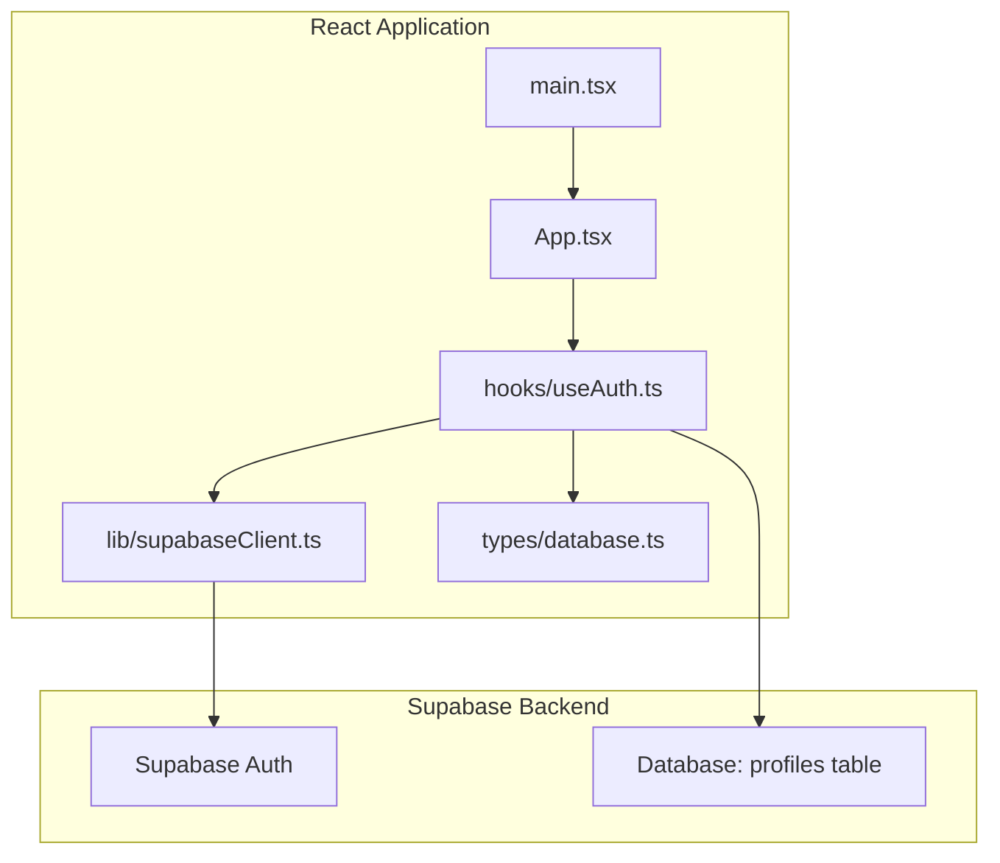
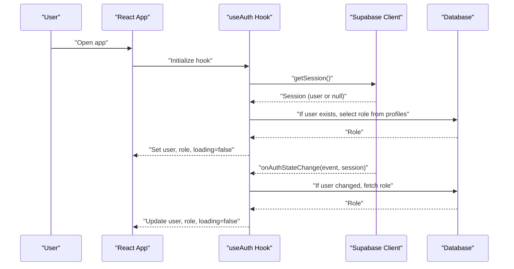
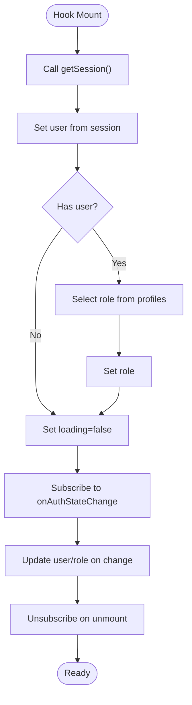
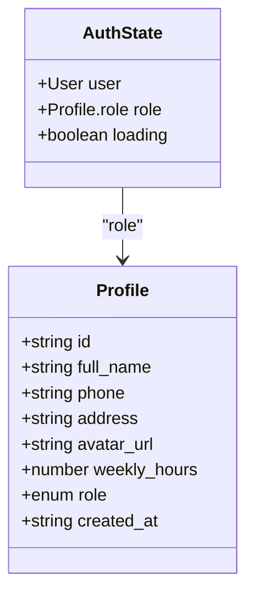
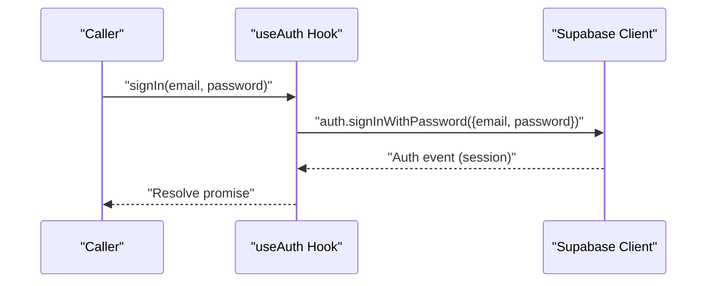
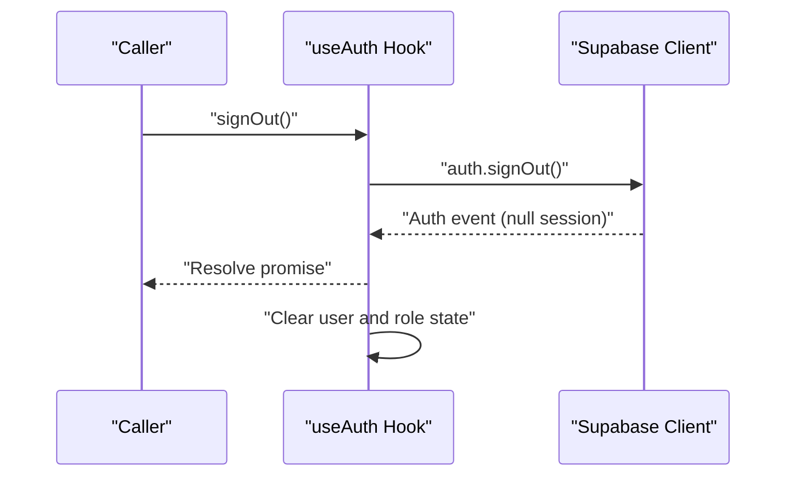
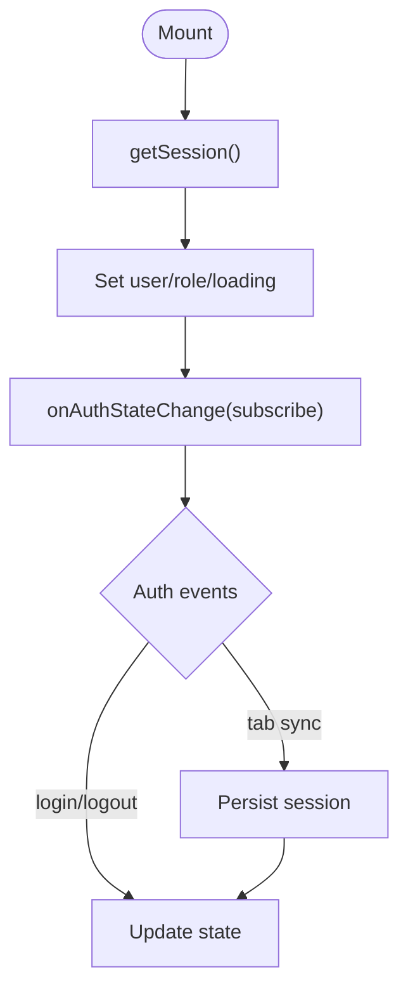
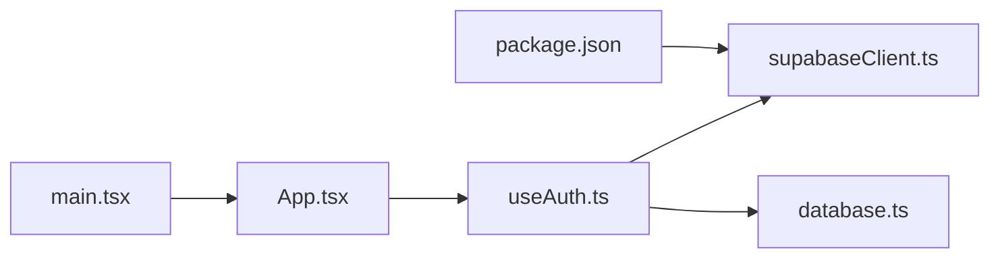

# Authentication System

<cite>
**Referenced Files in This Document**
- [useAuth.ts](file://src/hooks/useAuth.ts)
- [supabaseClient.ts](file://src/lib/supabaseClient.ts)
- [database.ts](file://src/types/database.ts)
- [App.tsx](file://src/App.tsx)
- [main.tsx](file://src/main.tsx)
- [package.json](file://package.json)
</cite>

## Table of Contents
1. [Introduction](#introduction)
2. [Project Structure](#project-structure)
3. [Core Components](#core-components)
4. [Architecture Overview](#architecture-overview)
5. [Detailed Component Analysis](#detailed-component-analysis)
6. [Dependency Analysis](#dependency-analysis)
7. [Performance Considerations](#performance-considerations)
8. [Troubleshooting Guide](#troubleshooting-guide)
9. [Conclusion](#conclusion)

## Introduction
This document explains the authentication system built with Supabase Auth in a React application. It covers how user sessions are initialized, persisted, and synchronized across browser tabs and page reloads, how login and logout are performed, and how roles are resolved for access control. It also documents the useAuth hook that centralizes authentication state and integrates with Supabase Auth, along with practical examples from the codebase that show authentication workflows, session persistence, and user state handling. Finally, it outlines relationships with other components that require authenticated access, common issues, security considerations, and best practices.

## Project Structure
The authentication system is composed of:
- A Supabase client initialization module that loads environment variables and creates the Supabase client instance.
- A custom React hook that manages authentication state, exposes login/logout/sign-in helpers, and synchronizes with Supabase Auth events.
- Type definitions that model user roles and authentication state for type-safe access control.

**Diagram sources**
- [main.tsx:1-11](file://src/main.tsx#L1-L11)
- [App.tsx:1-123](file://src/App.tsx#L1-L123)
- [useAuth.ts:1-81](file://src/hooks/useAuth.ts#L1-L81)
- [supabaseClient.ts:1-14](file://src/lib/supabaseClient.ts#L1-L14)
- [database.ts:1-55](file://src/types/database.ts#L1-L55)

**Section sources**
- [main.tsx:1-11](file://src/main.tsx#L1-L11)
- [App.tsx:1-123](file://src/App.tsx#L1-L123)
- [useAuth.ts:1-81](file://src/hooks/useAuth.ts#L1-L81)
- [supabaseClient.ts:1-14](file://src/lib/supabaseClient.ts#L1-L14)
- [database.ts:1-55](file://src/types/database.ts#L1-L55)

## Core Components
- Supabase client initialization: Creates a Supabase client using environment variables and guards against missing configuration.
- useAuth hook: Centralizes authentication state, exposes login and logout actions, resolves user roles from the database, and listens to Supabase Auth state changes.
- Role model: Defines the profile role type used for access control decisions.

Key responsibilities:
- Initialize and persist sessions across browser sessions.
- Subscribe to real-time auth state changes to keep UI in sync.
- Resolve user roles from the profiles table for role-based access control.
- Provide safe login and logout operations with error propagation.

**Section sources**
- [supabaseClient.ts:1-14](file://src/lib/supabaseClient.ts#L1-L14)
- [useAuth.ts:15-80](file://src/hooks/useAuth.ts#L15-L80)
- [database.ts:3-12](file://src/types/database.ts#L3-L12)

## Architecture Overview
The authentication architecture ties the React UI to Supabase Auth and the database for role resolution. The flow below illustrates how the app initializes the session, subscribes to auth state changes, and updates local state accordingly.

**Diagram sources**
- [useAuth.ts:51-77](file://src/hooks/useAuth.ts#L51-L77)
- [useAuth.ts:20-27](file://src/hooks/useAuth.ts#L20-L27)
- [supabaseClient.ts:13](file://src/lib/supabaseClient.ts#L13)

## Detailed Component Analysis

### Supabase Client Initialization
- Loads Supabase URL and anonymous key from environment variables.
- Validates presence of required environment variables and throws if missing.
- Exports a singleton Supabase client instance for use across the app.

Operational notes:
- Environment variables are consumed via Vite’s import.meta.env mechanism.
- The client is created once and reused by the authentication hook and other modules.

**Section sources**
- [supabaseClient.ts:1-14](file://src/lib/supabaseClient.ts#L1-L14)

### useAuth Hook Implementation
Responsibilities:
- Manage user, role, and loading state.
- Provide functions to sign in, sign out, and fetch the current user.
- Initialize session on mount and subscribe to auth state changes.
- Resolve user role by querying the profiles table.

Implementation highlights:
- Session initialization: Retrieves the current session and sets user and role state.
- Auth state listener: Subscribes to Supabase Auth state changes and updates local state.
- Role resolution: Fetches the user’s role from the profiles table when a user is present.
- Sign-out cleanup: Clears user and role state after successful sign-out.

**Diagram sources**
- [useAuth.ts:51-77](file://src/hooks/useAuth.ts#L51-L77)
- [useAuth.ts:20-27](file://src/hooks/useAuth.ts#L20-L27)

**Section sources**
- [useAuth.ts:15-80](file://src/hooks/useAuth.ts#L15-L80)

### Role-Based Access Control Model
- Role type is defined as part of the Profile entity.
- The useAuth hook resolves the role for the logged-in user and exposes it alongside the user object.
- Components requiring authenticated access can gate UI or routes based on user and role.

**Diagram sources**
- [database.ts:3-12](file://src/types/database.ts#L3-L12)
- [database.ts:50-54](file://src/types/database.ts#L50-L54)

**Section sources**
- [database.ts:3-12](file://src/types/database.ts#L3-L12)
- [database.ts:50-54](file://src/types/database.ts#L50-L54)

### Authentication Workflows

#### Login Workflow
- The sign-in method delegates to Supabase Auth to authenticate the user with email and password.
- On success, Supabase emits an auth state change event that the hook listens to, updating user and role state.

**Diagram sources**
- [useAuth.ts:36-42](file://src/hooks/useAuth.ts#L36-L42)
- [useAuth.ts:64-71](file://src/hooks/useAuth.ts#L64-L71)

**Section sources**
- [useAuth.ts:36-42](file://src/hooks/useAuth.ts#L36-L42)
- [useAuth.ts:64-71](file://src/hooks/useAuth.ts#L64-L71)

#### Logout Workflow
- The sign-out method delegates to Supabase Auth to terminate the session.
- On success, the hook clears user and role state locally.

**Diagram sources**
- [useAuth.ts:44-49](file://src/hooks/useAuth.ts#L44-L49)
- [useAuth.ts:64-71](file://src/hooks/useAuth.ts#L64-L71)

**Section sources**
- [useAuth.ts:44-49](file://src/hooks/useAuth.ts#L44-L49)
- [useAuth.ts:64-71](file://src/hooks/useAuth.ts#L64-L71)

#### Session Persistence and Sync Across Tabs
- The hook retrieves the initial session on mount and subscribes to auth state changes.
- Supabase Auth persists the session in storage, ensuring the app remains authenticated across reloads and tabs.

**Diagram sources**
- [useAuth.ts:51-77](file://src/hooks/useAuth.ts#L51-L77)

**Section sources**
- [useAuth.ts:51-77](file://src/hooks/useAuth.ts#L51-L77)

### Integration with Other Components That Require Authenticated Access
- Components that need to restrict access should read the user and role from the useAuth hook and conditionally render content or redirect unauthenticated users.
- Loading state can be used to defer rendering until the session is resolved, preventing flicker and race conditions.
- The getCurrentUser helper can be used to programmatically fetch the current user when needed.

Practical guidance:
- Gate sensitive UI or navigation items behind user and role checks.
- Use loading state to avoid rendering partial UI before session resolution.
- Redirect to a login route if user is null and access requires authentication.

**Section sources**
- [useAuth.ts:29-34](file://src/hooks/useAuth.ts#L29-L34)
- [useAuth.ts:16-18](file://src/hooks/useAuth.ts#L16-L18)

## Dependency Analysis
- The useAuth hook depends on the Supabase client for session retrieval, sign-in/sign-out, and auth state subscriptions.
- Role resolution depends on the profiles table in the database.
- The application bootstraps the React root and renders the main App component.

**Diagram sources**
- [useAuth.ts:1-4](file://src/hooks/useAuth.ts#L1-L4)
- [supabaseClient.ts:1-14](file://src/lib/supabaseClient.ts#L1-L14)
- [database.ts:1-55](file://src/types/database.ts#L1-L55)
- [App.tsx:1-123](file://src/App.tsx#L1-L123)
- [main.tsx:1-11](file://src/main.tsx#L1-L11)
- [package.json:12-13](file://package.json#L12-L13)

**Section sources**
- [useAuth.ts:1-4](file://src/hooks/useAuth.ts#L1-L4)
- [supabaseClient.ts:1-14](file://src/lib/supabaseClient.ts#L1-L14)
- [database.ts:1-55](file://src/types/database.ts#L1-L55)
- [App.tsx:1-123](file://src/App.tsx#L1-L123)
- [main.tsx:1-11](file://src/main.tsx#L1-L11)
- [package.json:12-13](file://package.json#L12-L13)

## Performance Considerations
- Minimize unnecessary re-renders by memoizing callbacks returned by the hook (already handled via useCallback).
- Avoid redundant role queries by caching role results per user ID if the app grows larger.
- Keep the auth listener active only where needed to reduce overhead.
- Defer heavy computations until after loading completes to prevent UI thrashing.

## Troubleshooting Guide
Common issues and resolutions:
- Missing environment variables:
  - Symptom: Runtime error during client creation.
  - Cause: VITE_SUPABASE_URL or VITE_SUPABASE_ANON_KEY not set.
  - Resolution: Ensure environment variables are configured in .env and re-run the dev server.
  - Section sources
    - [supabaseClient.ts:6-11](file://src/lib/supabaseClient.ts#L6-L11)
- Auth state not updating across tabs:
  - Symptom: Login/logout does not reflect in other tabs.
  - Cause: Not subscribed to onAuthStateChange or session not persisted.
  - Resolution: Ensure the hook subscribes to auth state changes and relies on Supabase Auth’s session persistence.
  - Section sources
    - [useAuth.ts:61-72](file://src/hooks/useAuth.ts#L61-L72)
- Role appears null unexpectedly:
  - Symptom: Role is null despite a valid user.
  - Cause: Role not yet fetched or user ID mismatch.
  - Resolution: Verify the profiles table contains a row for the user ID and ensure fetchRole runs after user is set.
  - Section sources
    - [useAuth.ts:20-27](file://src/hooks/useAuth.ts#L20-L27)
- Sign-in errors:
  - Symptom: Sign-in fails with an error.
  - Cause: Invalid credentials or network issues.
  - Resolution: Propagate and display the error from the sign-in call; confirm credentials and network connectivity.
  - Section sources
    - [useAuth.ts:36-42](file://src/hooks/useAuth.ts#L36-L42)
- Sign-out does not clear state:
  - Symptom: User still appears logged in after sign-out.
  - Cause: Not clearing local state after sign-out.
  - Resolution: Ensure signOut clears user and role state as implemented.
  - Section sources
    - [useAuth.ts:44-49](file://src/hooks/useAuth.ts#L44-L49)

Security considerations and best practices:
- Never log sensitive tokens or user data.
- Enforce role-based access control on both the client and server-side where applicable.
- Prefer secure cookies and HTTPS in production environments.
- Regularly rotate API keys and limit permissions where possible.
- Validate and sanitize all inputs to prevent injection attacks.
- Use short-lived sessions and refresh tokens appropriately.

## Conclusion
The authentication system leverages Supabase Auth to manage sessions, synchronize state across tabs, and integrate with a simple role model stored in the profiles table. The useAuth hook centralizes authentication concerns, exposing a clean API for sign-in, sign-out, and role-aware access control. By subscribing to auth state changes and resolving roles on demand, the system provides a robust foundation for building authenticated features. Following the troubleshooting steps and best practices outlined here will help maintain reliability and security as the application evolves.