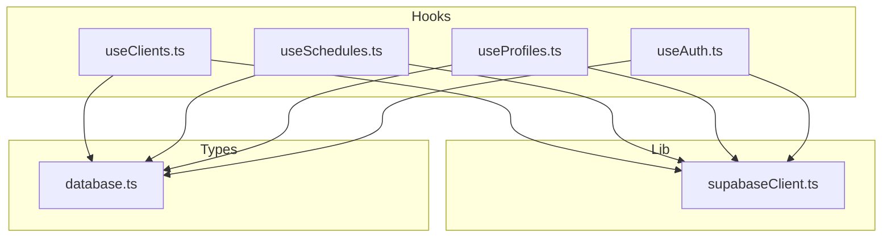
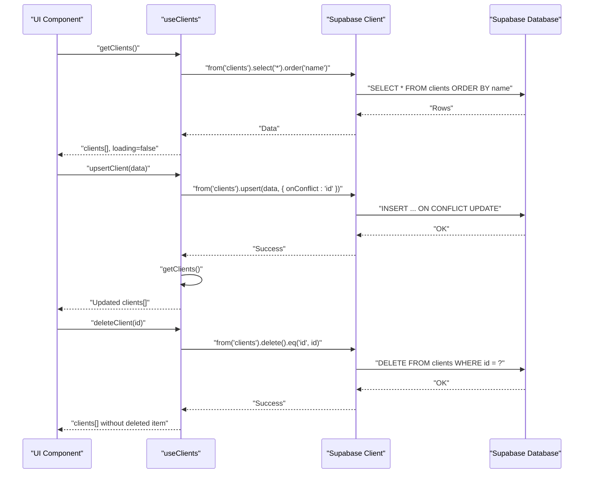
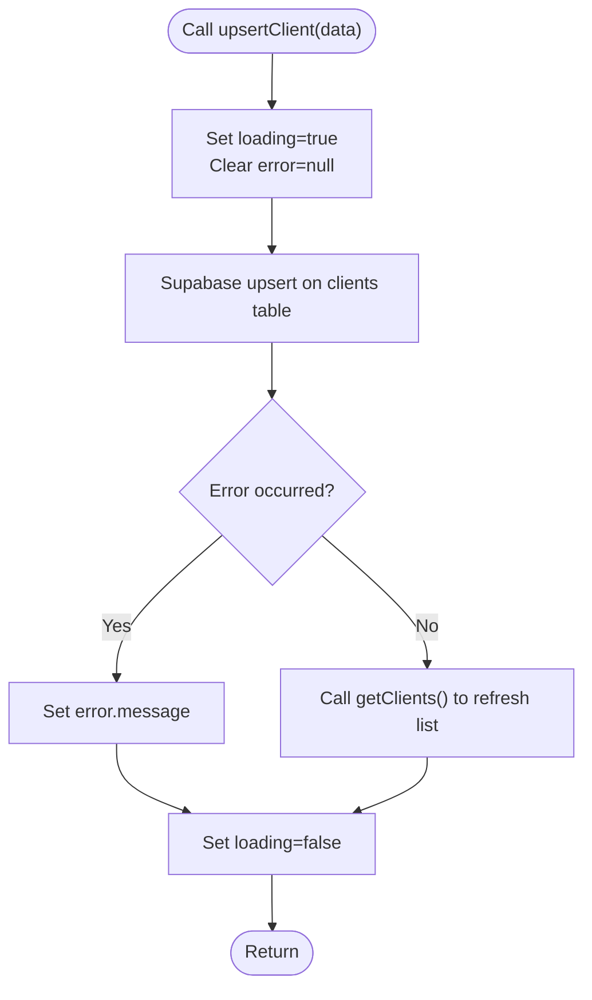
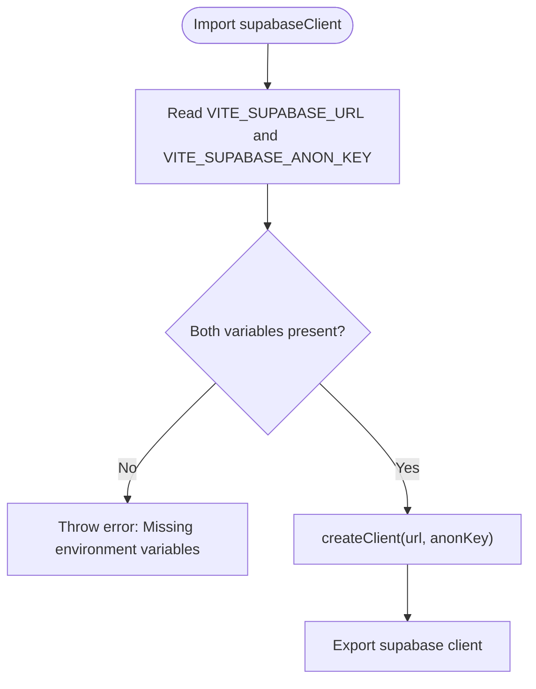
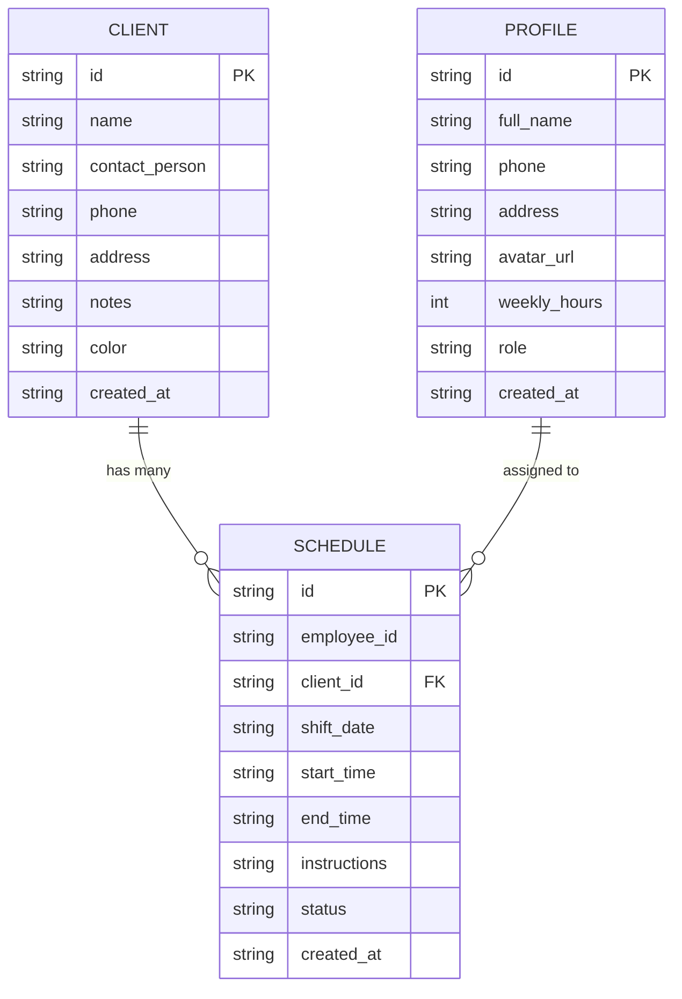
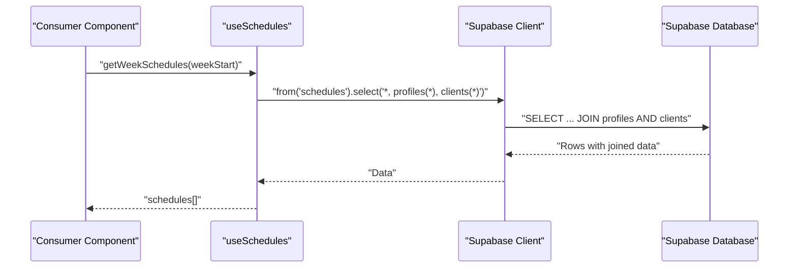
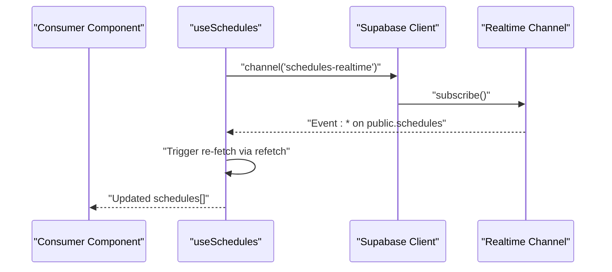
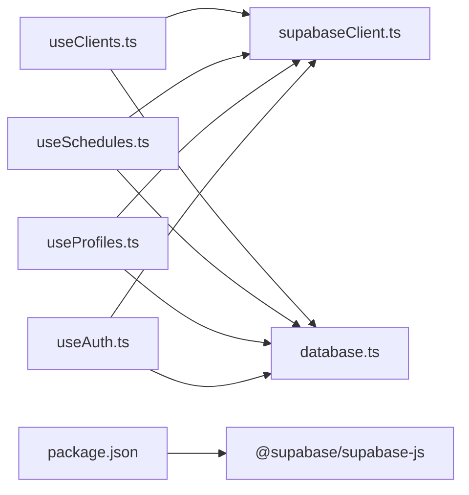

# Client Management

<cite>
**Referenced Files in This Document**
- [useClients.ts](file://src/hooks/useClients.ts)
- [supabaseClient.ts](file://src/lib/supabaseClient.ts)
- [database.ts](file://src/types/database.ts)
- [useSchedules.ts](file://src/hooks/useSchedules.ts)
- [useProfiles.ts](file://src/hooks/useProfiles.ts)
- [useAuth.ts](file://src/hooks/useAuth.ts)
- [package.json](file://package.json)
</cite>

## Table of Contents
1. [Introduction](#introduction)
2. [Project Structure](#project-structure)
3. [Core Components](#core-components)
4. [Architecture Overview](#architecture-overview)
5. [Detailed Component Analysis](#detailed-component-analysis)
6. [Dependency Analysis](#dependency-analysis)
7. [Performance Considerations](#performance-considerations)
8. [Troubleshooting Guide](#troubleshooting-guide)
9. [Conclusion](#conclusion)

## Introduction
This document explains the client management system implemented in the project. It focuses on the CRUD operations for client records (create, read, update, delete), the useClients React hook, data validation, error handling, and real-time synchronization with Supabase. It also covers how client data integrates with scheduling and profile management, common client management scenarios, data consistency, and performance considerations for large client lists.

## Project Structure
The client management functionality is encapsulated in a dedicated React hook that interacts with a Supabase client configured in a shared library. Type definitions for database entities are centralized, enabling type-safe operations across modules. Scheduling and profile management are handled by separate hooks, which reference the same Supabase client and share the same database schema.

**Diagram sources**
- [useClients.ts:1-74](file://src/hooks/useClients.ts#L1-L74)
- [useSchedules.ts:1-153](file://src/hooks/useSchedules.ts#L1-L153)
- [useProfiles.ts:1-63](file://src/hooks/useProfiles.ts#L1-L63)
- [useAuth.ts:1-81](file://src/hooks/useAuth.ts#L1-L81)
- [supabaseClient.ts:1-14](file://src/lib/supabaseClient.ts#L1-L14)
- [database.ts:1-55](file://src/types/database.ts#L1-L55)

**Section sources**
- [useClients.ts:1-74](file://src/hooks/useClients.ts#L1-L74)
- [supabaseClient.ts:1-14](file://src/lib/supabaseClient.ts#L1-L14)
- [database.ts:1-55](file://src/types/database.ts#L1-L55)

## Core Components
- useClients: Provides CRUD operations for client records, loading and error states, and a refresh mechanism after upsert/delete.
- supabaseClient: Centralized Supabase client initialization with environment variable validation.
- database types: Strongly typed models for Client, Profile, Schedule, Comment, and AuthState.
- Related integrations: useSchedules and useProfiles leverage the same Supabase client and share the Client model via foreign keys.

Key responsibilities:
- Read: Fetch all clients ordered by name.
- Upsert: Insert or update a client record using conflict resolution on id.
- Delete: Remove a client and update local state immediately.
- Error handling: Surface errors from Supabase operations and manage loading states.
- Real-time: While useClients does not subscribe to real-time events, downstream consumers can integrate real-time updates for related entities.

**Section sources**
- [useClients.ts:14-73](file://src/hooks/useClients.ts#L14-L73)
- [supabaseClient.ts:6-13](file://src/lib/supabaseClient.ts#L6-L13)
- [database.ts:14-23](file://src/types/database.ts#L14-L23)

## Architecture Overview
The client management flow relies on a single source of truth for client data via Supabase. The useClients hook orchestrates data fetching, upserts, and deletions. Other modules (useSchedules, useProfiles) depend on the same Supabase client and types, ensuring consistency across the application.

**Diagram sources**
- [useClients.ts:19-70](file://src/hooks/useClients.ts#L19-L70)
- [supabaseClient.ts:1-14](file://src/lib/supabaseClient.ts#L1-L14)

## Detailed Component Analysis

### useClients Hook
Implements:
- getClients: Retrieves all clients sorted by name.
- upsertClient: Inserts or updates a client using conflict resolution on id, then refreshes the list.
- deleteClient: Deletes a client by id and removes it from local state.

Operational characteristics:
- Loading and error states are managed internally.
- No built-in client-side validation; relies on server-side constraints.
- Real-time subscriptions are not implemented here; consumers can opt-in to real-time updates for related entities.

**Diagram sources**
- [useClients.ts:35-51](file://src/hooks/useClients.ts#L35-L51)

**Section sources**
- [useClients.ts:14-73](file://src/hooks/useClients.ts#L14-L73)

### Supabase Client Initialization
Ensures environment variables are present before creating the client. Throws a descriptive error if either VITE_SUPABASE_URL or VITE_SUPABASE_ANON_KEY is missing.

**Diagram sources**
- [supabaseClient.ts:3-13](file://src/lib/supabaseClient.ts#L3-L13)

**Section sources**
- [supabaseClient.ts:1-14](file://src/lib/supabaseClient.ts#L1-L14)

### Data Types and Relationships
Client entity definition and relationships:
- Client: Core entity with id, name, contact info, notes, color, and created_at.
- Schedule: References Client via client_id; includes joined fields for profiles and clients.
- Profile: Employee role and metadata; used by schedules and comments.

**Diagram sources**
- [database.ts:3-38](file://src/types/database.ts#L3-L38)

**Section sources**
- [database.ts:14-38](file://src/types/database.ts#L14-L38)

### Integration with Scheduling and Profiles
- Schedules reference clients via client_id, enabling filtering and joins when retrieving schedule data.
- Profiles are used to assign employees to schedules; both entities rely on the shared Supabase client and types.
- Real-time updates: While useClients does not subscribe to real-time events, useSchedules demonstrates a pattern for subscribing to table changes and refreshing data.

**Diagram sources**
- [useSchedules.ts:45-64](file://src/hooks/useSchedules.ts#L45-L64)

**Section sources**
- [useSchedules.ts:117-141](file://src/hooks/useSchedules.ts#L117-L141)
- [database.ts:25-38](file://src/types/database.ts#L25-L38)

### Filtering and Search Functionality
- Client retrieval currently orders by name but does not include explicit filters or search parameters in the hook.
- To implement filtering/searching, consumers can:
  - Extend the hook to accept filter parameters.
  - Add Supabase select/filter clauses (e.g., .ilike("name", `%${term}%`)).
  - Apply client-side filtering for additional fields.

Note: The current implementation focuses on simplicity and centralizes data access through a single hook. Extending it to support search requires adding parameters and corresponding Supabase queries.

**Section sources**
- [useClients.ts:19-33](file://src/hooks/useClients.ts#L19-L33)

### Error Handling and Validation
- Error handling:
  - Errors from Supabase operations are captured and exposed via the error state.
  - Consumers should display error messages and handle retry logic.
- Validation:
  - There is no client-side validation in useClients.
  - Validation should be added at the UI level (e.g., form validation) and/or enforced by database constraints.

Recommendations:
- Add input sanitization and validation before calling upsertClient.
- Consider server-side validation feedback and surface meaningful error messages to users.

**Section sources**
- [useClients.ts:27-29](file://src/hooks/useClients.ts#L27-L29)
- [useClients.ts:43-45](file://src/hooks/useClients.ts#L43-L45)
- [useClients.ts:62-64](file://src/hooks/useClients.ts#L62-L64)

### Real-Time Synchronization
- useClients does not implement real-time subscriptions for the clients table.
- For real-time updates, consumers can:
  - Subscribe to the clients table using Supabase channels.
  - Re-fetch data on changes or update local state optimistically and reconcile later.
- Related module (useSchedules) demonstrates a real-time pattern that can be adapted for clients.

**Diagram sources**
- [useSchedules.ts:117-141](file://src/hooks/useSchedules.ts#L117-L141)

**Section sources**
- [useSchedules.ts:117-141](file://src/hooks/useSchedules.ts#L117-L141)

## Dependency Analysis
- useClients depends on:
  - supabaseClient for database operations.
  - database.ts for type safety.
- useSchedules and useProfiles also depend on supabaseClient and database.ts, ensuring consistent behavior across modules.
- package.json declares @supabase/supabase-js as a runtime dependency.

**Diagram sources**
- [useClients.ts:1-3](file://src/hooks/useClients.ts#L1-L3)
- [useSchedules.ts:1-3](file://src/hooks/useSchedules.ts#L1-L3)
- [useProfiles.ts:1-3](file://src/hooks/useProfiles.ts#L1-L3)
- [useAuth.ts:1-3](file://src/hooks/useAuth.ts#L1-L3)
- [supabaseClient.ts:1](file://src/lib/supabaseClient.ts#L1)
- [database.ts:1](file://src/types/database.ts#L1)
- [package.json:12-13](file://package.json#L12-L13)

**Section sources**
- [package.json:12-13](file://package.json#L12-L13)

## Performance Considerations
- Large client lists:
  - Pagination: Introduce pagination parameters to getClients to limit rows per request.
  - Virtualization: Use virtualized lists in UI to render only visible items.
  - Caching: Cache results locally and invalidate on upsert/delete to reduce network calls.
- Sorting and indexing:
  - Keep ordering by name efficient; ensure database indexes exist on frequently queried columns.
- Real-time updates:
  - Subscribe only to necessary tables and events to minimize bandwidth.
  - Debounce frequent updates to avoid excessive re-renders.
- Network efficiency:
  - Batch operations where possible.
  - Use selective field retrieval (avoid "*") to reduce payload size.

[No sources needed since this section provides general guidance]

## Troubleshooting Guide
Common issues and resolutions:
- Missing environment variables:
  - Symptom: Application fails during Supabase client initialization.
  - Resolution: Ensure VITE_SUPABASE_URL and VITE_SUPABASE_ANON_KEY are set in the environment.
- Supabase errors:
  - Symptom: Error state populated with message.
  - Resolution: Inspect the error message and retry; check database permissions and constraints.
- Data not updating:
  - Symptom: Client list does not reflect recent changes.
  - Resolution: Call getClients after upsert/delete; consider implementing real-time subscriptions for immediate updates.
- Role-based access:
  - Symptom: Profile role not available.
  - Resolution: Verify auth session and profile lookup in useAuth and useProfiles.

**Section sources**
- [supabaseClient.ts:6-11](file://src/lib/supabaseClient.ts#L6-L11)
- [useClients.ts:27-29](file://src/hooks/useClients.ts#L27-L29)
- [useClients.ts:43-45](file://src/hooks/useClients.ts#L43-L45)
- [useClients.ts:62-64](file://src/hooks/useClients.ts#L62-L64)
- [useAuth.ts:20-27](file://src/hooks/useAuth.ts#L20-L27)

## Conclusion
The client management system centers around a focused useClients hook that provides robust CRUD operations backed by Supabase. It offers predictable loading and error states, leverages strong typing, and integrates seamlessly with scheduling and profile management through shared types and a unified Supabase client. For production readiness, consider adding client-side validation, search/filter capabilities, pagination, and optional real-time subscriptions to keep client data synchronized across clients.