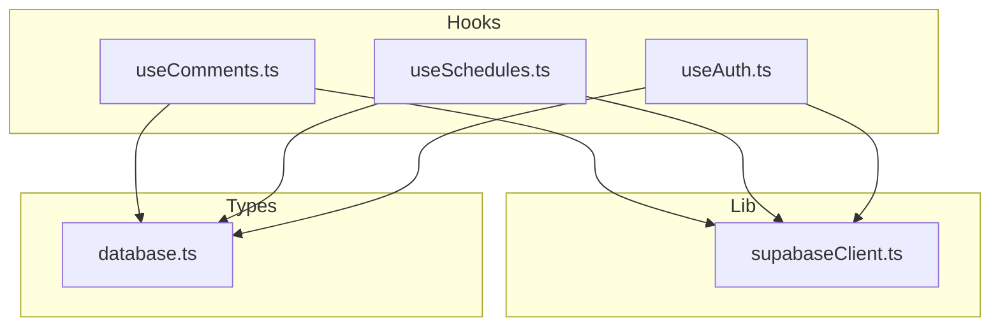
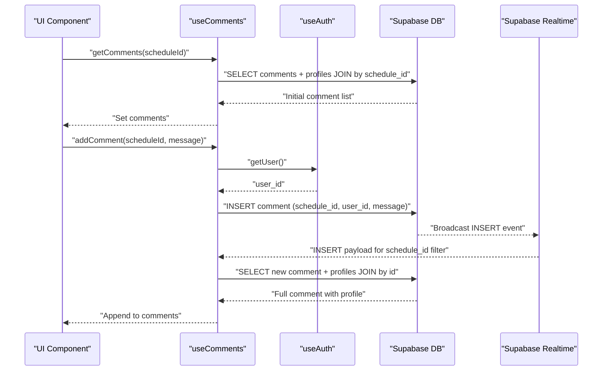
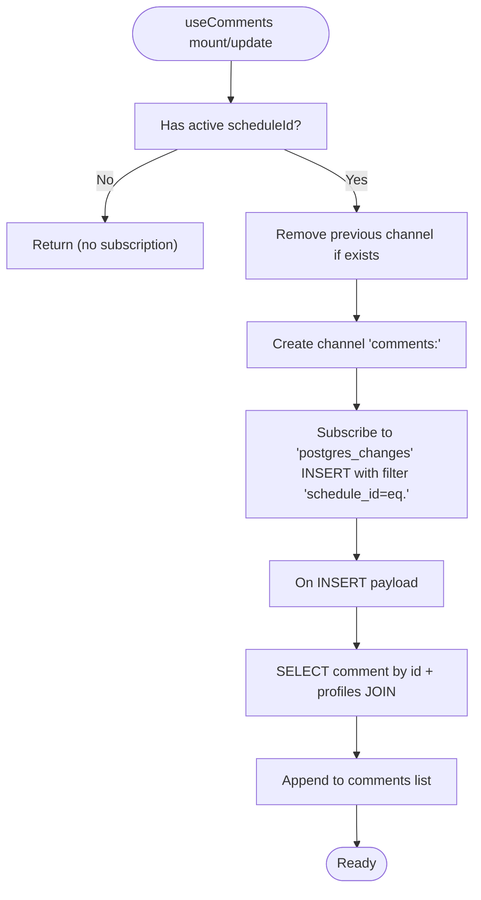
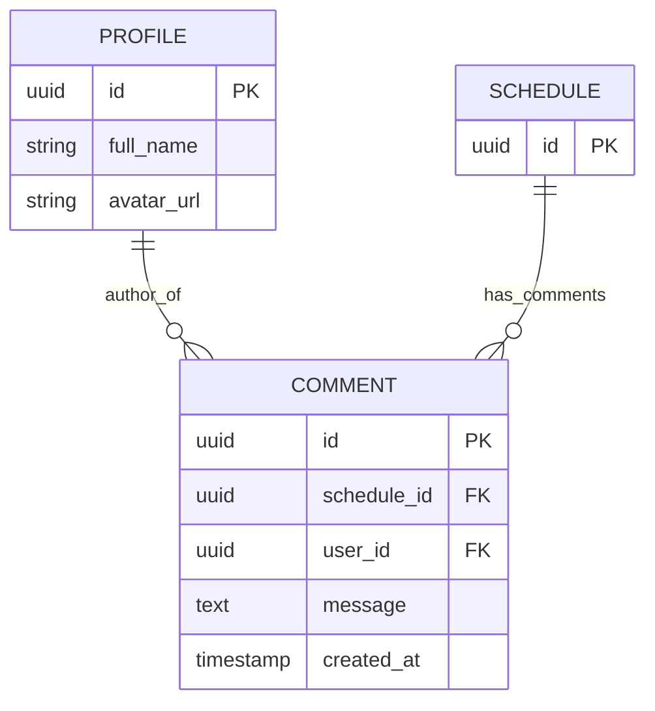
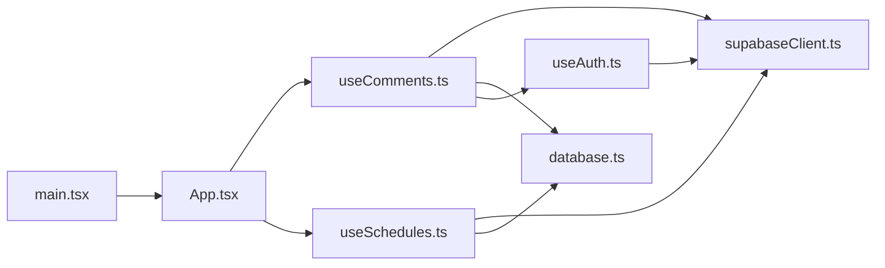

# Comment System

<cite>
**Referenced Files in This Document**
- [useComments.ts](file://src/hooks/useComments.ts)
- [supabaseClient.ts](file://src/lib/supabaseClient.ts)
- [database.ts](file://src/types/database.ts)
- [useSchedules.ts](file://src/hooks/useSchedules.ts)
- [useAuth.ts](file://src/hooks/useAuth.ts)
- [App.tsx](file://src/App.tsx)
- [main.tsx](file://src/main.tsx)
</cite>

## Table of Contents
1. [Introduction](#introduction)
2. [Project Structure](#project-structure)
3. [Core Components](#core-components)
4. [Architecture Overview](#architecture-overview)
5. [Detailed Component Analysis](#detailed-component-analysis)
6. [Dependency Analysis](#dependency-analysis)
7. [Performance Considerations](#performance-considerations)
8. [Troubleshooting Guide](#troubleshooting-guide)
9. [Conclusion](#conclusion)
10. [Appendices](#appendices)

## Introduction
This document explains the real-time comment system implemented in the project. It covers the real-time messaging architecture, comment posting and display functionality, Supabase Realtime integration, the useComments hook implementation, real-time synchronization, and how comments relate to scheduling and team collaboration. It also addresses performance considerations, offline handling, and data consistency across multiple users.

## Project Structure
The comment system is centered around a React hook that encapsulates fetching, inserting, and subscribing to comments in real time. Supabase is configured as a singleton client and is used for both database operations and real-time subscriptions. The comment model is defined alongside other domain types.

**Diagram sources**
- [useComments.ts:1-113](file://src/hooks/useComments.ts#L1-L113)
- [useSchedules.ts:1-153](file://src/hooks/useSchedules.ts#L1-L153)
- [useAuth.ts:1-81](file://src/hooks/useAuth.ts#L1-L81)
- [supabaseClient.ts:1-14](file://src/lib/supabaseClient.ts#L1-L14)
- [database.ts:1-55](file://src/types/database.ts#L1-L55)

**Section sources**
- [useComments.ts:1-113](file://src/hooks/useComments.ts#L1-L113)
- [supabaseClient.ts:1-14](file://src/lib/supabaseClient.ts#L1-L14)
- [database.ts:1-55](file://src/types/database.ts#L1-L55)
- [useSchedules.ts:1-153](file://src/hooks/useSchedules.ts#L1-L153)
- [useAuth.ts:1-81](file://src/hooks/useAuth.ts#L1-L81)
- [App.tsx:1-123](file://src/App.tsx#L1-L123)
- [main.tsx:1-11](file://src/main.tsx#L1-L11)

## Core Components
- useComments: Provides fetching, insertion, and real-time subscription for comments scoped to a schedule.
- supabaseClient: Initializes and exports the Supabase client used across the app.
- database types: Define the Comment entity and joined fields for display.
- useSchedules: Manages schedule CRUD and real-time updates; comments are associated with schedules.
- useAuth: Supplies user context used when posting comments.

Key responsibilities:
- Fetch comments for a given schedule and order by creation time.
- Insert new comments with the current authenticated user’s ID.
- Subscribe to real-time inserts for the active schedule and append new items after joining with profile data.
- Expose loading and error states for UI feedback.

**Section sources**
- [useComments.ts:13-112](file://src/hooks/useComments.ts#L13-L112)
- [supabaseClient.ts:13-14](file://src/lib/supabaseClient.ts#L13-L14)
- [database.ts:40-48](file://src/types/database.ts#L40-L48)
- [useSchedules.ts:39-152](file://src/hooks/useSchedules.ts#L39-L152)
- [useAuth.ts:15-80](file://src/hooks/useAuth.ts#L15-L80)

## Architecture Overview
The comment system integrates with Supabase Realtime to synchronize comment additions across users. The flow below maps the actual code paths and interactions.

**Diagram sources**
- [useComments.ts:20-61](file://src/hooks/useComments.ts#L20-L61)
- [useComments.ts:74-99](file://src/hooks/useComments.ts#L74-L99)
- [useAuth.ts:29-34](file://src/hooks/useAuth.ts#L29-L34)
- [database.ts:40-48](file://src/types/database.ts#L40-L48)

## Detailed Component Analysis

### useComments Hook
The hook manages:
- State: comments array, loading flag, and error string.
- Methods:
  - getComments(scheduleId): fetches and orders comments by creation time, joining profile fields.
  - addComment(scheduleId, message): inserts a comment with the authenticated user’s ID.
- Real-time:
  - Subscribes to a channel named after the active schedule.
  - Listens for INSERT events filtered by schedule_id.
  - On insert, fetches the full row with profile join and appends to the list.

**Diagram sources**
- [useComments.ts:64-109](file://src/hooks/useComments.ts#L64-L109)
- [useComments.ts:74-99](file://src/hooks/useComments.ts#L74-L99)

Implementation highlights:
- Channel naming and filtering ensure isolation per schedule.
- After insert, the hook fetches the full row with profile fields to render author info consistently.
- The effect re-runs when comments change, which ensures re-subscription when the active schedule changes.

**Section sources**
- [useComments.ts:13-112](file://src/hooks/useComments.ts#L13-L112)

### Supabase Realtime Integration
- Channel creation uses a channel name pattern that scopes updates to a single schedule.
- Event filtering uses a Postgres equality filter on schedule_id to avoid cross-schedule noise.
- The hook cleans up channels on unmount and when switching schedules to prevent leaks.

Operational notes:
- The channel is removed and recreated when the active schedule changes.
- The subscription lifecycle is tied to the hook’s effect.

**Section sources**
- [useComments.ts:64-109](file://src/hooks/useComments.ts#L64-L109)

### Comment Data Model
The Comment type includes:
- Identifier, schedule association, author reference, message body, and timestamps.
- Optional joined profile fields for rendering author name and avatar.

**Diagram sources**
- [database.ts:40-48](file://src/types/database.ts#L40-L48)
- [database.ts:3,12:3-12](file://src/types/database.ts#L3-L12)
- [database.ts:25-38](file://src/types/database.ts#L25-L38)

**Section sources**
- [database.ts:40-48](file://src/types/database.ts#L40-L48)

### Relationship with Scheduling and Team Collaboration
- Comments are associated with a schedule via schedule_id, enabling contextual collaboration around shifts.
- The schedules hook provides real-time updates for schedule changes, while the comments hook provides real-time updates for comment additions.
- Together, these enable team members to observe schedule changes and new comments concurrently, facilitating coordination.

**Section sources**
- [useSchedules.ts:117-141](file://src/hooks/useSchedules.ts#L117-L141)
- [useComments.ts:25-37](file://src/hooks/useComments.ts#L25-L37)

### Authentication and Posting
- The addComment method retrieves the current user and associates it with the comment.
- This ensures attribution and enables profile joins for display.

**Section sources**
- [useComments.ts:39-61](file://src/hooks/useComments.ts#L39-L61)
- [useAuth.ts:29-34](file://src/hooks/useAuth.ts#L29-L34)

### Comment Threading
- The current implementation does not define a parent-child relationship for replies.
- Comments are ordered by creation time and displayed as a flat list per schedule.
- To support threaded replies, the schema would require a parent_comment_id field and UI logic to nest replies.

[No sources needed since this section analyzes the current absence of threading and proposes future extension]

## Dependency Analysis
The comment system depends on:
- Supabase client initialization and environment variables.
- Types for the Comment entity and joined profile fields.
- Authentication state to attribute comments to users.
- Schedules context to scope comments.

**Diagram sources**
- [useComments.ts:1-113](file://src/hooks/useComments.ts#L1-L113)
- [supabaseClient.ts:1-14](file://src/lib/supabaseClient.ts#L1-L14)
- [database.ts:1-55](file://src/types/database.ts#L1-L55)
- [useAuth.ts:1-81](file://src/hooks/useAuth.ts#L1-L81)
- [useSchedules.ts:1-153](file://src/hooks/useSchedules.ts#L1-L153)
- [App.tsx:1-123](file://src/App.tsx#L1-L123)
- [main.tsx:1-11](file://src/main.tsx#L1-L11)

**Section sources**
- [useComments.ts:1-113](file://src/hooks/useComments.ts#L1-L113)
- [supabaseClient.ts:1-14](file://src/lib/supabaseClient.ts#L1-L14)
- [database.ts:1-55](file://src/types/database.ts#L1-L55)
- [useAuth.ts:1-81](file://src/hooks/useAuth.ts#L1-L81)
- [useSchedules.ts:1-153](file://src/hooks/useSchedules.ts#L1-L153)
- [App.tsx:1-123](file://src/App.tsx#L1-L123)
- [main.tsx:1-11](file://src/main.tsx#L1-L11)

## Performance Considerations
- Real-time channel scope: Using a channel per schedule reduces unnecessary broadcasts and minimizes payload sizes.
- Selective fetching: After an INSERT, the hook fetches only the newly inserted record with the profile join, avoiding full list reloads.
- Subscription lifecycle: Channels are cleaned up on unmount and when switching schedules to prevent memory leaks and redundant listeners.
- Initial load: The initial fetch orders comments by creation time to present them chronologically without extra client-side sorting.

[No sources needed since this section provides general guidance]

## Troubleshooting Guide
Common issues and remedies:
- Missing environment variables:
  - Symptom: Client initialization throws an error.
  - Cause: Missing Supabase URL or anonymous key.
  - Fix: Set VITE_SUPABASE_URL and VITE_SUPABASE_ANON_KEY in the environment.
- No real-time updates:
  - Symptom: New comments do not appear until refresh.
  - Cause: Channel not subscribed or active schedule not set.
  - Fix: Ensure getComments is called before addComment and that the hook remains mounted.
- Incorrect user attribution:
  - Symptom: Comments appear without an author.
  - Cause: No authenticated user session.
  - Fix: Verify authentication state and ensure getUser resolves a user.
- Cross-schedule noise:
  - Symptom: Comments from other schedules appear.
  - Cause: Improper channel or filter configuration.
  - Fix: Confirm channel name pattern and filter by schedule_id.

**Section sources**
- [supabaseClient.ts:6-11](file://src/lib/supabaseClient.ts#L6-L11)
- [useComments.ts:64-109](file://src/hooks/useComments.ts#L64-L109)
- [useComments.ts:39-61](file://src/hooks/useComments.ts#L39-L61)

## Conclusion
The comment system provides a robust, real-time foundation for team collaboration around schedules. It leverages Supabase Realtime to synchronize new comments instantly, maintains clean separation of concerns via a dedicated hook, and exposes a simple interface for fetching and posting. Extending the model to support threaded replies would further enhance conversational context within the scheduling domain.

[No sources needed since this section summarizes without analyzing specific files]

## Appendices

### API and Operation Examples (by file reference)
- Fetch comments for a schedule:
  - [useComments.getComments:20-37](file://src/hooks/useComments.ts#L20-L37)
- Post a comment:
  - [useComments.addComment:39-61](file://src/hooks/useComments.ts#L39-L61)
- Real-time subscription and handling:
  - [useComments.useEffect (subscription):64-109](file://src/hooks/useComments.ts#L64-L109)
- Supabase client initialization:
  - [supabaseClient.ts:13-14](file://src/lib/supabaseClient.ts#L13-L14)
- Comment data model:
  - [database.ts.Comment:40-48](file://src/types/database.ts#L40-L48)
- Schedule real-time updates:
  - [useSchedules.realtime:117-141](file://src/hooks/useSchedules.ts#L117-L141)
- Authentication integration:
  - [useAuth.getUser:29-34](file://src/hooks/useAuth.ts#L29-L34)