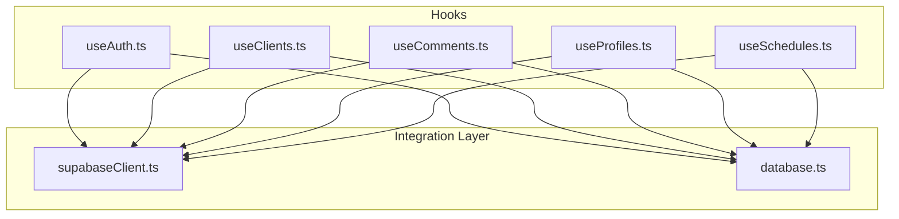
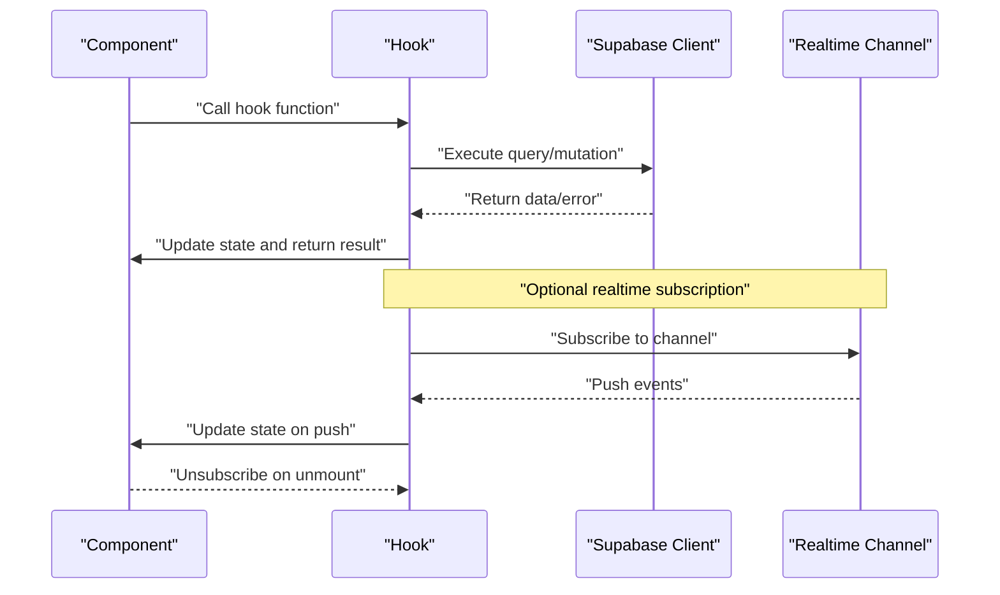
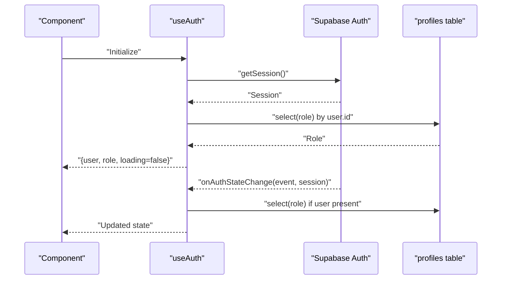
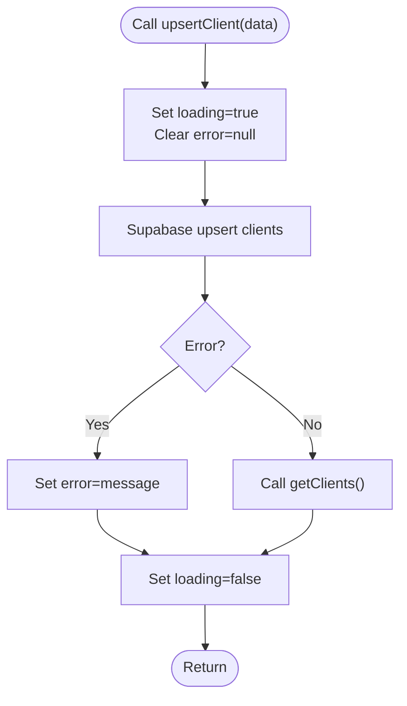
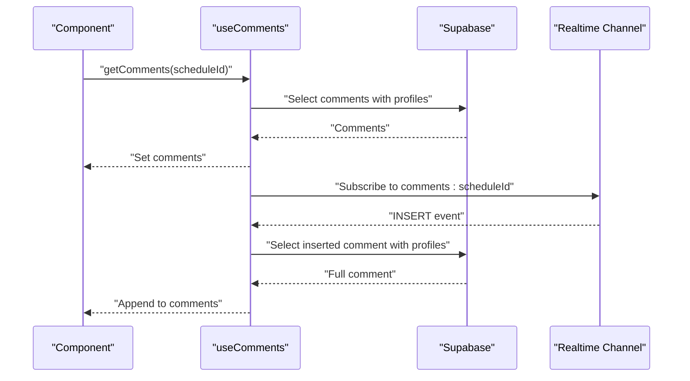
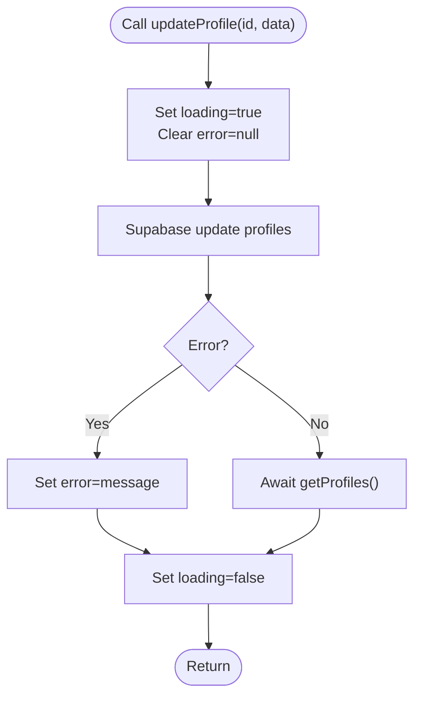
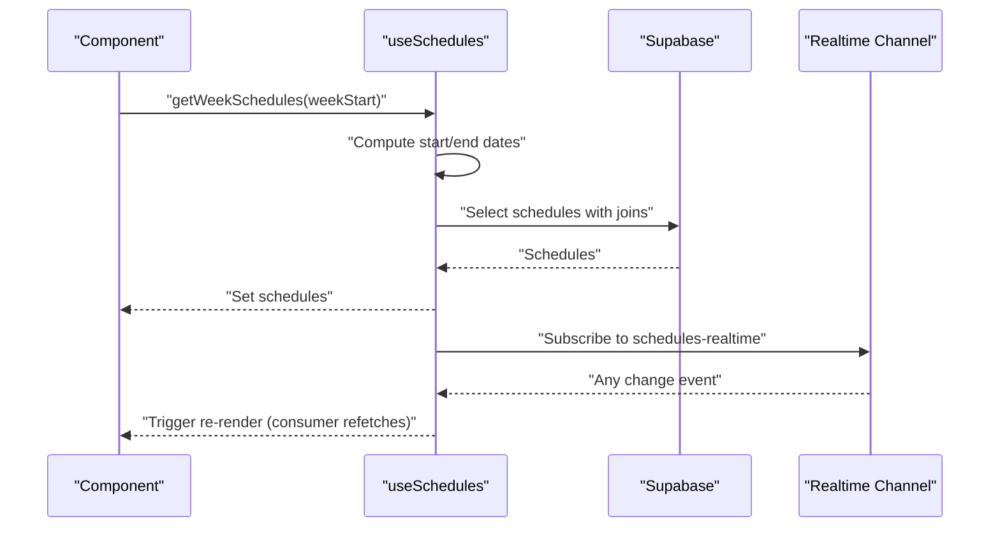
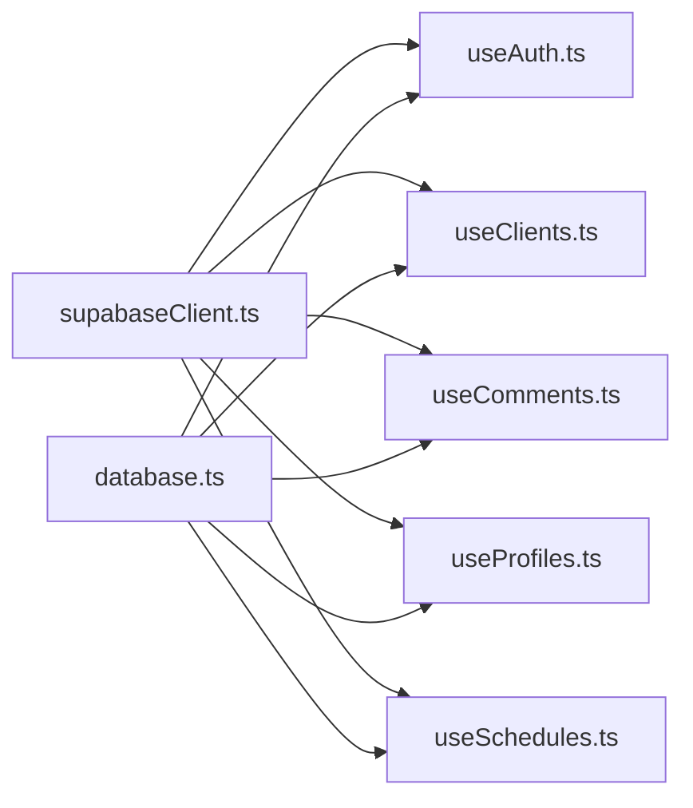

# Custom Hooks Reference

<cite>
**Referenced Files in This Document**
- [useAuth.ts](file://src/hooks/useAuth.ts)
- [useClients.ts](file://src/hooks/useClients.ts)
- [useComments.ts](file://src/hooks/useComments.ts)
- [useProfiles.ts](file://src/hooks/useProfiles.ts)
- [useSchedules.ts](file://src/hooks/useSchedules.ts)
- [supabaseClient.ts](file://src/lib/supabaseClient.ts)
- [database.ts](file://src/types/database.ts)
</cite>

## Table of Contents
1. [Introduction](#introduction)
2. [Project Structure](#project-structure)
3. [Core Components](#core-components)
4. [Architecture Overview](#architecture-overview)
5. [Detailed Component Analysis](#detailed-component-analysis)
6. [Dependency Analysis](#dependency-analysis)
7. [Performance Considerations](#performance-considerations)
8. [Troubleshooting Guide](#troubleshooting-guide)
9. [Conclusion](#conclusion)

## Introduction
This document provides a comprehensive reference for the custom React hooks used in the M_Sharif application. It focuses on five hooks that encapsulate Supabase-driven domain logic: useAuth, useClients, useComments, useProfiles, and useSchedules. For each hook, we explain usage patterns, state management approaches, composition strategies, lifecycle management, error handling, and performance considerations. We also show how these hooks integrate with Supabase and how consumers can compose them effectively in components.

## Project Structure
The hooks reside under src/hooks and depend on a shared Supabase client and typed database models.

**Diagram sources**
- [useAuth.ts:1-81](file://src/hooks/useAuth.ts#L1-L81)
- [useClients.ts:1-74](file://src/hooks/useClients.ts#L1-L74)
- [useComments.ts:1-113](file://src/hooks/useComments.ts#L1-L113)
- [useProfiles.ts:1-63](file://src/hooks/useProfiles.ts#L1-L63)
- [useSchedules.ts:1-153](file://src/hooks/useSchedules.ts#L1-L153)
- [supabaseClient.ts:1-14](file://src/lib/supabaseClient.ts#L1-L14)
- [database.ts:1-55](file://src/types/database.ts#L1-L55)

**Section sources**
- [useAuth.ts:1-81](file://src/hooks/useAuth.ts#L1-L81)
- [useClients.ts:1-74](file://src/hooks/useClients.ts#L1-L74)
- [useComments.ts:1-113](file://src/hooks/useComments.ts#L1-L113)
- [useProfiles.ts:1-63](file://src/hooks/useProfiles.ts#L1-L63)
- [useSchedules.ts:1-153](file://src/hooks/useSchedules.ts#L1-L153)
- [supabaseClient.ts:1-14](file://src/lib/supabaseClient.ts#L1-L14)
- [database.ts:1-55](file://src/types/database.ts#L1-L55)

## Core Components
- useAuth: Manages authentication state, role resolution, and sign-in/sign-out operations. It listens to Supabase auth state changes and hydrates role from the profiles table.
- useClients: Provides CRUD operations for clients with optimistic updates and error propagation.
- useComments: Loads comments for a schedule, adds new comments, and subscribes to real-time updates for the active schedule.
- useProfiles: Lists employees and updates profile fields, with refresh after updates.
- useSchedules: Fetches schedules for a given week, supports create/update/delete, and maintains a real-time subscription to keep data fresh.

**Section sources**
- [useAuth.ts:6-13](file://src/hooks/useAuth.ts#L6-L13)
- [useClients.ts:5-12](file://src/hooks/useClients.ts#L5-L12)
- [useComments.ts:5-11](file://src/hooks/useComments.ts#L5-L11)
- [useProfiles.ts:5-14](file://src/hooks/useProfiles.ts#L5-L14)
- [useSchedules.ts:5-20](file://src/hooks/useSchedules.ts#L5-L20)

## Architecture Overview
The hooks share a common integration model:
- Supabase client initialization enforces environment variables and exports a singleton client.
- Each hook encapsulates local state, async operations, and cleanup where applicable.
- Real-time subscriptions are scoped to the hook lifecycle to prevent leaks.

**Diagram sources**
- [supabaseClient.ts:1-14](file://src/lib/supabaseClient.ts#L1-L14)
- [useComments.ts:64-109](file://src/hooks/useComments.ts#L64-L109)
- [useSchedules.ts:118-141](file://src/hooks/useSchedules.ts#L118-L141)

## Detailed Component Analysis

### useAuth
Purpose:
- Centralizes authentication state and role resolution.
- Exposes sign-in, sign-out, and current user retrieval.
- Subscribes to Supabase auth state changes and hydrates role from the profiles table.

State management:
- user: Current logged-in user or null.
- role: Role derived from the profiles table for the current user.
- loading: Indicates whether initial session hydration is in progress.

Asynchronous operations:
- getSession on mount to initialize state.
- onAuthStateChange to react to login/logout or session updates.
- getUser for programmatic retrieval.
- signInWithPassword and signOut.

Lifecycle and cleanup:
- Unsubscribes the auth listener on unmount.

Composition strategies:
- Consumers can call getCurrentUser to refresh state or rely on the internal listener.
- Combine with useProfiles to resolve role after login.

Error handling:
- Throws errors from sign-in/sign-out operations; callers should catch and surface messages.

Performance considerations:
- fetchRole is memoized to avoid unnecessary re-renders.
- Dependency array includes fetchRole to prevent stale closures.

**Diagram sources**
- [useAuth.ts:51-77](file://src/hooks/useAuth.ts#L51-L77)
- [useAuth.ts:20-27](file://src/hooks/useAuth.ts#L20-L27)

**Section sources**
- [useAuth.ts:15-81](file://src/hooks/useAuth.ts#L15-L81)
- [supabaseClient.ts:1-14](file://src/lib/supabaseClient.ts#L1-L14)
- [database.ts:3-12](file://src/types/database.ts#L3-L12)

### useClients
Purpose:
- Manage a list of clients with CRUD operations.
- Provide loading and error states for UI feedback.

State management:
- clients: Array of client records.
- loading: Boolean indicating ongoing network operation.
- error: String or null representing last error.

Asynchronous operations:
- getClients: Fetches all clients ordered by name.
- upsertClient: Upserts a client record by id.
- deleteClient: Deletes a client by id.

Lifecycle and cleanup:
- No subscriptions; state is managed locally.

Composition strategies:
- Call getClients during component mount or when navigation changes.
- Use upsertClient after form submission; refresh list via getClients.

Error handling:
- Errors are captured and stored in the error field; callers should display messages.

Performance considerations:
- upsertClient depends on getClients to refresh the list, avoiding manual state reconciliation.

**Diagram sources**
- [useClients.ts:35-51](file://src/hooks/useClients.ts#L35-L51)

**Section sources**
- [useClients.ts:14-74](file://src/hooks/useClients.ts#L14-L74)
- [database.ts:14-23](file://src/types/database.ts#L14-L23)

### useComments
Purpose:
- Load comments for a specific schedule and add new comments.
- Subscribe to real-time inserts for the active schedule to keep the list fresh.

State management:
- comments: Array of comments joined with profile data.
- loading: Boolean indicating ongoing network operation.
- error: String or null representing last error.
- activeScheduleIdRef: Tracks the currently active schedule id.
- channelRef: Holds the realtime channel reference.

Asynchronous operations:
- getComments: Fetches comments for a schedule with profile joins and orders by creation time.
- addComment: Inserts a new comment associated with the current user and schedule.

Real-time integration:
- Subscribes to a channel scoped to the active schedule id.
- On insert events, fetches the full row with profile joins and appends to the list.

Lifecycle and cleanup:
- Cleans up previous channels on re-subscription and on unmount.

Composition strategies:
- Call getComments when the schedule changes; the effect will subscribe to updates.
- Use addComment to post new comments; rely on real-time updates to refresh.

Error handling:
- Errors are captured and stored in the error field.

Performance considerations:
- Uses refs to avoid recreating subscriptions unnecessarily.
- Re-subscribes only when the active schedule id changes.

**Diagram sources**
- [useComments.ts:20-37](file://src/hooks/useComments.ts#L20-L37)
- [useComments.ts:74-99](file://src/hooks/useComments.ts#L74-L99)

**Section sources**
- [useComments.ts:13-113](file://src/hooks/useComments.ts#L13-L113)
- [database.ts:40-48](file://src/types/database.ts#L40-L48)

### useProfiles
Purpose:
- Retrieve employee profiles and update profile fields.
- Provide loading and error states.

State management:
- profiles: Array of employee profiles.
- loading: Boolean indicating ongoing network operation.
- error: String or null representing last error.

Asynchronous operations:
- getProfiles: Fetches employees ordered by full name.
- updateProfile: Updates a profile by id.

Lifecycle and cleanup:
- No subscriptions; state is managed locally.

Composition strategies:
- Call getProfiles during component mount or when navigation changes.
- Use updateProfile after edits; refresh list via getProfiles.

Error handling:
- Errors are captured and stored in the error field.

Performance considerations:
- updateProfile depends on getProfiles to refresh the list.

**Diagram sources**
- [useProfiles.ts:38-59](file://src/hooks/useProfiles.ts#L38-L59)

**Section sources**
- [useProfiles.ts:16-63](file://src/hooks/useProfiles.ts#L16-L63)
- [database.ts:3-12](file://src/types/database.ts#L3-L12)

### useSchedules
Purpose:
- Fetch schedules for a given week, support create/update/delete, and maintain real-time freshness.

State management:
- schedules: Array of schedules with joined profile and client data.
- loading: Boolean indicating ongoing network operation.
- error: String or null representing last error.
- channelRef: Holds the realtime channel reference.

Asynchronous operations:
- getWeekSchedules: Computes ISO week boundaries and fetches schedules within that range, ordered by date and time.
- createSchedule: Inserts a new schedule.
- updateSchedule: Updates an existing schedule.
- deleteSchedule: Deletes a schedule.

Real-time integration:
- Subscribes to a global schedules channel.
- On any change, triggers a re-render signal to consumers who should refetch the current week.

Lifecycle and cleanup:
- Cleans up the channel on unmount.

Composition strategies:
- Call getWeekSchedules with the current week start date.
- After mutations, consumers should refetch the current week to reflect changes.

Error handling:
- Errors are captured and stored in the error field.

Performance considerations:
- Uses a helper to compute ISO week boundaries to ensure consistent date ranges.
- Real-time subscription acts as a safety net to keep views fresh.

**Diagram sources**
- [useSchedules.ts:45-64](file://src/hooks/useSchedules.ts#L45-L64)
- [useSchedules.ts:118-141](file://src/hooks/useSchedules.ts#L118-L141)

**Section sources**
- [useSchedules.ts:39-153](file://src/hooks/useSchedules.ts#L39-L153)
- [database.ts:25-38](file://src/types/database.ts#L25-L38)

## Dependency Analysis
- All hooks depend on the shared Supabase client initialized in supabaseClient.ts.
- Each hook defines its own domain-specific state and operations.
- Real-time subscriptions are isolated per hook to avoid cross-hook coupling.

**Diagram sources**
- [supabaseClient.ts:1-14](file://src/lib/supabaseClient.ts#L1-L14)
- [database.ts:1-55](file://src/types/database.ts#L1-L55)
- [useAuth.ts:1-5](file://src/hooks/useAuth.ts#L1-L5)
- [useClients.ts:1-3](file://src/hooks/useClients.ts#L1-L3)
- [useComments.ts:1-3](file://src/hooks/useComments.ts#L1-L3)
- [useProfiles.ts:1-3](file://src/hooks/useProfiles.ts#L1-L3)
- [useSchedules.ts:1-3](file://src/hooks/useSchedules.ts#L1-L3)

**Section sources**
- [supabaseClient.ts:1-14](file://src/lib/supabaseClient.ts#L1-L14)
- [database.ts:1-55](file://src/types/database.ts#L1-L55)

## Performance Considerations
- Memoization: useCallback is used for async operations to stabilize references across renders, reducing unnecessary re-renders and preventing stale closures.
- Dependency arrays: Hooks carefully define dependency arrays to avoid infinite loops or stale behavior. For example, useAuth’s fetchRole is included in its dependency array; useComments’ effect depends on comments to resubscribe when schedule id changes; useSchedules’ effect depends on no external values to maintain a persistent subscription.
- Real-time subscriptions: Channels are cleaned up on unmount and when switching contexts to prevent memory leaks and redundant listeners.
- Selective fetching: useSchedules computes week boundaries to limit query scope; useComments limits rows to the active schedule; useProfiles filters by role to reduce payload sizes.
- Optimistic updates: useClients and useProfiles refresh lists after mutations to keep UI in sync with the database.

[No sources needed since this section provides general guidance]

## Troubleshooting Guide
Common issues and resolutions:
- Missing environment variables:
  - Symptom: Error thrown during Supabase client initialization.
  - Resolution: Ensure VITE_SUPABASE_URL and VITE_SUPABASE_ANON_KEY are set in the environment.
- Authentication errors:
  - Symptom: Sign-in/sign-out throws errors.
  - Resolution: Catch and display error messages; verify credentials and network connectivity.
- Real-time subscription failures:
  - Symptom: Comments do not update or schedules do not refresh.
  - Resolution: Verify channel names and filters; ensure the active schedule id is set before subscribing; confirm Supabase Realtime is enabled.
- Stale data after mutations:
  - Symptom: UI does not reflect changes after create/update/delete.
  - Resolution: For schedules, consumers should refetch the current week; for clients/profiles, call the refresh function after mutations.
- Dependency array pitfalls:
  - Symptom: Infinite loops or stale behavior.
  - Resolution: Review dependency arrays for callbacks and effects; ensure stable references for callbacks and correct dependencies for effects.

**Section sources**
- [supabaseClient.ts:6-11](file://src/lib/supabaseClient.ts#L6-L11)
- [useAuth.ts:44-49](file://src/hooks/useAuth.ts#L44-L49)
- [useComments.ts:64-109](file://src/hooks/useComments.ts#L64-L109)
- [useSchedules.ts:118-141](file://src/hooks/useSchedules.ts#L118-L141)

## Conclusion
These custom hooks provide a cohesive, reusable foundation for managing authentication, clients, comments, profiles, and schedules in the M_Sharif application. They encapsulate Supabase integration, manage state efficiently, handle asynchronous operations, and leverage real-time updates where appropriate. By following the composition strategies and best practices outlined here, developers can build reliable UIs with predictable behavior and strong error handling.