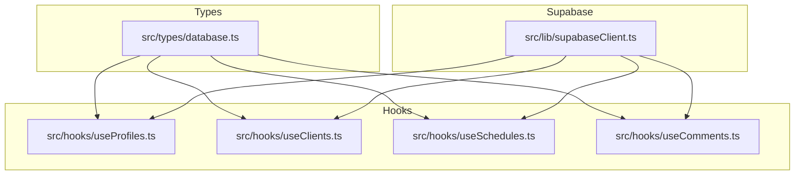
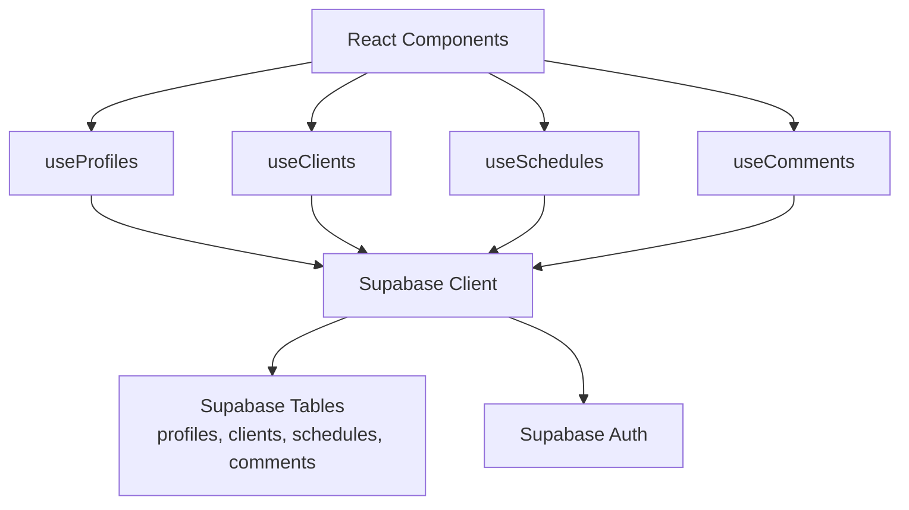
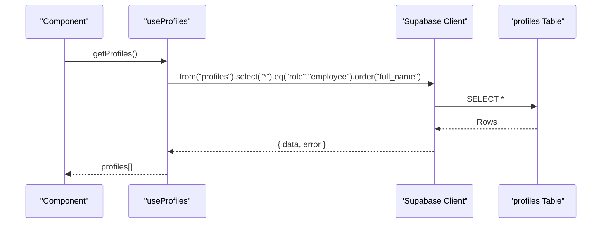
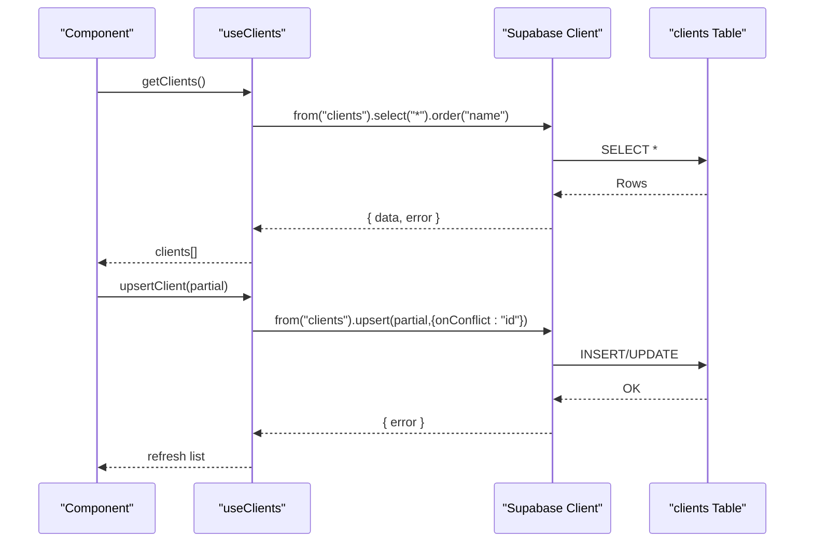
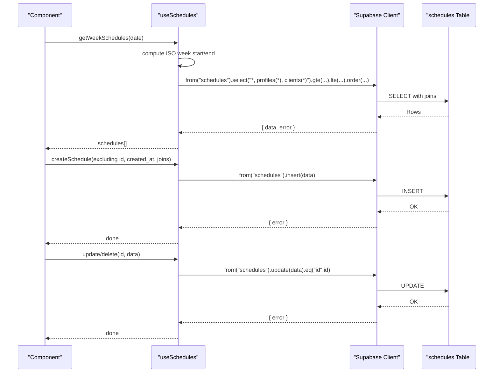
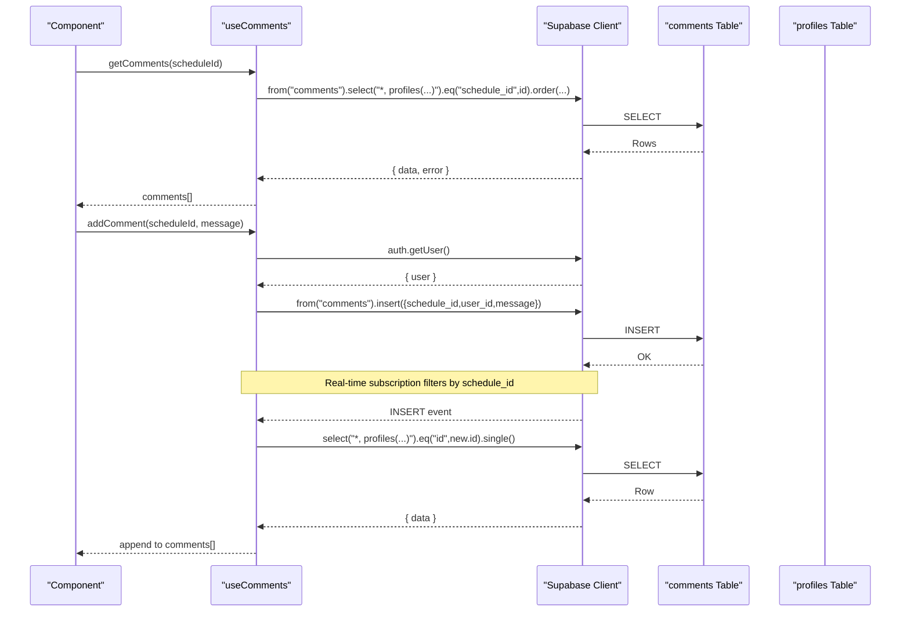
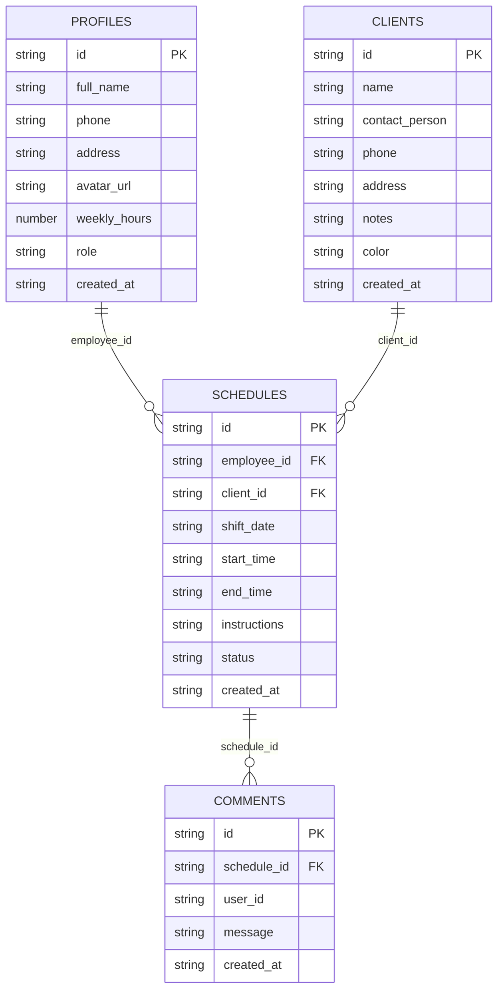
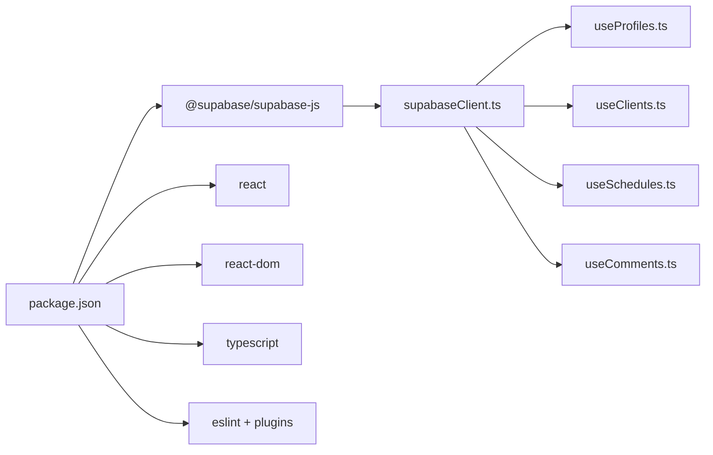

# Database Schema and Types

<cite>
**Referenced Files in This Document**
- [database.ts](file://src/types/database.ts)
- [supabaseClient.ts](file://src/lib/supabaseClient.ts)
- [useProfiles.ts](file://src/hooks/useProfiles.ts)
- [useClients.ts](file://src/hooks/useClients.ts)
- [useSchedules.ts](file://src/hooks/useSchedules.ts)
- [useComments.ts](file://src/hooks/useComments.ts)
- [package.json](file://package.json)
</cite>

## Table of Contents
1. [Introduction](#introduction)
2. [Project Structure](#project-structure)
3. [Core Components](#core-components)
4. [Architecture Overview](#architecture-overview)
5. [Detailed Component Analysis](#detailed-component-analysis)
6. [Dependency Analysis](#dependency-analysis)
7. [Performance Considerations](#performance-considerations)
8. [Troubleshooting Guide](#troubleshooting-guide)
9. [Conclusion](#conclusion)
10. [Appendices](#appendices)

## Introduction
This document describes the M_Sharif database schema and associated TypeScript interfaces. It focuses on the entity relationships among profiles, clients, schedules, and comments, and explains how Supabase serves as the backend while TypeScript interfaces provide compile-time type safety. It also documents data access patterns, real-time subscriptions, and business constraints enforced through the schema and application logic.

## Project Structure
The schema is defined in a centralized TypeScript module and consumed by React hooks that encapsulate CRUD operations against Supabase tables. The Supabase client is configured via environment variables and used by all hooks.

**Diagram sources**
- [database.ts:1-55](file://src/types/database.ts#L1-L55)
- [supabaseClient.ts:1-14](file://src/lib/supabaseClient.ts#L1-L14)
- [useProfiles.ts:1-63](file://src/hooks/useProfiles.ts#L1-L63)
- [useClients.ts:1-74](file://src/hooks/useClients.ts#L1-L74)
- [useSchedules.ts:1-153](file://src/hooks/useSchedules.ts#L1-L153)
- [useComments.ts:1-113](file://src/hooks/useComments.ts#L1-L113)

**Section sources**
- [database.ts:1-55](file://src/types/database.ts#L1-L55)
- [supabaseClient.ts:1-14](file://src/lib/supabaseClient.ts#L1-L14)
- [useProfiles.ts:1-63](file://src/hooks/useProfiles.ts#L1-L63)
- [useClients.ts:1-74](file://src/hooks/useClients.ts#L1-L74)
- [useSchedules.ts:1-153](file://src/hooks/useSchedules.ts#L1-L153)
- [useComments.ts:1-113](file://src/hooks/useComments.ts#L1-L113)

## Core Components
This section defines the core entities and their relationships, along with field-level characteristics and constraints.

- Profiles
  - Purpose: Stores user account details and roles.
  - Fields: id (string), full_name (string), phone (string|null), address (string|null), avatar_url (string|null), weekly_hours (number), role ("admin"|"employee"), created_at (string).
  - Constraints: role is an enum-like union type; id is the primary key; created_at is a timestamp string.

- Clients
  - Purpose: Stores client information for scheduling.
  - Fields: id (string), name (string), contact_person (string|null), phone (string|null), address (string|null), notes (string|null), color (string), created_at (string).
  - Constraints: id is the primary key; color is a hex-like string; created_at is a timestamp string.

- Schedules
  - Purpose: Assigns employees to clients for shifts with status tracking.
  - Fields: id (string), employee_id (string|null), client_id (string), shift_date (string), start_time (string), end_time (string), instructions (string|null), status ("scheduled"|"confirmed"|"completed"|"cancelled"), created_at (string).
  - Constraints: id is the primary key; employee_id references profiles.id; client_id references clients.id; status is an enum-like union type; created_at is a timestamp string.

- Comments
  - Purpose: Adds threaded messages to a schedule.
  - Fields: id (string), schedule_id (string), user_id (string|null), message (string), created_at (string).
  - Constraints: id is the primary key; schedule_id references schedules.id; user_id references Supabase auth user; created_at is a timestamp string.

Entity relationships:
- profiles.id ← schedules.employee_id
- clients.id ← schedules.client_id
- schedules.id ← comments.schedule_id

**Section sources**
- [database.ts:3-12](file://src/types/database.ts#L3-L12)
- [database.ts:14-23](file://src/types/database.ts#L14-L23)
- [database.ts:25-38](file://src/types/database.ts#L25-L38)
- [database.ts:40-48](file://src/types/database.ts#L40-L48)

## Architecture Overview
The application uses Supabase as the backend database and authentication provider. TypeScript interfaces mirror the database schema to enforce type safety at compile time. Hooks encapsulate data access patterns and expose typed APIs to React components.

**Diagram sources**
- [supabaseClient.ts:1-14](file://src/lib/supabaseClient.ts#L1-L14)
- [useProfiles.ts:1-63](file://src/hooks/useProfiles.ts#L1-L63)
- [useClients.ts:1-74](file://src/hooks/useClients.ts#L1-L74)
- [useSchedules.ts:1-153](file://src/hooks/useSchedules.ts#L1-L153)
- [useComments.ts:1-113](file://src/hooks/useComments.ts#L1-L113)

## Detailed Component Analysis

### Profiles Entity
- Purpose: Represents user accounts with role and availability metadata.
- Access patterns:
  - Retrieve employees ordered by full_name.
  - Update profile fields except id and created_at.
- Type safety: The hook’s update signature uses a partial type derived from the Profile interface, excluding immutable fields.

**Diagram sources**
- [useProfiles.ts:21-36](file://src/hooks/useProfiles.ts#L21-L36)
- [database.ts:3-12](file://src/types/database.ts#L3-L12)

**Section sources**
- [database.ts:3-12](file://src/types/database.ts#L3-L12)
- [useProfiles.ts:1-63](file://src/hooks/useProfiles.ts#L1-L63)

### Clients Entity
- Purpose: Stores client details and visual color coding.
- Access patterns:
  - List all clients sorted by name.
  - Upsert client records with conflict resolution on id.
  - Delete a client by id.
- Type safety: The upsert signature excludes created_at, ensuring only mutable fields are passed.

**Diagram sources**
- [useClients.ts:19-51](file://src/hooks/useClients.ts#L19-L51)
- [database.ts:14-23](file://src/types/database.ts#L14-L23)

**Section sources**
- [database.ts:14-23](file://src/types/database.ts#L14-L23)
- [useClients.ts:1-74](file://src/hooks/useClients.ts#L1-L74)

### Schedules Entity
- Purpose: Manages employee-client assignments with status and timing.
- Access patterns:
  - Fetch schedules for a given ISO week range with joined profile and client data.
  - Insert, update, and delete schedules.
  - Real-time subscription to schedule changes; consumers should refetch weekly data.
- Type safety: The hook enforces immutability of id and created_at during creation and updates.

**Diagram sources**
- [useSchedules.ts:45-115](file://src/hooks/useSchedules.ts#L45-L115)
- [database.ts:25-38](file://src/types/database.ts#L25-L38)

**Section sources**
- [database.ts:25-38](file://src/types/database.ts#L25-L38)
- [useSchedules.ts:1-153](file://src/hooks/useSchedules.ts#L1-L153)

### Comments Entity
- Purpose: Enables threaded messaging on a schedule with profile attribution.
- Access patterns:
  - Load comments for a schedule with profile join.
  - Add a comment using the authenticated user’s id.
  - Subscribe to real-time inserts for the active schedule and fetch the full row with profile join.
- Type safety: The hook’s addComment signature ensures only schedule_id and message are required; user_id is injected from the current session.

**Diagram sources**
- [useComments.ts:20-109](file://src/hooks/useComments.ts#L20-L109)
- [database.ts:40-48](file://src/types/database.ts#L40-L48)

**Section sources**
- [database.ts:40-48](file://src/types/database.ts#L40-L48)
- [useComments.ts:1-113](file://src/hooks/useComments.ts#L1-L113)

### Data Model Diagram

**Diagram sources**
- [database.ts:3-48](file://src/types/database.ts#L3-L48)

## Dependency Analysis
- Runtime dependencies:
  - @supabase/supabase-js is used for database and auth operations.
  - React and React DOM for UI rendering.
- Build-time dependencies:
  - TypeScript and ESLint for type checking and linting.
- Internal dependencies:
  - Hooks depend on the Supabase client and share the same TypeScript interfaces.

**Diagram sources**
- [package.json:12-30](file://package.json#L12-L30)
- [supabaseClient.ts:1-14](file://src/lib/supabaseClient.ts#L1-L14)
- [useProfiles.ts:1-63](file://src/hooks/useProfiles.ts#L1-L63)
- [useClients.ts:1-74](file://src/hooks/useClients.ts#L1-L74)
- [useSchedules.ts:1-153](file://src/hooks/useSchedules.ts#L1-L153)
- [useComments.ts:1-113](file://src/hooks/useComments.ts#L1-L113)

**Section sources**
- [package.json:12-30](file://package.json#L12-L30)
- [supabaseClient.ts:1-14](file://src/lib/supabaseClient.ts#L1-L14)

## Performance Considerations
- Selectivity and ordering:
  - Queries use equality and range filters (e.g., role, schedule date range) to limit result sets.
  - Sorting by name/full_name and timestamps improves UI predictability.
- Joins:
  - Schedules queries join profiles and clients to avoid N+1 loads.
  - Comments queries join profiles to enrich comment author information.
- Real-time:
  - Subscriptions reduce polling and keep UIs synchronized.
  - Consumers should refetch weekly schedules after any change to maintain consistency.
- Mutations:
  - Upserts minimize duplicate insert/update logic.
  - Partial updates prevent accidental overwrites of immutable fields.

[No sources needed since this section provides general guidance]

## Troubleshooting Guide
- Environment variables:
  - Ensure VITE_SUPABASE_URL and VITE_SUPABASE_ANON_KEY are set; otherwise, the Supabase client throws an error.
- Authentication:
  - Comments rely on the current user; ensure the user is logged in before adding comments.
- Data integrity:
  - Status values for schedules and roles for profiles are constrained by TypeScript unions; mismatches will cause compile errors.
- Real-time updates:
  - For schedules, consumers should call getWeekSchedules with the current week start after receiving a change event.
  - For comments, the subscription filters by schedule_id; ensure the active schedule id is set before subscribing.

**Section sources**
- [supabaseClient.ts:6-11](file://src/lib/supabaseClient.ts#L6-L11)
- [useComments.ts:44-52](file://src/hooks/useComments.ts#L44-L52)
- [useSchedules.ts:118-131](file://src/hooks/useSchedules.ts#L118-L131)

## Conclusion
The M_Sharif schema centers on four entities with clear relationships: profiles, clients, schedules, and comments. TypeScript interfaces provide strong compile-time guarantees aligned with Supabase tables. Hooks encapsulate CRUD and real-time patterns, enabling predictable data access and responsive UIs. Business constraints such as enums for status and role, and foreign key relationships, are enforced both at the type level and by the underlying database.

[No sources needed since this section summarizes without analyzing specific files]

## Appendices

### Sample Data Structures
- Profile
  - Example fields: id, full_name, phone, address, avatar_url, weekly_hours, role, created_at
  - Notes: role is either admin or employee; weekly_hours is numeric; created_at is a timestamp string.

- Client
  - Example fields: id, name, contact_person, phone, address, notes, color, created_at
  - Notes: color is a string identifier; created_at is a timestamp string.

- Schedule
  - Example fields: id, employee_id, client_id, shift_date, start_time, end_time, instructions, status, created_at
  - Notes: status is one of scheduled, confirmed, completed, cancelled; created_at is a timestamp string.

- Comment
  - Example fields: id, schedule_id, user_id, message, created_at
  - Notes: user_id comes from the authenticated session; created_at is a timestamp string.

**Section sources**
- [database.ts:3-48](file://src/types/database.ts#L3-L48)