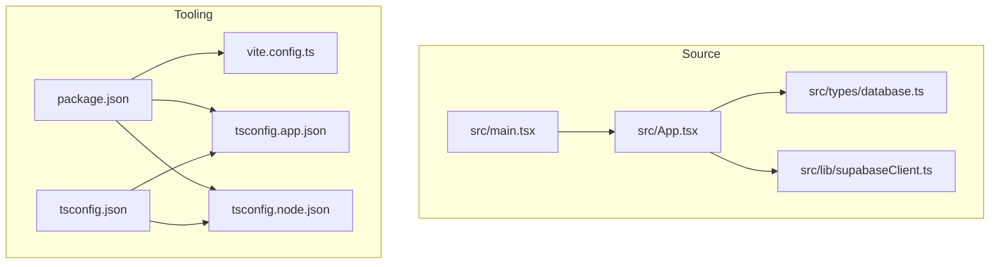
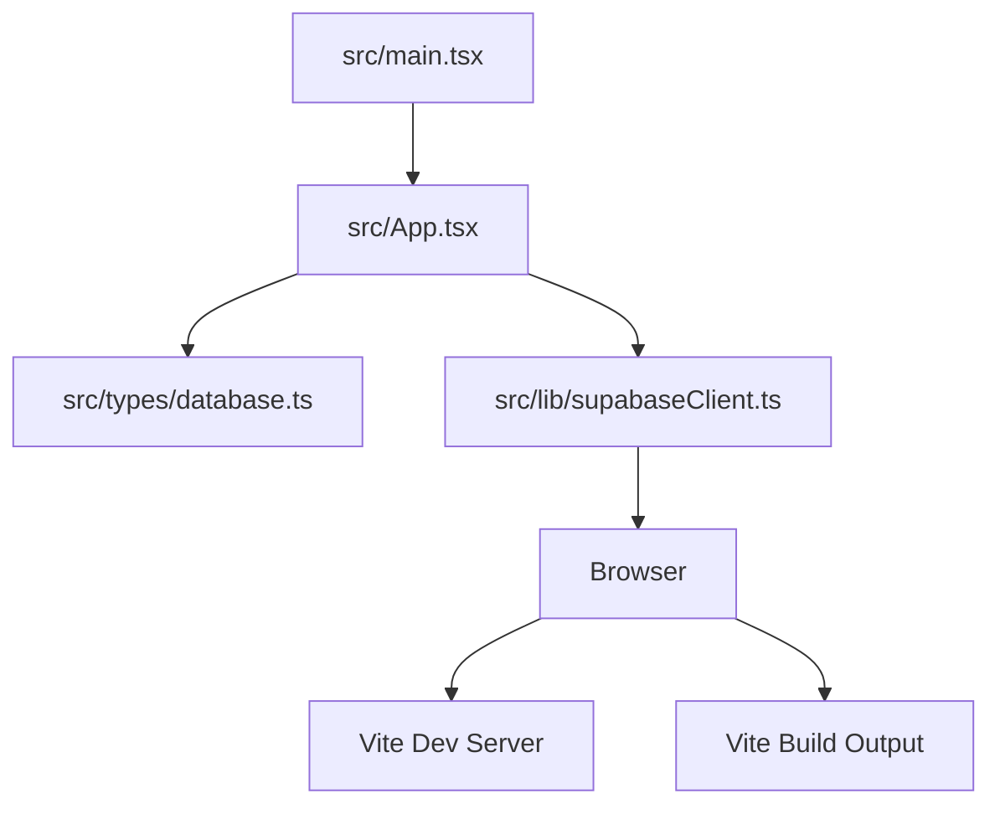
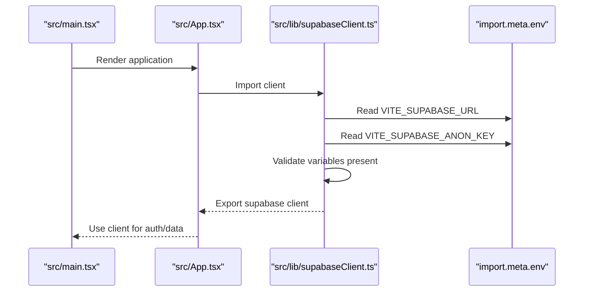
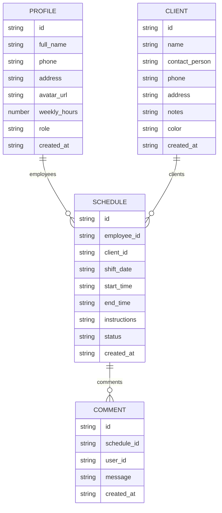
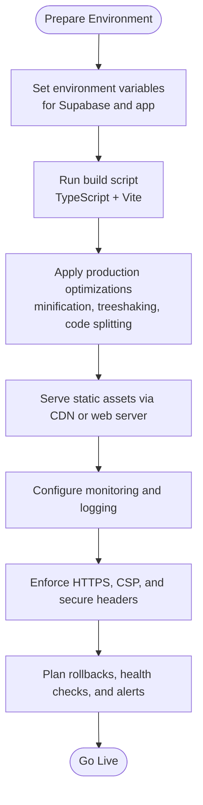
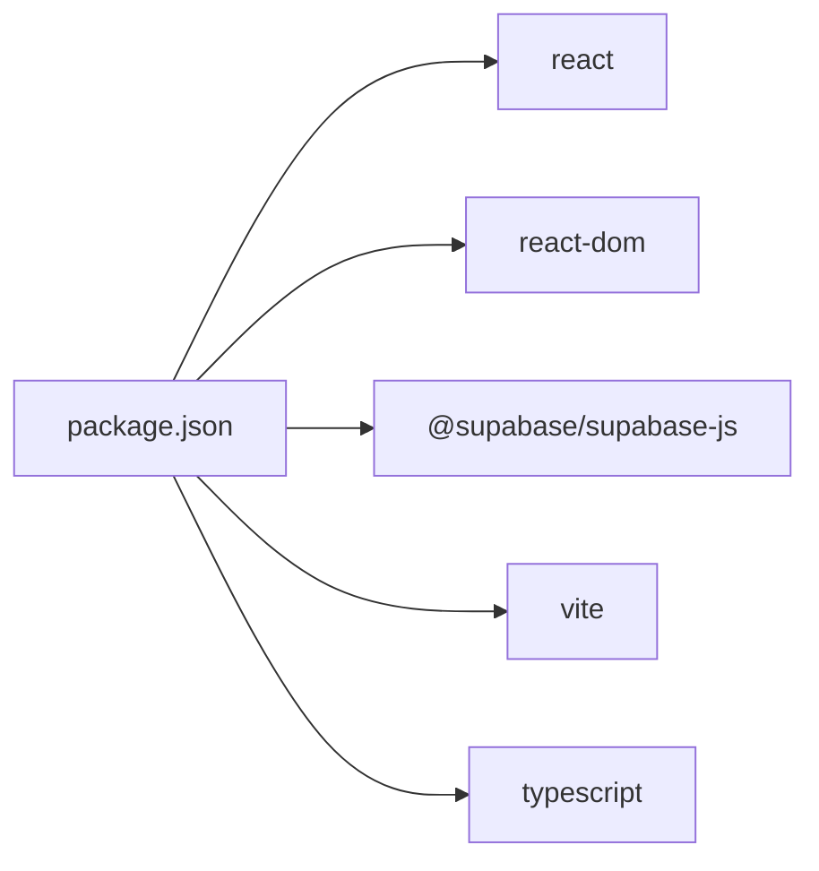

# Deployment and Production

<cite>
**Referenced Files in This Document**
- [package.json](file://package.json)
- [vite.config.ts](file://vite.config.ts)
- [tsconfig.json](file://tsconfig.json)
- [tsconfig.app.json](file://tsconfig.app.json)
- [tsconfig.node.json](file://tsconfig.node.json)
- [src/lib/supabaseClient.ts](file://src/lib/supabaseClient.ts)
- [src/types/database.ts](file://src/types/database.ts)
- [src/App.tsx](file://src/App.tsx)
- [src/main.tsx](file://src/main.tsx)
- [README.md](file://README.md)
</cite>

## Table of Contents
1. [Introduction](#introduction)
2. [Project Structure](#project-structure)
3. [Core Components](#core-components)
4. [Architecture Overview](#architecture-overview)
5. [Detailed Component Analysis](#detailed-component-analysis)
6. [Dependency Analysis](#dependency-analysis)
7. [Performance Considerations](#performance-considerations)
8. [Troubleshooting Guide](#troubleshooting-guide)
9. [Conclusion](#conclusion)
10. [Appendices](#appendices)

## Introduction
This document provides comprehensive deployment and production guidance for M_Sharif. It covers build configuration, environment variable setup, production deployment strategies, optimization of build outputs, environment-specific settings, hosting considerations, performance tuning, monitoring and maintenance, error tracking, production troubleshooting, and security best practices for live environments.

## Project Structure
M_Sharif is a React + TypeScript application built with Vite. The repository includes:
- Application source under src/
- Build tooling via Vite and TypeScript compiler
- Supabase client initialization and typed database models
- Minimal starter UI scaffolding

**Diagram sources**
- [src/main.tsx:1-11](file://src/main.tsx#L1-L11)
- [src/App.tsx:1-123](file://src/App.tsx#L1-L123)
- [src/types/database.ts:1-55](file://src/types/database.ts#L1-L55)
- [src/lib/supabaseClient.ts:1-14](file://src/lib/supabaseClient.ts#L1-L14)
- [package.json:1-32](file://package.json#L1-L32)
- [vite.config.ts:1-8](file://vite.config.ts#L1-L8)
- [tsconfig.app.json:1-26](file://tsconfig.app.json#L1-L26)
- [tsconfig.node.json:1-25](file://tsconfig.node.json#L1-L25)
- [tsconfig.json:1-8](file://tsconfig.json#L1-L8)

**Section sources**
- [package.json:1-32](file://package.json#L1-L32)
- [vite.config.ts:1-8](file://vite.config.ts#L1-L8)
- [tsconfig.json:1-8](file://tsconfig.json#L1-L8)
- [tsconfig.app.json:1-26](file://tsconfig.app.json#L1-L26)
- [tsconfig.node.json:1-25](file://tsconfig.node.json#L1-L25)
- [src/main.tsx:1-11](file://src/main.tsx#L1-L11)
- [src/App.tsx:1-123](file://src/App.tsx#L1-L123)
- [src/types/database.ts:1-55](file://src/types/database.ts#L1-L55)
- [src/lib/supabaseClient.ts:1-14](file://src/lib/supabaseClient.ts#L1-L14)

## Core Components
- Build and scripts: The project uses Vite for development and builds, with TypeScript compilation chained before building. Scripts include dev, build, lint, and preview.
- Runtime configuration: Environment variables are accessed via import.meta.env and are prefixed for Vite. Supabase client initialization requires VITE_SUPABASE_URL and VITE_SUPABASE_ANON_KEY.
- Type safety: Typed database interfaces define domain models for Profiles, Clients, Schedules, Comments, and AuthState.

Production readiness highlights:
- Ensure environment variables are present at build time for Vite to inject them into the client bundle.
- Verify TypeScript configuration targets modern JS environments suitable for bundlers.
- Confirm Supabase credentials are configured to avoid runtime errors during client initialization.

**Section sources**
- [package.json:6-11](file://package.json#L6-L11)
- [src/lib/supabaseClient.ts:3-13](file://src/lib/supabaseClient.ts#L3-L13)
- [tsconfig.app.json:2-22](file://tsconfig.app.json#L2-L22)
- [src/types/database.ts:1-55](file://src/types/database.ts#L1-L55)

## Architecture Overview
The runtime architecture centers on a React application bootstrapped by Vite. Supabase is initialized early in the app lifecycle and used throughout the UI. TypeScript types provide compile-time guarantees for data shapes.

**Diagram sources**
- [src/main.tsx:1-11](file://src/main.tsx#L1-L11)
- [src/App.tsx:1-123](file://src/App.tsx#L1-L123)
- [src/types/database.ts:1-55](file://src/types/database.ts#L1-L55)
- [src/lib/supabaseClient.ts:1-14](file://src/lib/supabaseClient.ts#L1-L14)

## Detailed Component Analysis

### Build and Toolchain
- Build command: The build script compiles TypeScript projects first, then runs Vite to produce optimized static assets.
- Vite configuration: Minimal plugin setup with React plugin enables JSX transform and fast refresh.
- TypeScript configuration: Separate app and node configs enable strict bundler-mode checks for both app and tooling code.

Optimization levers:
- Prefer modern target and module resolution settings for smaller bundles.
- Keep noEmit true for app config to rely on Vite’s inlining and tree-shaking.
- Use verbatimModuleSyntax and bundler moduleResolution to reduce bundling ambiguity.

**Section sources**
- [package.json:6-11](file://package.json#L6-L11)
- [vite.config.ts:1-8](file://vite.config.ts#L1-L8)
- [tsconfig.app.json:1-26](file://tsconfig.app.json#L1-L26)
- [tsconfig.node.json:1-25](file://tsconfig.node.json#L1-L25)
- [tsconfig.json:1-8](file://tsconfig.json#L1-L8)

### Environment Variables and Supabase Integration
Supabase client initialization reads Vite environment variables and validates their presence. Missing variables cause an immediate runtime error, preventing silent failures.

**Diagram sources**
- [src/main.tsx:1-11](file://src/main.tsx#L1-L11)
- [src/App.tsx:1-123](file://src/App.tsx#L1-L123)
- [src/lib/supabaseClient.ts:3-13](file://src/lib/supabaseClient.ts#L3-L13)

Operational guidance:
- Define VITE_SUPABASE_URL and VITE_SUPABASE_ANON_KEY in your environment prior to building.
- For production, supply these variables to the server serving the static assets so Vite can inject them at build time.

**Section sources**
- [src/lib/supabaseClient.ts:3-13](file://src/lib/supabaseClient.ts#L3-L13)

### Data Types and Domain Models
Typed interfaces describe Profiles, Clients, Schedules, Comments, and AuthState. These types inform UI rendering and client-side logic.

**Diagram sources**
- [src/types/database.ts:3-54](file://src/types/database.ts#L3-L54)

**Section sources**
- [src/types/database.ts:1-55](file://src/types/database.ts#L1-L55)

### Conceptual Overview
This section outlines production deployment steps conceptually, without mapping to specific files.

[No sources needed since this diagram shows conceptual workflow, not actual code structure]

## Dependency Analysis
Runtime and build dependencies are declared in package.json. The Supabase client is imported by the application code and used by UI components.

**Diagram sources**
- [package.json:12-30](file://package.json#L12-L30)

**Section sources**
- [package.json:12-30](file://package.json#L12-L30)

## Performance Considerations
- Target modern JS environments to benefit from native features and reduce polyfills.
- Keep TypeScript noEmit true and rely on Vite’s inlining and tree-shaking for smaller bundles.
- Use verbatimModuleSyntax and bundler moduleResolution to minimize bundling overhead.
- Leverage Vite’s built-in minification and code-splitting for production builds.
- Consider lazy-loading heavy routes/components to improve initial load times.

[No sources needed since this section provides general guidance]

## Troubleshooting Guide
Common production issues and resolutions:
- Missing Supabase environment variables: The Supabase client throws an error if required variables are missing. Ensure VITE_SUPABASE_URL and VITE_SUPABASE_ANON_KEY are set before building and deploying.
- Build-time environment injection: Confirm your hosting environment passes variables to Vite so they are embedded in the client bundle.
- Runtime errors: Use browser developer tools to inspect network requests to Supabase and verify response payloads align with typed models.

**Section sources**
- [src/lib/supabaseClient.ts:6-11](file://src/lib/supabaseClient.ts#L6-L11)

## Conclusion
M_Sharif is a lightweight React + TypeScript application powered by Vite. For production, focus on correct environment variable configuration, robust build and optimization, secure hosting, and proactive monitoring. The current codebase integrates Supabase early and relies on typed models, which simplifies correctness in production.

## Appendices

### A. Build and Preview Commands
- Development: Run the dev script to start the Vite dev server.
- Production build: Run the build script to compile TypeScript and produce optimized static assets.
- Preview: Use the preview script to serve the built assets locally for testing.

**Section sources**
- [package.json:6-11](file://package.json#L6-L11)

### B. Environment Variable Reference
- VITE_SUPABASE_URL: Supabase project URL.
- VITE_SUPABASE_ANON_KEY: Supabase anonymous public key.

Ensure these variables are present in the environment during build and runtime.

**Section sources**
- [src/lib/supabaseClient.ts:3-13](file://src/lib/supabaseClient.ts#L3-L13)

### C. Hosting Considerations
- Static hosting: Serve the dist directory produced by Vite from a CDN or static host.
- Base path: Configure base in Vite if deploying under a subpath.
- HTTPS: Enforce TLS termination at the edge or load balancer.
- Security headers: Add CSP, HSTS, and other security headers at the edge or via server configuration.

[No sources needed since this section provides general guidance]

### D. Monitoring and Maintenance
- Health checks: Expose a simple endpoint or rely on 200 OK from the index route.
- Logging: Capture client-side console logs and Supabase operation errors.
- Rollbacks: Keep previous builds available for quick rollback.
- Alerts: Monitor uptime, error rates, and latency thresholds.

[No sources needed since this section provides general guidance]

### E. Security Best Practices
- Secrets: Never embed private keys in client bundles; use VITE_ for public keys only.
- Transport: Enforce HTTPS and secure cookies if applicable.
- Content Security Policy: Restrict inline scripts and external resource loading.
- Dependencies: Regularly audit and update dependencies to mitigate vulnerabilities.

[No sources needed since this section provides general guidance]