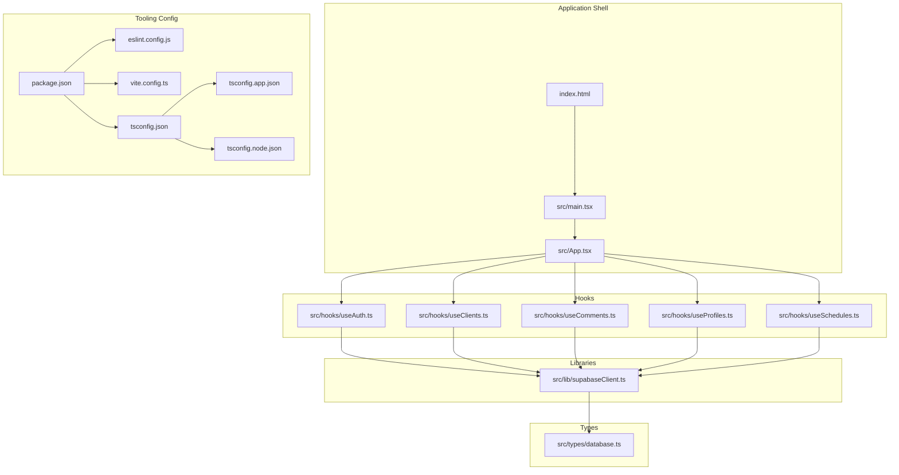
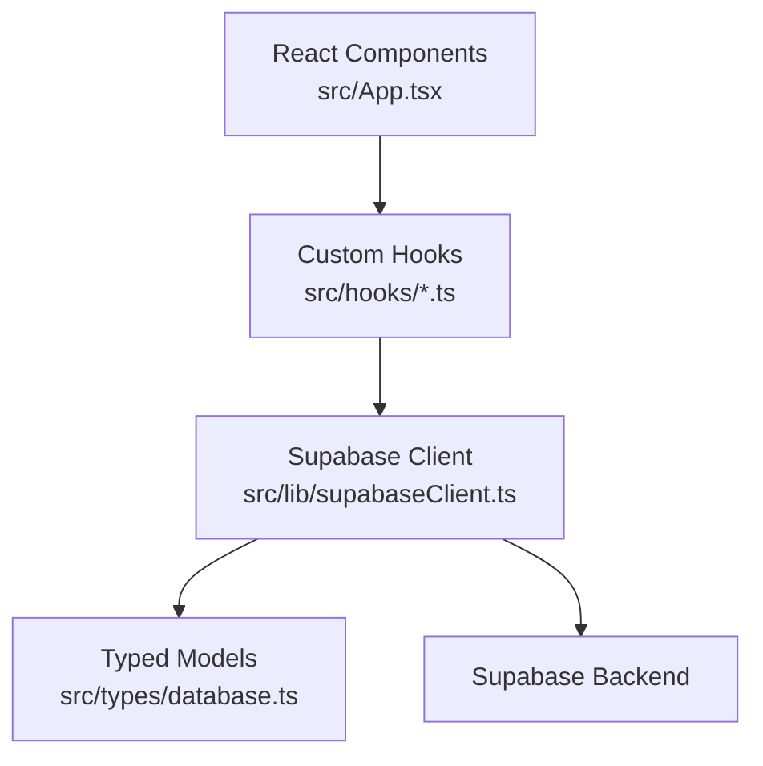
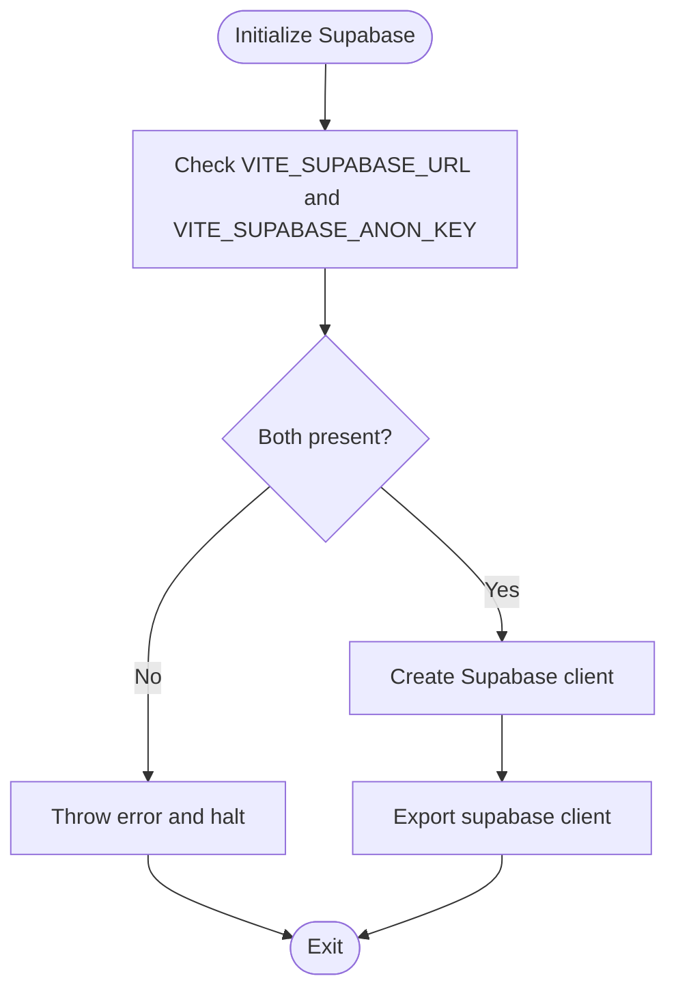
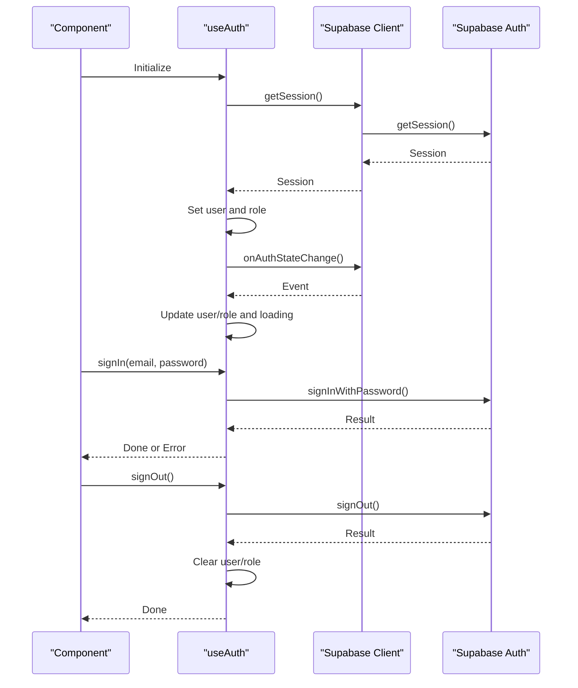
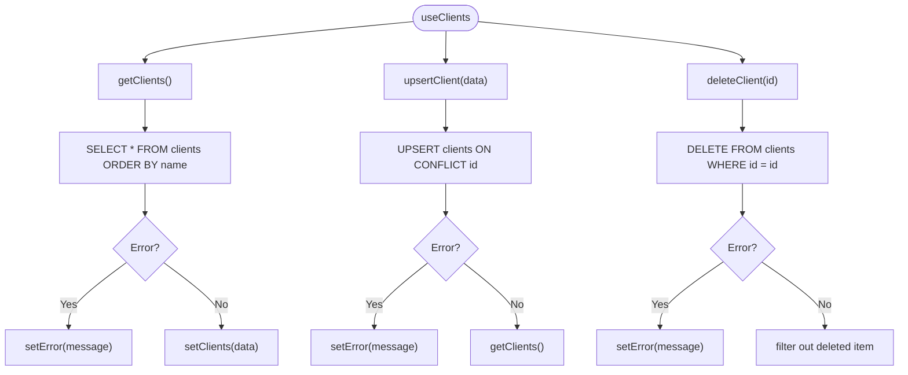
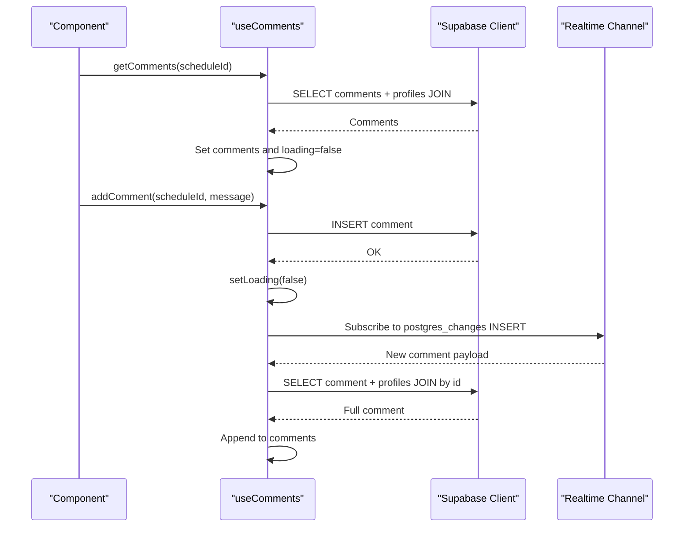
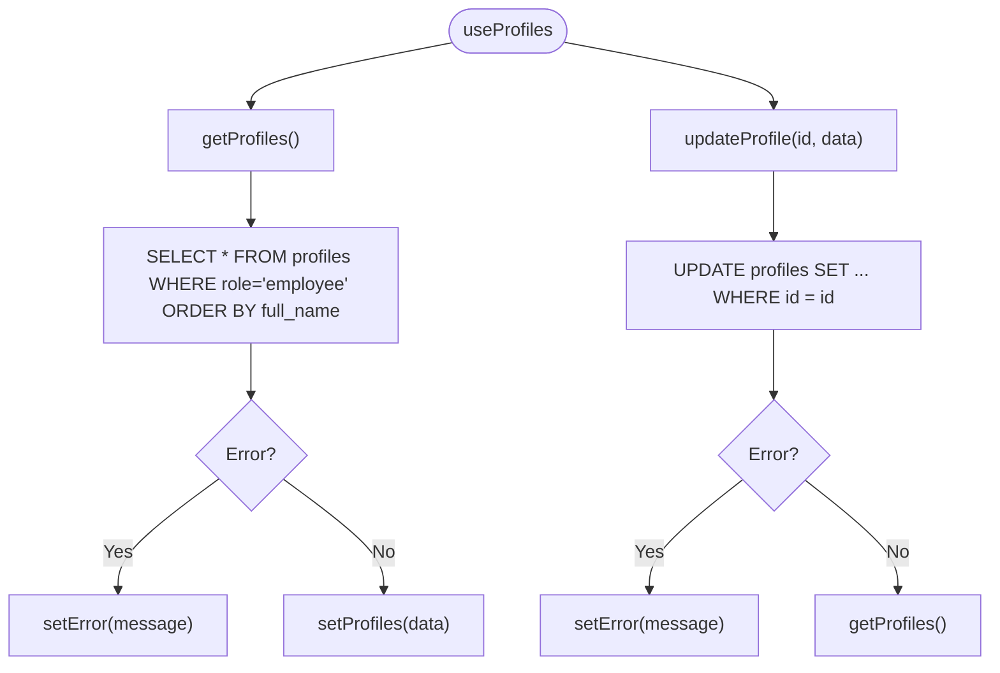
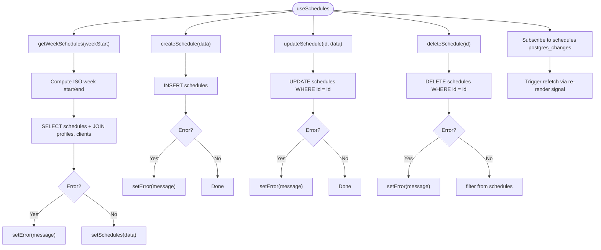
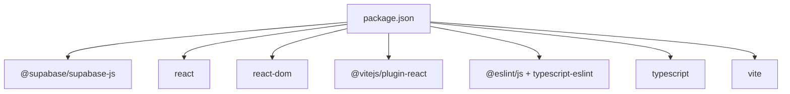

# Development Guidelines

<cite>
**Referenced Files in This Document**
- [package.json](file://package.json)
- [eslint.config.js](file://eslint.config.js)
- [vite.config.ts](file://vite.config.ts)
- [tsconfig.json](file://tsconfig.json)
- [tsconfig.app.json](file://tsconfig.app.json)
- [tsconfig.node.json](file://tsconfig.node.json)
- [README.md](file://README.md)
- [src/lib/supabaseClient.ts](file://src/lib/supabaseClient.ts)
- [src/types/database.ts](file://src/types/database.ts)
- [src/hooks/useAuth.ts](file://src/hooks/useAuth.ts)
- [src/hooks/useClients.ts](file://src/hooks/useClients.ts)
- [src/hooks/useComments.ts](file://src/hooks/useComments.ts)
- [src/hooks/useProfiles.ts](file://src/hooks/useProfiles.ts)
- [src/hooks/useSchedules.ts](file://src/hooks/useSchedules.ts)
- [src/App.tsx](file://src/App.tsx)
- [src/main.tsx](file://src/main.tsx)
- [index.html](file://index.html)
</cite>

## Table of Contents
1. [Introduction](#introduction)
2. [Project Structure](#project-structure)
3. [Core Components](#core-components)
4. [Architecture Overview](#architecture-overview)
5. [Detailed Component Analysis](#detailed-component-analysis)
6. [Dependency Analysis](#dependency-analysis)
7. [Performance Considerations](#performance-considerations)
8. [Testing Strategies](#testing-strategies)
9. [Debugging Strategies](#debugging-strategies)
10. [Code Quality Practices](#code-quality-practices)
11. [Contributing Guidelines](#contributing-guidelines)
12. [Conclusion](#conclusion)

## Introduction
This document provides comprehensive development guidelines for the M_Sharif project. It covers code organization principles, component development patterns, testing strategies, and configuration for ESLint, TypeScript, and Vite. It also documents React and Supabase integration best practices, performance optimization techniques, debugging strategies, and contribution guidelines to maintain consistency across the codebase.

## Project Structure
The project follows a feature-based layout with clear separation of concerns:
- src/lib: Shared client initialization and utilities (Supabase client)
- src/hooks: Custom React hooks encapsulating data fetching, mutations, and real-time subscriptions
- src/types: TypeScript type definitions aligned with the Supabase schema
- src/assets, src/App.tsx, src/main.tsx, index.html: Minimal React application shell
- Configuration files at the repository root define tooling and build settings

**Diagram sources**
- [index.html:1-14](file://index.html#L1-L14)
- [src/main.tsx:1-11](file://src/main.tsx#L1-L11)
- [src/App.tsx:1-123](file://src/App.tsx#L1-L123)
- [src/lib/supabaseClient.ts:1-14](file://src/lib/supabaseClient.ts#L1-L14)
- [src/hooks/useAuth.ts:1-81](file://src/hooks/useAuth.ts#L1-L81)
- [src/hooks/useClients.ts:1-74](file://src/hooks/useClients.ts#L1-L74)
- [src/hooks/useComments.ts:1-113](file://src/hooks/useComments.ts#L1-L113)
- [src/hooks/useProfiles.ts:1-63](file://src/hooks/useProfiles.ts#L1-L63)
- [src/hooks/useSchedules.ts:1-153](file://src/hooks/useSchedules.ts#L1-L153)
- [src/types/database.ts:1-55](file://src/types/database.ts#L1-L55)
- [package.json:1-32](file://package.json#L1-L32)
- [eslint.config.js:1-23](file://eslint.config.js#L1-L23)
- [vite.config.ts:1-8](file://vite.config.ts#L1-L8)
- [tsconfig.json:1-8](file://tsconfig.json#L1-L8)
- [tsconfig.app.json:1-26](file://tsconfig.app.json#L1-L26)
- [tsconfig.node.json:1-25](file://tsconfig.node.json#L1-L25)

**Section sources**
- [package.json:1-32](file://package.json#L1-L32)
- [tsconfig.json:1-8](file://tsconfig.json#L1-L8)
- [vite.config.ts:1-8](file://vite.config.ts#L1-L8)
- [eslint.config.js:1-23](file://eslint.config.js#L1-L23)
- [src/main.tsx:1-11](file://src/main.tsx#L1-L11)
- [src/App.tsx:1-123](file://src/App.tsx#L1-L123)
- [index.html:1-14](file://index.html#L1-L14)

## Core Components
This section outlines the foundational building blocks and patterns used across the application.

- Supabase client initialization
  - Centralized client creation with environment variable validation
  - Exported singleton for use across hooks and components
  - Reference: [src/lib/supabaseClient.ts:1-14](file://src/lib/supabaseClient.ts#L1-L14)

- TypeScript type definitions
  - Strongly typed domain models for profiles, clients, schedules, comments, and auth state
  - Used consistently in hooks and components to enforce correctness
  - Reference: [src/types/database.ts:1-55](file://src/types/database.ts#L1-L55)

- Custom React hooks
  - Encapsulate CRUD operations, loading/error states, and real-time updates
  - Provide a consistent API surface for consumers
  - References:
    - [src/hooks/useAuth.ts:1-81](file://src/hooks/useAuth.ts#L1-L81)
    - [src/hooks/useClients.ts:1-74](file://src/hooks/useClients.ts#L1-L74)
    - [src/hooks/useComments.ts:1-113](file://src/hooks/useComments.ts#L1-L113)
    - [src/hooks/useProfiles.ts:1-63](file://src/hooks/useProfiles.ts#L1-L63)
    - [src/hooks/useSchedules.ts:1-153](file://src/hooks/useSchedules.ts#L1-L153)

- Application shell
  - Minimal React app bootstrapped via root element
  - References:
    - [src/main.tsx:1-11](file://src/main.tsx#L1-L11)
    - [index.html:1-14](file://index.html#L1-L14)

**Section sources**
- [src/lib/supabaseClient.ts:1-14](file://src/lib/supabaseClient.ts#L1-L14)
- [src/types/database.ts:1-55](file://src/types/database.ts#L1-L55)
- [src/hooks/useAuth.ts:1-81](file://src/hooks/useAuth.ts#L1-L81)
- [src/hooks/useClients.ts:1-74](file://src/hooks/useClients.ts#L1-L74)
- [src/hooks/useComments.ts:1-113](file://src/hooks/useComments.ts#L1-L113)
- [src/hooks/useProfiles.ts:1-63](file://src/hooks/useProfiles.ts#L1-L63)
- [src/hooks/useSchedules.ts:1-153](file://src/hooks/useSchedules.ts#L1-L153)
- [src/main.tsx:1-11](file://src/main.tsx#L1-L11)
- [index.html:1-14](file://index.html#L1-L14)

## Architecture Overview
The application follows a layered architecture:
- Presentation layer: React components render UI and orchestrate hook usage
- Domain layer: Custom hooks encapsulate business logic and data operations
- Data access layer: Supabase client handles authentication, queries, mutations, and real-time channels
- Type system: TypeScript types mirror the database schema for compile-time safety

**Diagram sources**
- [src/App.tsx:1-123](file://src/App.tsx#L1-L123)
- [src/hooks/useAuth.ts:1-81](file://src/hooks/useAuth.ts#L1-L81)
- [src/hooks/useClients.ts:1-74](file://src/hooks/useClients.ts#L1-L74)
- [src/hooks/useComments.ts:1-113](file://src/hooks/useComments.ts#L1-L113)
- [src/hooks/useProfiles.ts:1-63](file://src/hooks/useProfiles.ts#L1-L63)
- [src/hooks/useSchedules.ts:1-153](file://src/hooks/useSchedules.ts#L1-L153)
- [src/lib/supabaseClient.ts:1-14](file://src/lib/supabaseClient.ts#L1-L14)
- [src/types/database.ts:1-55](file://src/types/database.ts#L1-L55)

## Detailed Component Analysis

### Supabase Client Initialization
- Validates required environment variables at startup
- Creates a single Supabase client instance for the app
- Exports the client for consumption by hooks and services

**Diagram sources**
- [src/lib/supabaseClient.ts:1-14](file://src/lib/supabaseClient.ts#L1-L14)

**Section sources**
- [src/lib/supabaseClient.ts:1-14](file://src/lib/supabaseClient.ts#L1-L14)

### Authentication Hook (useAuth)
- Manages user session lifecycle and role resolution
- Subscribes to auth state changes and updates local state accordingly
- Provides sign-in, sign-out, and current user retrieval utilities

**Diagram sources**
- [src/hooks/useAuth.ts:1-81](file://src/hooks/useAuth.ts#L1-L81)
- [src/lib/supabaseClient.ts:1-14](file://src/lib/supabaseClient.ts#L1-L14)

**Section sources**
- [src/hooks/useAuth.ts:1-81](file://src/hooks/useAuth.ts#L1-L81)

### Clients Management Hook (useClients)
- Loads clients with ordering and error handling
- Upserts clients with conflict resolution
- Deletes clients and updates the local list

**Diagram sources**
- [src/hooks/useClients.ts:1-74](file://src/hooks/useClients.ts#L1-L74)
- [src/lib/supabaseClient.ts:1-14](file://src/lib/supabaseClient.ts#L1-L14)

**Section sources**
- [src/hooks/useClients.ts:1-74](file://src/hooks/useClients.ts#L1-L74)

### Comments Management Hook (useComments)
- Loads comments with joined profile data and orders by creation time
- Adds comments and leverages real-time channel for live updates
- Manages channel lifecycle and cleanup

**Diagram sources**
- [src/hooks/useComments.ts:1-113](file://src/hooks/useComments.ts#L1-L113)
- [src/lib/supabaseClient.ts:1-14](file://src/lib/supabaseClient.ts#L1-L14)

**Section sources**
- [src/hooks/useComments.ts:1-113](file://src/hooks/useComments.ts#L1-L113)

### Profiles Management Hook (useProfiles)
- Retrieves employees by role and sorts by full name
- Updates profile attributes and refreshes the list

**Diagram sources**
- [src/hooks/useProfiles.ts:1-63](file://src/hooks/useProfiles.ts#L1-L63)
- [src/lib/supabaseClient.ts:1-14](file://src/lib/supabaseClient.ts#L1-L14)

**Section sources**
- [src/hooks/useProfiles.ts:1-63](file://src/hooks/useProfiles.ts#L1-L63)

### Schedules Management Hook (useSchedules)
- Computes ISO week boundaries and fetches schedules within the range
- Supports create, update, delete operations
- Subscribes to real-time changes and triggers refetch signals

**Diagram sources**
- [src/hooks/useSchedules.ts:1-153](file://src/hooks/useSchedules.ts#L1-L153)
- [src/lib/supabaseClient.ts:1-14](file://src/lib/supabaseClient.ts#L1-L14)

**Section sources**
- [src/hooks/useSchedules.ts:1-153](file://src/hooks/useSchedules.ts#L1-L153)

## Dependency Analysis
The project relies on a focused set of libraries and tooling configured via npm scripts and configuration files.

**Diagram sources**
- [package.json:1-32](file://package.json#L1-L32)

**Section sources**
- [package.json:1-32](file://package.json#L1-L32)

## Performance Considerations
- Prefer real-time subscriptions for live updates to avoid polling overhead
- Use targeted queries with appropriate filters and joins to minimize payload sizes
- Debounce or batch UI interactions that trigger frequent network requests
- Keep component state minimal and derived from hooks to reduce unnecessary renders
- Leverage Vite’s fast refresh and bundler mode for efficient development builds

## Testing Strategies
- Unit tests for hooks: Mock Supabase client methods and assert state transitions and error handling
- Component tests: Render components under test and simulate user interactions; verify UI updates and data fetching
- Integration tests: Verify end-to-end flows using a test Supabase project or mock backend
- Snapshot tests: Capture UI snapshots for regression detection
- Test coverage: Aim for high coverage in critical business logic and hooks

## Debugging Strategies
- Enable browser devtools and network tab to inspect Supabase requests and responses
- Add logging around hook lifecycles and real-time events to trace state changes
- Validate environment variables during client initialization to catch misconfiguration early
- Use strict TypeScript settings to catch type-related issues at compile time

## Code Quality Practices
- Naming conventions
  - Hooks: useCamelCase prefixed with "use" (e.g., useAuth, useSchedules)
  - Types: PascalCase for interfaces (e.g., Profile, Schedule)
  - Variables: camelCase for local variables and parameters
- Code organization
  - Group related hooks in separate files under src/hooks
  - Centralize shared utilities in src/lib
  - Define domain types in src/types
- Error handling
  - Surface errors via dedicated state fields and log messages
  - Fail fast on invalid environment configuration
- TypeScript usage
  - Enable strict type checking and unused member warnings
  - Use mapped types and generics to derive parameter types from schema models
- ESLint configuration
  - Recommended base rules plus React hooks and React refresh plugins
  - Extend with type-aware rules for production-grade codebases

## Contributing Guidelines
- Branching strategy
  - Feature branches per task; keep commits small and focused
- Pull requests
  - Include a summary of changes, rationale, and testing performed
  - Ensure linting and build pass locally before opening PRs
- Code review
  - Focus on correctness, readability, and adherence to established patterns
- Environment setup
  - Provide clear instructions for setting environment variables and seeding data if applicable

## Conclusion
These guidelines establish a consistent foundation for building features, integrating Supabase, and maintaining high code quality. By following the patterns outlined here—strong typing, modular hooks, real-time subscriptions, and disciplined tooling—you can develop scalable and maintainable enhancements to the M_Sharif application.