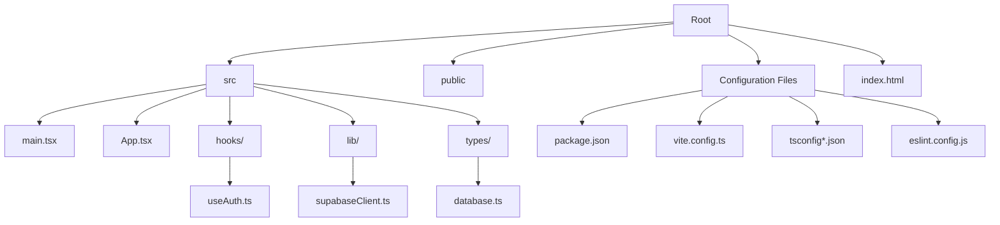

# Getting Started

<cite>
**Referenced Files in This Document**
- [package.json](file://package.json)
- [README.md](file://README.md)
- [vite.config.ts](file://vite.config.ts)
- [index.html](file://index.html)
- [src/main.tsx](file://src/main.tsx)
- [src/App.tsx](file://src/App.tsx)
- [src/lib/supabaseClient.ts](file://src/lib/supabaseClient.ts)
- [src/hooks/useAuth.ts](file://src/hooks/useAuth.ts)
- [src/types/database.ts](file://src/types/database.ts)
- [tsconfig.json](file://tsconfig.json)
- [tsconfig.app.json](file://tsconfig.app.json)
- [tsconfig.node.json](file://tsconfig.node.json)
- [eslint.config.js](file://eslint.config.js)
</cite>

## Table of Contents
1. [Introduction](#introduction)
2. [Prerequisites](#prerequisites)
3. [Installation](#installation)
4. [Environment Setup](#environment-setup)
5. [Initial Configuration](#initial-configuration)
6. [Development Workflow](#development-workflow)
7. [Project Structure](#project-structure)
8. [Basic Usage Examples](#basic-usage-examples)
9. [Verification Steps](#verification-steps)
10. [Troubleshooting Guide](#troubleshooting-guide)
11. [Conclusion](#conclusion)

## Introduction
This guide helps you quickly set up and run the M_Sharif application locally. It covers prerequisites, installation, environment configuration, development server startup, build commands, and basic usage. The project is a React + TypeScript + Vite application with Supabase integration for authentication and data access.

## Prerequisites
- Node.js: Ensure you have Node.js installed. The project uses modern JavaScript/TypeScript features and requires a recent LTS version compatible with the specified toolchain.
- npm: The project uses npm scripts for development and build tasks.

These requirements align with the project’s configuration and toolchain.

**Section sources**
- [package.json:1-32](file://package.json#L1-L32)
- [tsconfig.app.json:1-26](file://tsconfig.app.json#L1-L26)
- [tsconfig.node.json:1-25](file://tsconfig.node.json#L1-L25)

## Installation
Follow these steps to install dependencies and prepare your local environment:

1. Install dependencies
   - Run the package manager install command in the project root directory to install all declared dependencies and devDependencies.

2. Verify installation
   - Confirm that node_modules is created and package-lock.json exists after installation.

This ensures your environment has all required packages for development and building.

**Section sources**
- [package.json:12-30](file://package.json#L12-L30)

## Environment Setup
The application integrates with Supabase for authentication and data access. Configure the following environment variables:

- VITE_SUPABASE_URL: Your Supabase project URL.
- VITE_SUPABASE_ANON_KEY: Your Supabase project anonymous key.

These variables are required for initializing the Supabase client. The application enforces their presence at runtime.

Notes:
- Store these variables in a local environment file (for example, a .env file) recognized by Vite.
- Ensure the variable names match exactly what the application expects.

**Section sources**
- [src/lib/supabaseClient.ts:3-11](file://src/lib/supabaseClient.ts#L3-L11)

## Initial Configuration
Configure your development environment with the following files:

- Vite configuration: Defines the React plugin and serves the app during development.
- TypeScript configuration: Separate configurations for application code and Node tooling.
- ESLint configuration: Provides recommended linting rules for TypeScript and React.

Key configuration highlights:
- Vite plugin: React plugin is enabled for fast refresh and JSX support.
- TypeScript: Bundler module resolution and JSX transform are configured for modern builds.
- ESLint: Recommended rules for TypeScript, React Hooks, and React Refresh are applied.

**Section sources**
- [vite.config.ts:1-8](file://vite.config.ts#L1-L8)
- [tsconfig.json:1-8](file://tsconfig.json#L1-L8)
- [tsconfig.app.json:1-26](file://tsconfig.app.json#L1-L26)
- [tsconfig.node.json:1-25](file://tsconfig.node.json#L1-L25)
- [eslint.config.js:1-23](file://eslint.config.js#L1-L23)

## Development Workflow
Start the development server and work on the application:

1. Start the development server
   - Use the dev script to launch Vite’s development server with hot module replacement (HMR).

2. Open the app
   - The browser will open automatically to the development URL shown in the terminal.

3. Make changes
   - Edit files under src. Changes are reflected immediately due to HMR.

4. Preview production build
   - Use the preview script to serve the production build locally for testing.

5. Lint your code
   - Use the lint script to run ESLint checks across the project.

6. Build for production
   - Use the build script to compile TypeScript and bundle the application.

**Section sources**
- [package.json:6-11](file://package.json#L6-L11)
- [README.md:1-74](file://README.md#L1-L74)

## Project Structure
The project follows a conventional React + TypeScript + Vite layout:

- Root-level configuration files define scripts, dependencies, TypeScript targets, and ESLint rules.
- src contains the application entry point, main React component, styles, hooks, Supabase client, and TypeScript type definitions.
- public contains static assets referenced by the HTML shell.
- index.html is the single-page application shell that mounts the React root.

High-level structure overview:

**Diagram sources**
- [package.json:1-32](file://package.json#L1-L32)
- [vite.config.ts:1-8](file://vite.config.ts#L1-L8)
- [tsconfig.json:1-8](file://tsconfig.json#L1-L8)
- [eslint.config.js:1-23](file://eslint.config.js#L1-L23)
- [index.html:1-14](file://index.html#L1-L14)
- [src/main.tsx:1-11](file://src/main.tsx#L1-L11)
- [src/App.tsx:1-123](file://src/App.tsx#L1-L123)
- [src/lib/supabaseClient.ts:1-14](file://src/lib/supabaseClient.ts#L1-L14)
- [src/hooks/useAuth.ts:1-81](file://src/hooks/useAuth.ts#L1-L81)
- [src/types/database.ts:1-55](file://src/types/database.ts#L1-L55)

**Section sources**
- [index.html:1-14](file://index.html#L1-L14)
- [src/main.tsx:1-11](file://src/main.tsx#L1-L11)
- [src/App.tsx:1-123](file://src/App.tsx#L1-L123)

## Basic Usage Examples
Explore the application’s core components and integrations:

- Application entry and rendering
  - The React root is mounted in main.tsx and renders the App component.
  - The App component displays a welcome area and links to documentation resources.

- Supabase integration
  - The Supabase client is initialized using environment variables and exposed for use across the app.
  - Authentication hooks manage user sessions, roles, and state changes.

- Type definitions
  - Strongly typed interfaces for profiles, clients, schedules, comments, and auth state are defined for type-safe development.

Example references:
- Mounting the root: [src/main.tsx:6-10](file://src/main.tsx#L6-L10)
- App component rendering: [src/App.tsx:10-31](file://src/App.tsx#L10-L31)
- Supabase client initialization: [src/lib/supabaseClient.ts:3-13](file://src/lib/supabaseClient.ts#L3-L13)
- Authentication hook: [src/hooks/useAuth.ts:15-80](file://src/hooks/useAuth.ts#L15-L80)
- Database types: [src/types/database.ts:3-54](file://src/types/database.ts#L3-L54)

**Section sources**
- [src/main.tsx:1-11](file://src/main.tsx#L1-L11)
- [src/App.tsx:1-123](file://src/App.tsx#L1-L123)
- [src/lib/supabaseClient.ts:1-14](file://src/lib/supabaseClient.ts#L1-L14)
- [src/hooks/useAuth.ts:1-81](file://src/hooks/useAuth.ts#L1-L81)
- [src/types/database.ts:1-55](file://src/types/database.ts#L1-L55)

## Verification Steps
Confirm your installation and environment are ready:

1. Check dependencies
   - Ensure node_modules exists and contains the expected packages.

2. Verify environment variables
   - Confirm VITE_SUPABASE_URL and VITE_SUPABASE_ANON_KEY are present and valid.

3. Start the development server
   - Run the dev script and verify the browser opens to the development URL.

4. Test hot module replacement
   - Edit src/App.tsx and save to confirm changes appear instantly.

5. Build preview
   - Run the preview script to serve the production build locally.

6. Lint verification
   - Run the lint script to ensure code quality checks pass.

7. TypeScript compilation
   - Confirm TypeScript compiles without errors using the build script.

**Section sources**
- [package.json:6-11](file://package.json#L6-L11)
- [src/lib/supabaseClient.ts:3-11](file://src/lib/supabaseClient.ts#L3-L11)

## Troubleshooting Guide
Common setup and runtime issues:

- Missing Supabase environment variables
  - Symptom: Application fails to initialize Supabase client at startup.
  - Fix: Set VITE_SUPABASE_URL and VITE_SUPABASE_ANON_KEY in your environment file and restart the dev server.

- Port conflicts during development
  - Symptom: Dev server fails to start due to port binding issues.
  - Fix: Change the port in Vite configuration or stop the conflicting service.

- Node.js version compatibility
  - Symptom: Build errors or unexpected behavior with older Node.js versions.
  - Fix: Upgrade to a supported LTS version aligned with the project’s toolchain.

- TypeScript errors blocking build
  - Symptom: Build fails due to type errors.
  - Fix: Address reported type issues in src files or adjust tsconfig settings as needed.

- ESLint errors during development
  - Symptom: Lint warnings or errors prevent smooth development.
  - Fix: Run the lint script and resolve reported issues according to the configured rules.

- Missing assets or icons
  - Symptom: Images or SVG icons do not render.
  - Fix: Verify asset paths in components and ensure assets are placed under public or imported correctly in src/assets.

**Section sources**
- [src/lib/supabaseClient.ts:6-11](file://src/lib/supabaseClient.ts#L6-L11)
- [vite.config.ts:5-7](file://vite.config.ts#L5-L7)
- [tsconfig.app.json:4-22](file://tsconfig.app.json#L4-L22)
- [eslint.config.js:8-22](file://eslint.config.js#L8-L22)

## Conclusion
You now have the essentials to install, configure, and run M_Sharif locally. Use the development server for rapid iteration, the build command for production bundles, and the preview command to validate deployments. Keep environment variables secure and up-to-date, and leverage the included linting and TypeScript configurations for a smooth development experience.