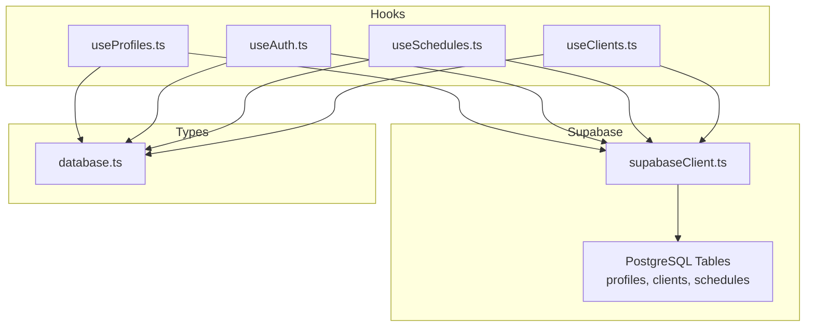
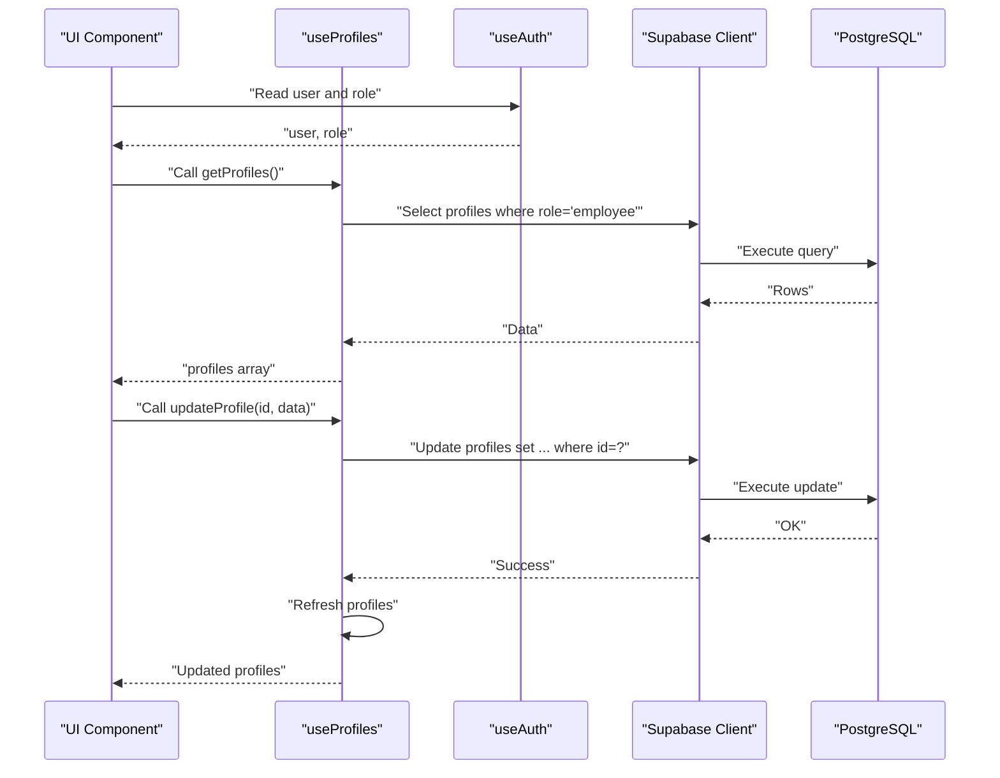
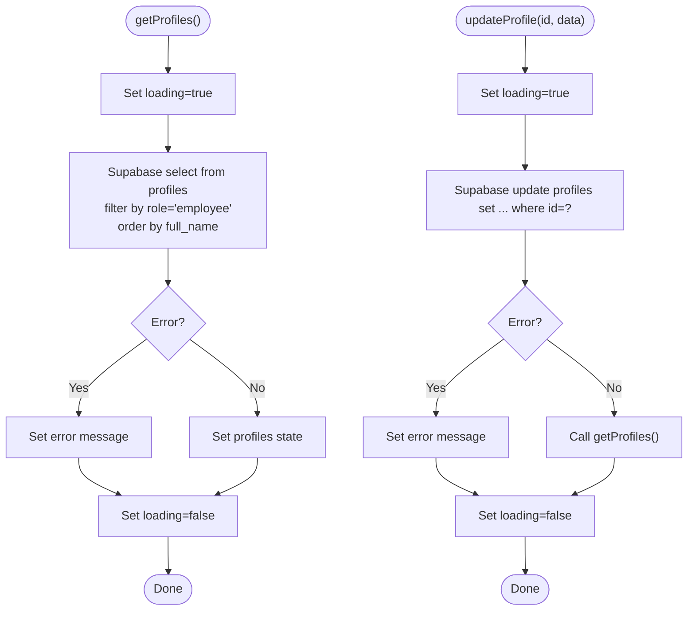
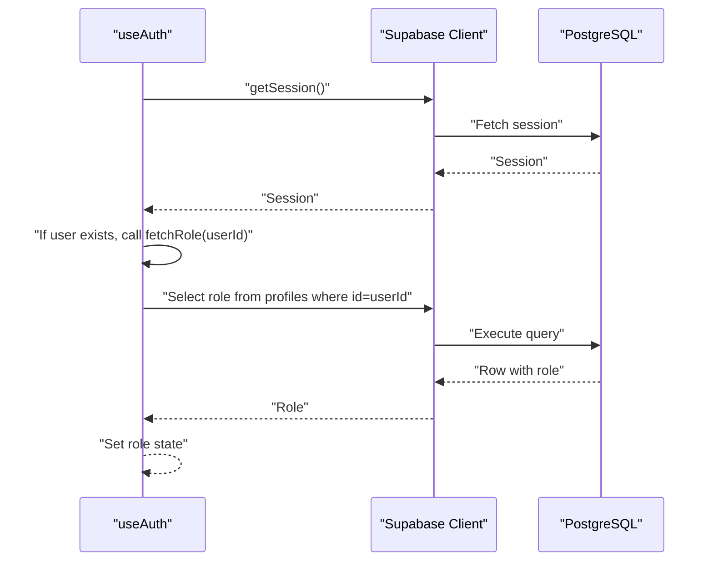
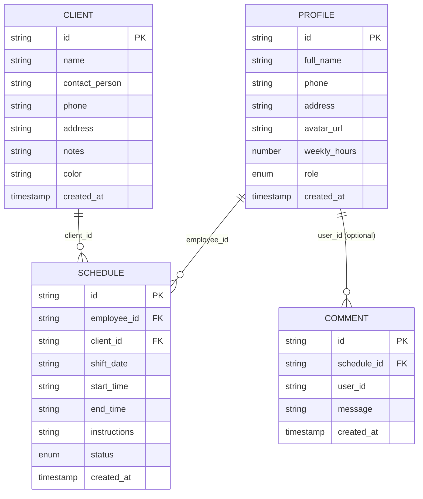
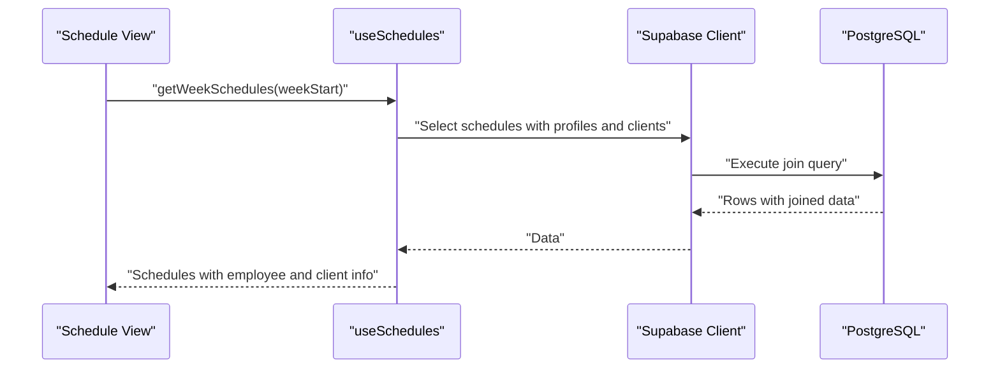
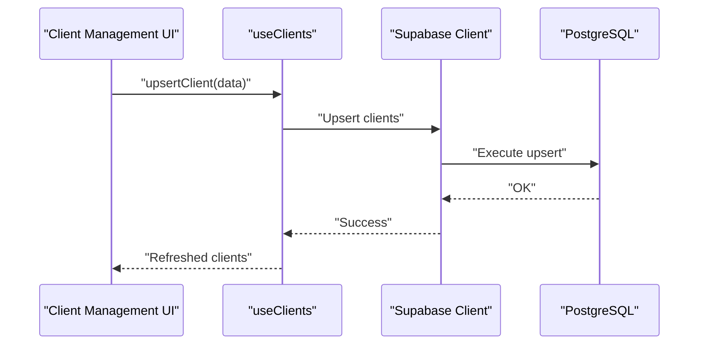
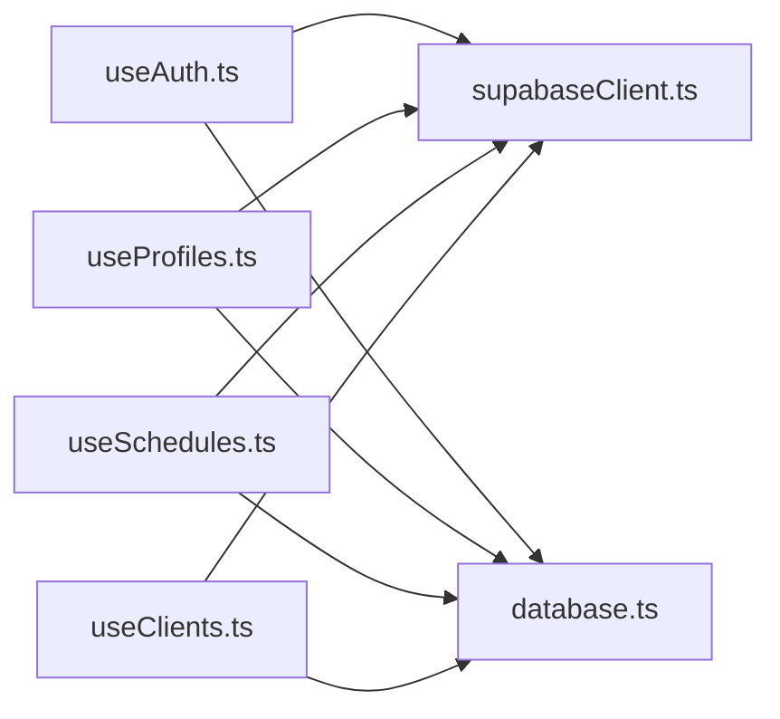

# Profile Management

<cite>
**Referenced Files in This Document**
- [useProfiles.ts](file://src/hooks/useProfiles.ts)
- [useAuth.ts](file://src/hooks/useAuth.ts)
- [supabaseClient.ts](file://src/lib/supabaseClient.ts)
- [database.ts](file://src/types/database.ts)
- [useSchedules.ts](file://src/hooks/useSchedules.ts)
- [useClients.ts](file://src/hooks/useClients.ts)
</cite>

## Table of Contents
1. [Introduction](#introduction)
2. [Project Structure](#project-structure)
3. [Core Components](#core-components)
4. [Architecture Overview](#architecture-overview)
5. [Detailed Component Analysis](#detailed-component-analysis)
6. [Dependency Analysis](#dependency-analysis)
7. [Performance Considerations](#performance-considerations)
8. [Troubleshooting Guide](#troubleshooting-guide)
9. [Conclusion](#conclusion)

## Introduction
This document explains the profile management system, focusing on employee profile editing, profile information display, and role-based permissions. It documents the useProfiles hook implementation, profile data operations, and integration with authentication. It also covers relationships with scheduling assignments and client management, along with profile data validation, security considerations, and user privacy controls.

## Project Structure
The profile management system is implemented as a React hook that integrates with Supabase for data persistence and authentication. The key elements are:
- useProfiles: Fetches and updates employee profiles
- useAuth: Provides authentication state and role resolution
- supabaseClient: Initializes the Supabase client
- database types: Define the Profile, Client, Schedule, and Comment data models
- Related integrations: useSchedules and useClients for scheduling and client management

**Diagram sources**
- [useProfiles.ts:1-63](file://src/hooks/useProfiles.ts#L1-L63)
- [useAuth.ts:1-81](file://src/hooks/useAuth.ts#L1-L81)
- [supabaseClient.ts:1-14](file://src/lib/supabaseClient.ts#L1-L14)
- [database.ts:1-55](file://src/types/database.ts#L1-L55)
- [useSchedules.ts:1-153](file://src/hooks/useSchedules.ts#L1-L153)
- [useClients.ts:1-74](file://src/hooks/useClients.ts#L1-L74)

**Section sources**
- [useProfiles.ts:1-63](file://src/hooks/useProfiles.ts#L1-L63)
- [useAuth.ts:1-81](file://src/hooks/useAuth.ts#L1-L81)
- [supabaseClient.ts:1-14](file://src/lib/supabaseClient.ts#L1-L14)
- [database.ts:1-55](file://src/types/database.ts#L1-L55)
- [useSchedules.ts:1-153](file://src/hooks/useSchedules.ts#L1-L153)
- [useClients.ts:1-74](file://src/hooks/useClients.ts#L1-L74)

## Core Components
- useProfiles
  - Purpose: Centralized CRUD for employee profiles
  - Key operations:
    - getProfiles: Fetches all employees ordered by full_name
    - updateProfile: Updates a profile by id
  - Data model: Uses Profile interface from database types
  - Persistence: Uses Supabase client initialized in supabaseClient
- useAuth
  - Purpose: Authentication state and role resolution
  - Key operations:
    - getCurrentUser: Retrieves current user session
    - signIn/signOut: Handles login/logout
    - Role resolution: Reads role from profiles table using user id
  - Persistence: Uses Supabase auth and profiles table
- supabaseClient
  - Purpose: Creates and exports the Supabase client instance
  - Validation: Ensures environment variables are present
- database types
  - Purpose: Defines Profile, Client, Schedule, Comment, and AuthState interfaces
  - Relationships:
    - Schedule.employee_id references Profile.id
    - Schedule.client_id references Client.id
    - Comment.schedule_id references Schedule.id and optionally joins Profile for author metadata

**Section sources**
- [useProfiles.ts:16-62](file://src/hooks/useProfiles.ts#L16-L62)
- [useAuth.ts:15-79](file://src/hooks/useAuth.ts#L15-L79)
- [supabaseClient.ts:1-14](file://src/lib/supabaseClient.ts#L1-L14)
- [database.ts:3-48](file://src/types/database.ts#L3-L48)

## Architecture Overview
The profile management system follows a clean separation of concerns:
- Hooks encapsulate data fetching and mutations
- Supabase client abstracts database connectivity
- Types define data contracts and relationships
- Authentication state drives role-based permissions

**Diagram sources**
- [useProfiles.ts:21-59](file://src/hooks/useProfiles.ts#L21-L59)
- [useAuth.ts:29-49](file://src/hooks/useAuth.ts#L29-L49)
- [supabaseClient.ts:1-14](file://src/lib/supabaseClient.ts#L1-L14)
- [database.ts:3-12](file://src/types/database.ts#L3-L12)

## Detailed Component Analysis

### useProfiles Hook
- Responsibilities
  - Load employee profiles with role filtering
  - Update profile attributes
  - Manage loading and error states
- Implementation highlights
  - Filtering by role ensures only employees are listed
  - After successful update, the hook refreshes the list to reflect changes
  - Exposes Partial updates excluding immutable fields (id, created_at)
- Typical usage patterns
  - Display employee list sorted by full_name
  - Allow authorized users to edit contact info, hours, and other editable fields

**Diagram sources**
- [useProfiles.ts:21-59](file://src/hooks/useProfiles.ts#L21-L59)

**Section sources**
- [useProfiles.ts:16-62](file://src/hooks/useProfiles.ts#L16-L62)

### useAuth Hook and Role-Based Permissions
- Responsibilities
  - Track current user session
  - Resolve user role from profiles table
  - Provide sign-in/out handlers
- Permission implications
  - Role is used to gate access to admin-only features
  - Employee users can view/edit their own profiles
  - Admin users can manage profiles and other administrative tasks
- Integration points
  - On auth state change, role is re-fetched
  - Role is derived from the authenticated user’s id

**Diagram sources**
- [useAuth.ts:20-27](file://src/hooks/useAuth.ts#L20-L27)
- [useAuth.ts:51-77](file://src/hooks/useAuth.ts#L51-L77)

**Section sources**
- [useAuth.ts:15-79](file://src/hooks/useAuth.ts#L15-L79)

### Profile Data Model and Relationships
- Profile fields
  - id, full_name, phone, address, avatar_url, weekly_hours, role, created_at
- Relationships
  - Schedules.employee_id references Profile.id
  - Comments optionally join Profile to show author metadata
  - Clients are managed separately and linked via Schedule.client_id

**Diagram sources**
- [database.ts:3-48](file://src/types/database.ts#L3-L48)

**Section sources**
- [database.ts:3-48](file://src/types/database.ts#L3-L48)

### Integration with Scheduling Assignments
- Profiles feed scheduling displays
  - Schedules queries join with profiles to show employee details
- Profile updates propagate to schedule views
  - Updated contact info or availability (weekly_hours) appear in schedule listings
- Example integration points
  - useSchedules performs joins with profiles and clients during week retrieval

**Diagram sources**
- [useSchedules.ts:45-64](file://src/hooks/useSchedules.ts#L45-L64)
- [database.ts:25-38](file://src/types/database.ts#L25-L38)

**Section sources**
- [useSchedules.ts:39-151](file://src/hooks/useSchedules.ts#L39-L151)
- [database.ts:25-38](file://src/types/database.ts#L25-L38)

### Integration with Client Management
- Profiles and clients are distinct entities
- Schedules link employees (profiles) to clients
- useClients manages client CRUD independently of profile management
- Together they enable end-to-end assignment workflows

**Diagram sources**
- [useClients.ts:35-51](file://src/hooks/useClients.ts#L35-L51)

**Section sources**
- [useClients.ts:14-73](file://src/hooks/useClients.ts#L14-L73)
- [database.ts:14-23](file://src/types/database.ts#L14-L23)

## Dependency Analysis
- Internal dependencies
  - useProfiles depends on supabaseClient and database types
  - useAuth depends on supabaseClient and database types
  - useSchedules and useClients depend on supabaseClient and database types
- External dependencies
  - Supabase client for database and auth operations
- Coupling and cohesion
  - Hooks are cohesive around single responsibilities
  - Supabase client centralizes external service access
  - Types define shared contracts across modules

**Diagram sources**
- [useAuth.ts:1-81](file://src/hooks/useAuth.ts#L1-L81)
- [useProfiles.ts:1-63](file://src/hooks/useProfiles.ts#L1-L63)
- [useSchedules.ts:1-153](file://src/hooks/useSchedules.ts#L1-L153)
- [useClients.ts:1-74](file://src/hooks/useClients.ts#L1-L74)
- [supabaseClient.ts:1-14](file://src/lib/supabaseClient.ts#L1-L14)
- [database.ts:1-55](file://src/types/database.ts#L1-L55)

**Section sources**
- [useAuth.ts:1-81](file://src/hooks/useAuth.ts#L1-L81)
- [useProfiles.ts:1-63](file://src/hooks/useProfiles.ts#L1-L63)
- [useSchedules.ts:1-153](file://src/hooks/useSchedules.ts#L1-L153)
- [useClients.ts:1-74](file://src/hooks/useClients.ts#L1-L74)
- [supabaseClient.ts:1-14](file://src/lib/supabaseClient.ts#L1-L14)
- [database.ts:1-55](file://src/types/database.ts#L1-L55)

## Performance Considerations
- Query ordering and filtering
  - Employee lists are filtered by role and ordered by full_name to optimize rendering and lookup
- Real-time updates
  - Schedules support real-time subscriptions; while profiles do not, consider similar patterns for live updates if needed
- Batch operations
  - Use upsert for clients to minimize round trips
- Caching and refetching
  - After profile updates, the list is refreshed to ensure UI consistency

## Troubleshooting Guide
- Missing environment variables
  - Ensure VITE_SUPABASE_URL and VITE_SUPABASE_ANON_KEY are configured; otherwise, the Supabase client initialization throws an error
- Authentication state not resolving role
  - Verify that the authenticated user’s id exists in the profiles table and has a valid role value
- Profile update failures
  - Check for errors returned by Supabase and confirm the id exists and the user has appropriate permissions
- Scheduling data missing profile/client details
  - Confirm that schedules queries include joins with profiles and clients

**Section sources**
- [supabaseClient.ts:6-11](file://src/lib/supabaseClient.ts#L6-L11)
- [useAuth.ts:20-27](file://src/hooks/useAuth.ts#L20-L27)
- [useProfiles.ts:30-35](file://src/hooks/useProfiles.ts#L30-L35)
- [useSchedules.ts:50-56](file://src/hooks/useSchedules.ts#L50-L56)

## Conclusion
The profile management system provides a focused, type-safe foundation for employee profile operations integrated with authentication and scheduling. The useProfiles hook centralizes profile CRUD, while useAuth supplies role-aware authentication state. Together with database types and related hooks for schedules and clients, the system supports secure, maintainable workflows for employee management and assignment coordination.