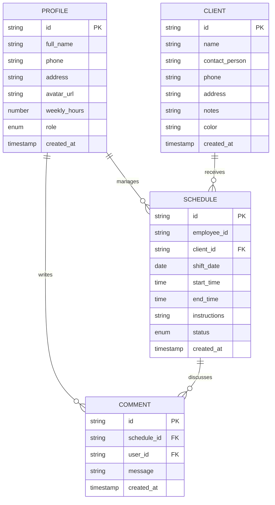
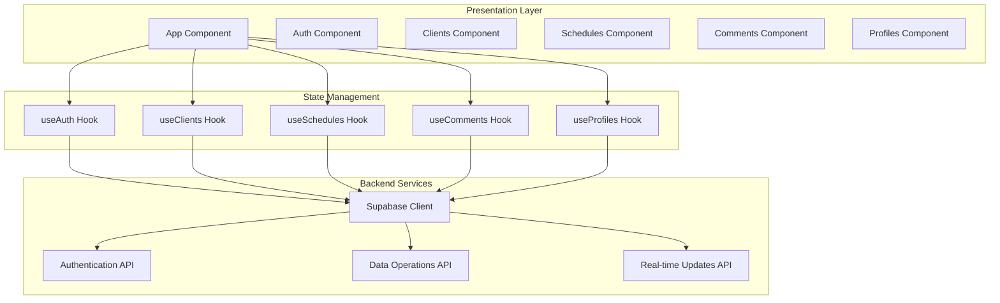
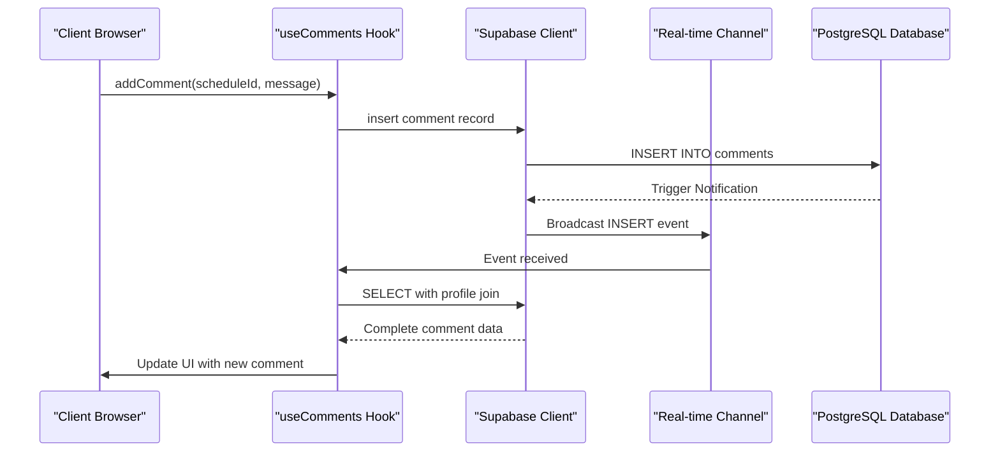
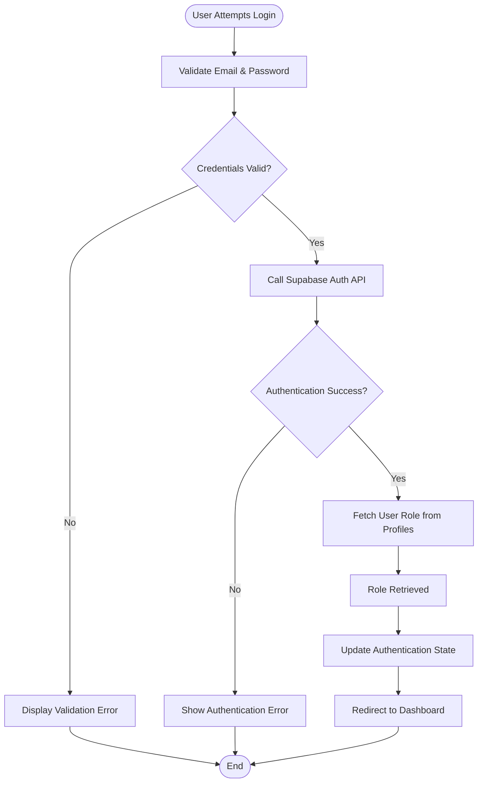
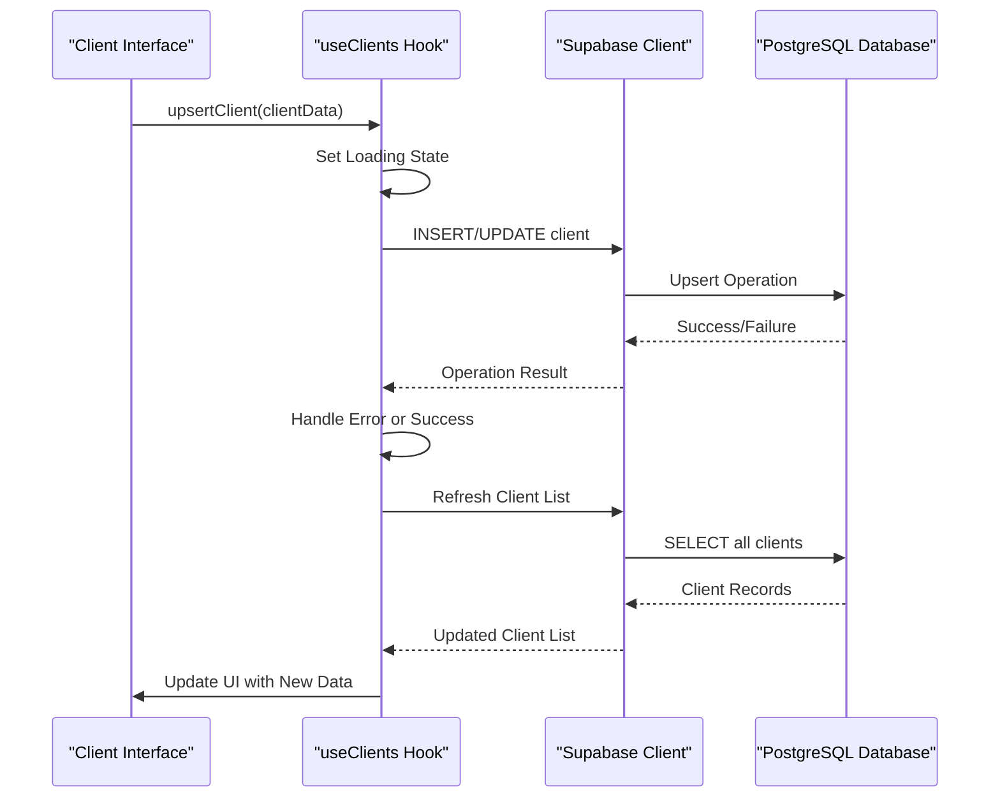
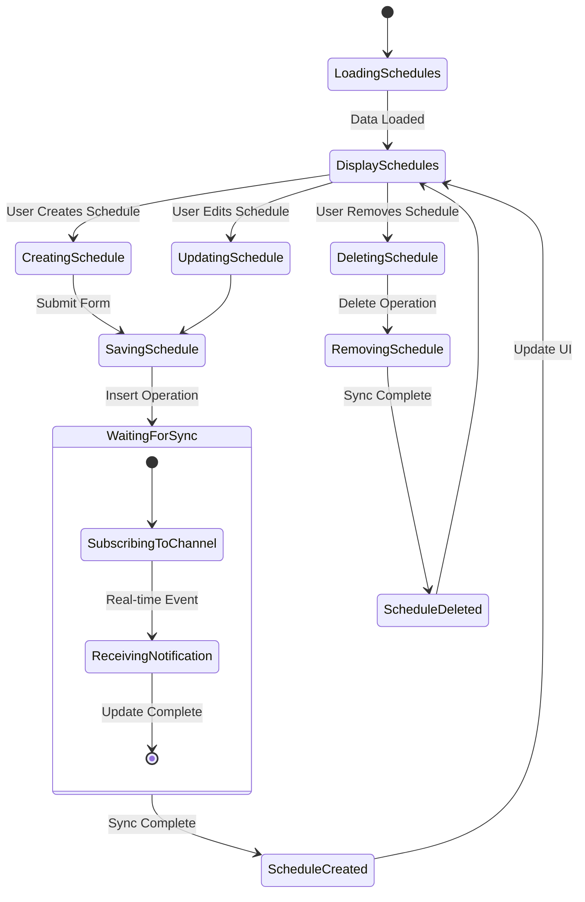

# Project Overview

<cite>
**Referenced Files in This Document**
- [README.md](file://README.md)
- [package.json](file://package.json)
- [vite.config.ts](file://vite.config.ts)
- [src/main.tsx](file://src/main.tsx)
- [src/App.tsx](file://src/App.tsx)
- [src/App.css](file://src/App.css)
- [src/index.css](file://src/index.css)
- [src/lib/supabaseClient.ts](file://src/lib/supabaseClient.ts)
- [src/hooks/useAuth.ts](file://src/hooks/useAuth.ts)
- [src/hooks/useClients.ts](file://src/hooks/useClients.ts)
- [src/hooks/useSchedules.ts](file://src/hooks/useSchedules.ts)
- [src/hooks/useComments.ts](file://src/hooks/useComments.ts)
- [src/hooks/useProfiles.ts](file://src/hooks/useProfiles.ts)
- [src/types/database.ts](file://src/types/database.ts)
</cite>

## Table of Contents
1. [Introduction](#introduction)
2. [Technology Stack](#technology-stack)
3. [Target Audience](#target-audience)
4. [Core Functionality](#core-functionality)
5. [Data Model](#data-model)
6. [Application Architecture](#application-architecture)
7. [Development Workflow](#development-workflow)
8. [Practical Examples](#practical-examples)
9. [Getting Started](#getting-started)
10. [Conclusion](#conclusion)

## Introduction

M_Sharif is a modern client management and scheduling application designed specifically for healthcare professionals. The platform provides a comprehensive solution for managing client relationships, coordinating work schedules, and facilitating real-time communication among team members. Built with contemporary web technologies, M_Sharif enables healthcare providers to streamline their administrative tasks while maintaining focus on patient care.

The application serves as a centralized hub where healthcare professionals can efficiently manage their client base, coordinate shifts and appointments, and maintain ongoing communication through integrated commenting capabilities. Its architecture emphasizes real-time collaboration, data integrity, and user-friendly interfaces tailored to the unique needs of healthcare environments.

## Technology Stack

M_Sharif leverages a robust, modern technology stack built around React 19.2.6 and TypeScript 6.0.2, providing a solid foundation for scalable and maintainable healthcare management applications.

### Frontend Framework
- **React 19.2.6**: Latest React version with concurrent features and improved performance
- **TypeScript ~6.0.2**: Strong typing for enhanced development experience and runtime reliability
- **Vite ^8.0.12**: Lightning-fast build tool and development server

### Backend Infrastructure
- **Supabase JS SDK ^2.107.0**: Full-featured backend-as-a-service providing authentication, database, and real-time capabilities

### Development Tools
- **ESLint**: Code quality and consistency enforcement
- **React Hooks**: Modern React patterns for state management and lifecycle management
- **CSS Modules**: Scoped styling with theme support

**Section sources**
- [package.json:12-30](file://package.json#L12-L30)
- [vite.config.ts:1-8](file://vite.config.ts#L1-L8)

## Target Audience

M_Sharif is specifically designed for healthcare professionals and organizations seeking efficient client management solutions. The primary user groups include:

### Healthcare Providers
- Nurses, therapists, and other clinical staff requiring client coordination
- Healthcare administrators managing team schedules and client relationships
- Independent practitioners needing professional client management tools

### Healthcare Organizations
- Medical clinics and private practices
- Home healthcare agencies
- Rehabilitation centers and therapy facilities
- Mental health and wellness organizations

The application addresses the unique challenges faced by healthcare professionals, including strict privacy requirements, need for real-time collaboration, and requirement for reliable client data management.

## Core Functionality

M_Sharif provides comprehensive functionality organized around five core areas that address the fundamental needs of healthcare client management.

### Authentication System
The authentication module handles secure user registration, login, and session management with role-based access control. It integrates seamlessly with Supabase authentication to provide enterprise-grade security for healthcare data.

### Client Management
Healthcare professionals can maintain comprehensive client profiles including personal information, contact details, medical notes, and color-coded categorization for easy visual identification. The system supports bulk operations and maintains audit trails for compliance purposes.

### Scheduling Coordination
Advanced scheduling capabilities enable healthcare teams to manage work shifts, appointments, and service delivery. The system supports recurring schedules, conflict detection, and automated notifications for schedule changes.

### Profile Management
Professional profiles include detailed information about healthcare staff, qualifications, specialties, and availability. This ensures proper resource allocation and maintains professional standards within the organization.

### Real-Time Communication
Integrated commenting system allows team members to collaborate on client cases, share updates, and coordinate care plans. The real-time nature of the system ensures all stakeholders have access to current information.

**Section sources**
- [src/hooks/useAuth.ts:15-81](file://src/hooks/useAuth.ts#L15-L81)
- [src/hooks/useClients.ts:14-74](file://src/hooks/useClients.ts#L14-L74)
- [src/hooks/useSchedules.ts:39-153](file://src/hooks/useSchedules.ts#L39-L153)
- [src/hooks/useProfiles.ts:16-63](file://src/hooks/useProfiles.ts#L16-L63)
- [src/hooks/useComments.ts:13-113](file://src/hooks/useComments.ts#L13-L113)

## Data Model

The application follows a normalized relational data model optimized for healthcare client management scenarios. The schema ensures data integrity while supporting complex relationships between clients, staff, schedules, and communications.

### Core Entities

**Diagram sources**
- [src/types/database.ts:3-48](file://src/types/database.ts#L3-L48)

### Entity Relationships

The data model establishes clear relationships between healthcare entities:

- **Staff-to-Schedule**: Each schedule is associated with a specific healthcare provider
- **Client-to-Schedule**: Schedules are linked to client records for comprehensive care coordination
- **User-to-Comments**: Team members can contribute to case discussions through the commenting system
- **Schedule-to-Comments**: Comments are contextually linked to specific scheduled activities

**Section sources**
- [src/types/database.ts:3-55](file://src/types/database.ts#L3-L55)

## Application Architecture

M_Sharif employs a modular architecture leveraging React hooks for state management and Supabase for backend services. The architecture emphasizes separation of concerns, real-time data synchronization, and responsive user interfaces.

### Component Architecture

**Diagram sources**
- [src/main.tsx:1-11](file://src/main.tsx#L1-L11)
- [src/App.tsx:1-123](file://src/App.tsx#L1-L123)
- [src/lib/supabaseClient.ts:1-14](file://src/lib/supabaseClient.ts#L1-L14)

### Real-Time Architecture

The application implements sophisticated real-time capabilities through Supabase's PostgreSQL-based real-time subscriptions:

**Diagram sources**
- [src/hooks/useComments.ts:39-98](file://src/hooks/useComments.ts#L39-L98)

**Section sources**
- [src/main.tsx:1-11](file://src/main.tsx#L1-L11)
- [src/App.tsx:1-123](file://src/App.tsx#L1-L123)
- [src/lib/supabaseClient.ts:1-14](file://src/lib/supabaseClient.ts#L1-L14)

## Development Workflow

M_Sharif follows modern development practices emphasizing rapid iteration, code quality, and maintainability. The development workflow integrates seamlessly with the Vite build system and TypeScript compiler.

### Build Process
- **Development**: Hot Module Replacement (HMR) for instant feedback during development
- **Production**: Optimized bundling with tree-shaking and code splitting
- **Type Checking**: Compile-time type verification during build process

### Environment Configuration
The application requires Supabase environment variables for proper operation:

- `VITE_SUPABASE_URL`: Supabase project URL
- `VITE_SUPABASE_ANON_KEY`: Public anonymous access key

### Code Organization
- **Feature-based structure**: Related components and hooks grouped by functionality
- **Type-safe architecture**: Comprehensive TypeScript interfaces for all data structures
- **Hook-based state management**: Custom hooks encapsulate business logic and data fetching

**Section sources**
- [src/lib/supabaseClient.ts:3-13](file://src/lib/supabaseClient.ts#L3-L13)
- [vite.config.ts:1-8](file://vite.config.ts#L1-L8)

## Practical Examples

### Example 1: User Authentication Flow
This workflow demonstrates the complete authentication process from login to session management:

**Diagram sources**
- [src/hooks/useAuth.ts:36-49](file://src/hooks/useAuth.ts#L36-L49)
- [src/hooks/useAuth.ts:20-27](file://src/hooks/useAuth.ts#L20-L27)

### Example 2: Client Management Operations
The client management system supports CRUD operations with real-time synchronization:

**Diagram sources**
- [src/hooks/useClients.ts:35-51](file://src/hooks/useClients.ts#L35-L51)
- [src/hooks/useClients.ts:19-33](file://src/hooks/useClients.ts#L19-L33)

### Example 3: Real-Time Scheduling Updates
The scheduling system demonstrates real-time collaboration capabilities:

**Diagram sources**
- [src/hooks/useSchedules.ts:118-141](file://src/hooks/useSchedules.ts#L118-L141)
- [src/hooks/useSchedules.ts:45-64](file://src/hooks/useSchedules.ts#L45-L64)

## Getting Started

### Prerequisites
- Node.js 18+ for optimal performance
- Supabase account with configured authentication and database
- Basic understanding of React and TypeScript concepts

### Installation Steps
1. Clone the repository and navigate to the project directory
2. Install dependencies using npm install
3. Configure Supabase environment variables in .env file
4. Start the development server with npm run dev
5. Access the application at http://localhost:5173

### Development Commands
- `npm run dev`: Start development server with hot reloading
- `npm run build`: Create production build with optimization
- `npm run lint`: Run ESLint for code quality checks
- `npm run preview`: Preview production build locally

**Section sources**
- [package.json:6-11](file://package.json#L6-L11)
- [src/lib/supabaseClient.ts:6-11](file://src/lib/supabaseClient.ts#L6-L11)

## Conclusion

M_Sharif represents a comprehensive solution for healthcare professionals seeking efficient client management and scheduling capabilities. The application's modern architecture, real-time collaboration features, and healthcare-specific functionality make it an ideal choice for medical practices and healthcare organizations.

The combination of React 19.2.6, TypeScript 6.0.2, and Supabase JS SDK 2.107.0 provides a robust foundation for scalable healthcare applications. The modular hook-based architecture ensures maintainability while the real-time capabilities facilitate seamless team collaboration.

Key benefits include:
- **Enhanced Productivity**: Streamlined client management reduces administrative overhead
- **Improved Communication**: Real-time commenting system facilitates team coordination
- **Data Security**: Enterprise-grade authentication and encryption for healthcare data
- **Scalability**: Modular architecture supports growth from solo practitioners to large organizations
- **Modern Development**: TypeScript and React 19.2.6 ensure long-term maintainability

The application's healthcare-focused design addresses industry-specific requirements while maintaining ease of use for healthcare professionals who may not have extensive technical backgrounds.