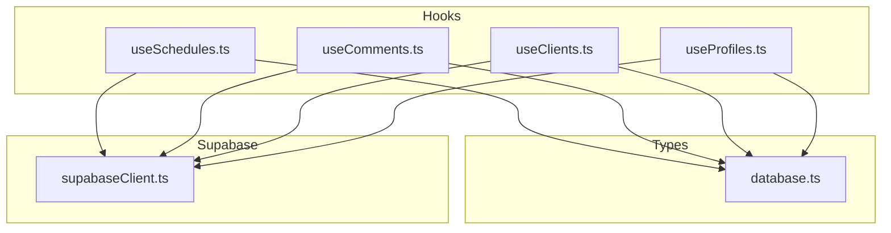
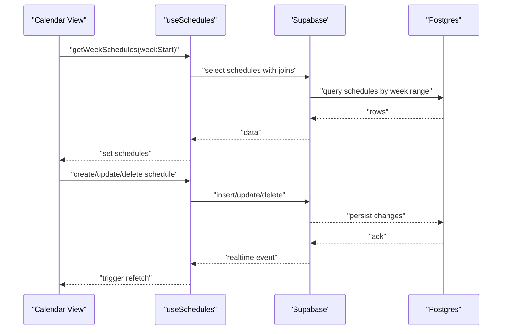
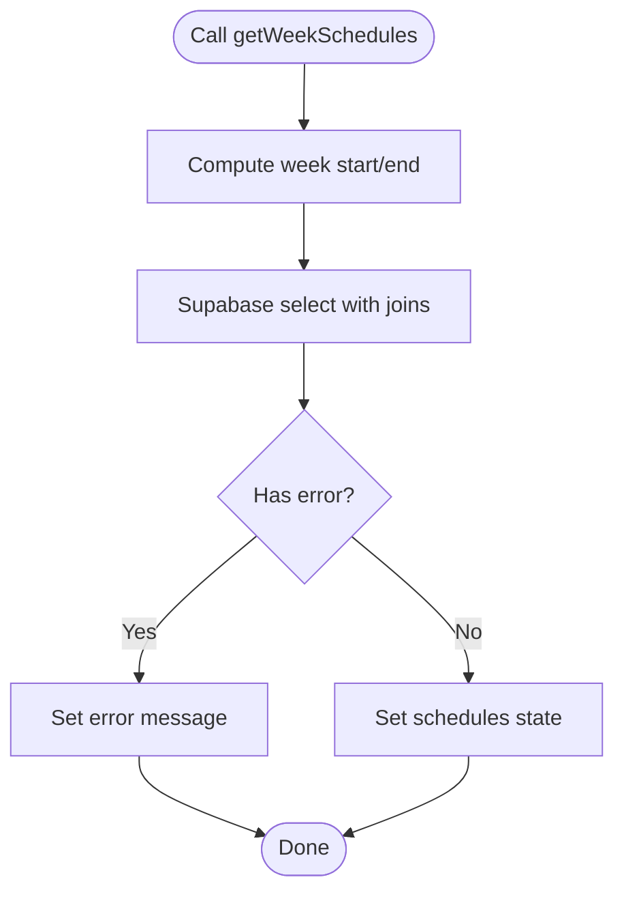
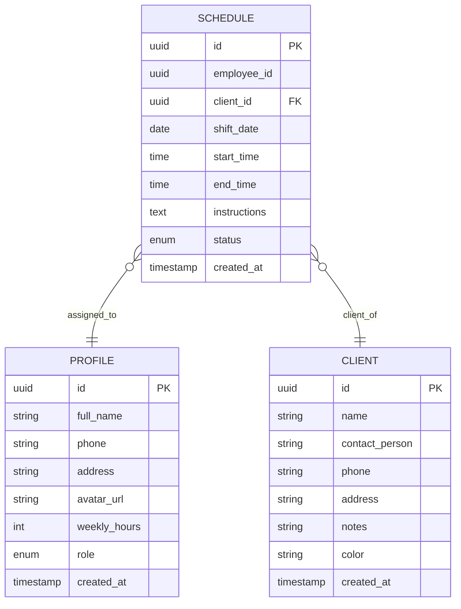
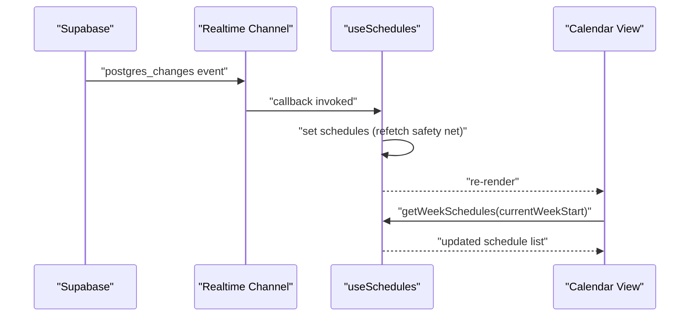
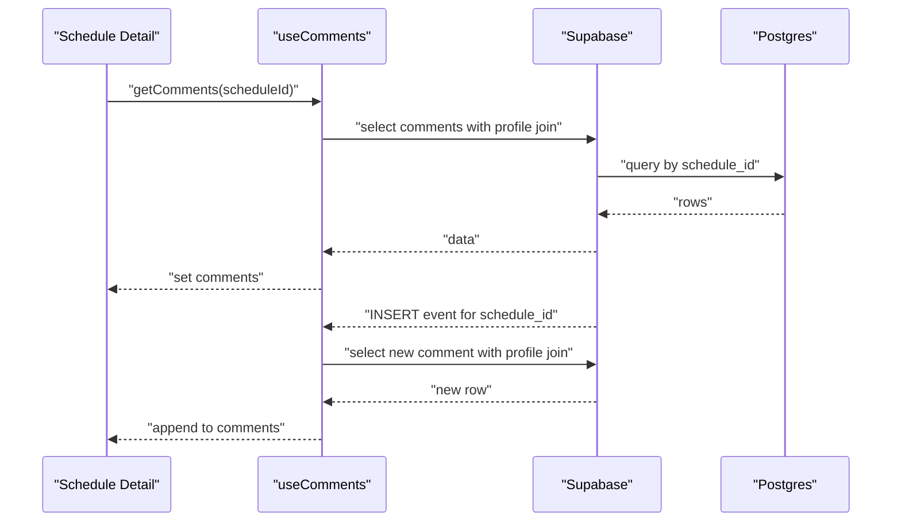
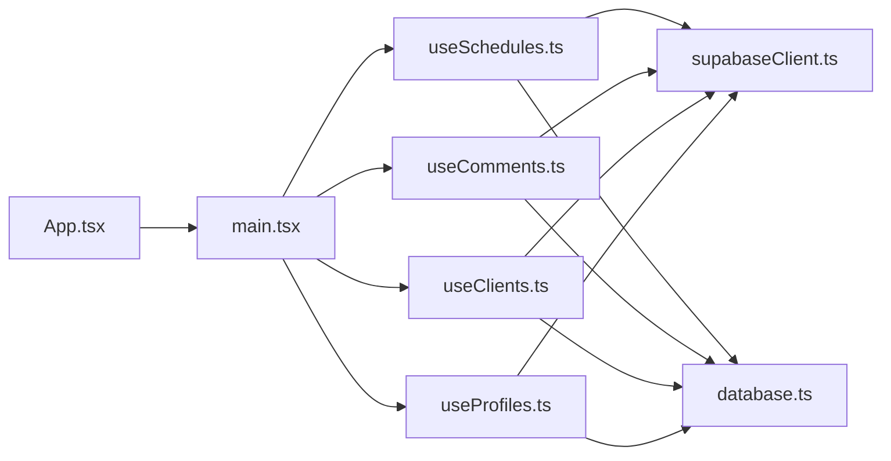

# Scheduling System

<cite>
**Referenced Files in This Document**
- [useSchedules.ts](file://src/hooks/useSchedules.ts)
- [useComments.ts](file://src/hooks/useComments.ts)
- [useClients.ts](file://src/hooks/useClients.ts)
- [useProfiles.ts](file://src/hooks/useProfiles.ts)
- [database.ts](file://src/types/database.ts)
- [supabaseClient.ts](file://src/lib/supabaseClient.ts)
- [App.tsx](file://src/App.tsx)
- [main.tsx](file://src/main.tsx)
</cite>

## Table of Contents
1. [Introduction](#introduction)
2. [Project Structure](#project-structure)
3. [Core Components](#core-components)
4. [Architecture Overview](#architecture-overview)
5. [Detailed Component Analysis](#detailed-component-analysis)
6. [Dependency Analysis](#dependency-analysis)
7. [Performance Considerations](#performance-considerations)
8. [Troubleshooting Guide](#troubleshooting-guide)
9. [Conclusion](#conclusion)

## Introduction
This document explains the scheduling system’s weekly calendar implementation, schedule creation and management, time slot coordination, and status management. It documents the useSchedules hook, real-time schedule updates, and how the system integrates with client and profile data. It also covers real-time comment integration, scheduling workflows, time zone considerations, and performance optimization for calendar rendering. The content is grounded in the actual codebase and references specific files and line ranges.

## Project Structure
The scheduling system is primarily implemented as React hooks that integrate with Supabase for data and real-time updates. The key elements are:
- useSchedules: fetches, creates, updates, deletes schedules, and subscribes to real-time changes
- useComments: manages comments per schedule with real-time updates
- useClients and useProfiles: manage client and employee profile data used by schedules
- Types define the shape of schedules, clients, profiles, and comments
- Supabase client initialization and environment configuration

**Diagram sources**
- [useSchedules.ts:1-153](file://src/hooks/useSchedules.ts#L1-L153)
- [useComments.ts:1-112](file://src/hooks/useComments.ts#L1-L112)
- [useClients.ts:1-74](file://src/hooks/useClients.ts#L1-L74)
- [useProfiles.ts:1-63](file://src/hooks/useProfiles.ts#L1-L63)
- [database.ts:1-55](file://src/types/database.ts#L1-L55)
- [supabaseClient.ts:1-14](file://src/lib/supabaseClient.ts#L1-L14)

**Section sources**
- [useSchedules.ts:1-153](file://src/hooks/useSchedules.ts#L1-L153)
- [useComments.ts:1-112](file://src/hooks/useComments.ts#L1-L112)
- [useClients.ts:1-74](file://src/hooks/useClients.ts#L1-L74)
- [useProfiles.ts:1-63](file://src/hooks/useProfiles.ts#L1-L63)
- [database.ts:1-55](file://src/types/database.ts#L1-L55)
- [supabaseClient.ts:1-14](file://src/lib/supabaseClient.ts#L1-L14)
- [App.tsx:1-123](file://src/App.tsx#L1-L123)
- [main.tsx:1-11](file://src/main.tsx#L1-L11)

## Core Components
- Weekly calendar and schedule retrieval: useSchedules provides a function to fetch schedules for a given week, joining profile and client data for display.
- Schedule lifecycle: create, update, delete operations backed by Supabase.
- Real-time synchronization: subscriptions to the schedules table ensure consumers refresh their view when changes occur.
- Client and profile management: separate hooks to maintain client lists and employee profiles used by schedules.
- Comments integration: real-time comments per schedule with user association and profile joins.

Key responsibilities:
- Week calculation and filtering for schedule queries
- Loading and error states for all operations
- Real-time channels for live updates
- Joining related entities for UI rendering

**Section sources**
- [useSchedules.ts:39-152](file://src/hooks/useSchedules.ts#L39-L152)
- [useComments.ts:13-112](file://src/hooks/useComments.ts#L13-L112)
- [useClients.ts:14-74](file://src/hooks/useClients.ts#L14-L74)
- [useProfiles.ts:16-63](file://src/hooks/useProfiles.ts#L16-L63)
- [database.ts:25-48](file://src/types/database.ts#L25-L48)

## Architecture Overview
The scheduling system follows a reactive pattern:
- Hooks encapsulate data fetching and mutations
- Supabase handles persistence and real-time events
- Types define the schema for schedules, clients, profiles, and comments
- Consumers call useSchedules to render weekly calendars and manage schedules

**Diagram sources**
- [useSchedules.ts:45-115](file://src/hooks/useSchedules.ts#L45-L115)
- [supabaseClient.ts:1-14](file://src/lib/supabaseClient.ts#L1-L14)

## Detailed Component Analysis

### useSchedules Hook
Responsibilities:
- Compute ISO week boundaries for a given date
- Fetch schedules for the week with profile and client joins
- Create, update, and delete schedules
- Subscribe to real-time changes on the schedules table

Processing logic:
- Week boundary computation ensures consistent Monday-to-Sunday grouping
- Queries use greater-than-or-equal and less-than-or-equal filters on shift_date
- Sorting by shift_date and start_time ensures predictable ordering
- Real-time channel triggers a refetch safety net

**Diagram sources**
- [useSchedules.ts:25-64](file://src/hooks/useSchedules.ts#L25-L64)

**Section sources**
- [useSchedules.ts:25-64](file://src/hooks/useSchedules.ts#L25-L64)
- [useSchedules.ts:66-115](file://src/hooks/useSchedules.ts#L66-L115)
- [useSchedules.ts:117-141](file://src/hooks/useSchedules.ts#L117-L141)

### Schedule Data Model
The Schedule entity includes:
- Employee assignment via employee_id
- Client assignment via client_id
- Shift date and time window
- Status enumeration
- Joined profile and client data for rendering

**Diagram sources**
- [database.ts:25-38](file://src/types/database.ts#L25-L38)

**Section sources**
- [database.ts:25-38](file://src/types/database.ts#L25-L38)

### Real-Time Schedule Updates
The hook subscribes to all changes on the schedules table. On any change, it triggers a refetch safety net to keep the UI synchronized. Consumers should call getWeekSchedules with the current week start to refresh the calendar view.

**Diagram sources**
- [useSchedules.ts:117-141](file://src/hooks/useSchedules.ts#L117-L141)

**Section sources**
- [useSchedules.ts:117-141](file://src/hooks/useSchedules.ts#L117-L141)

### Client and Profile Management
- useClients: fetches, upserts, and deletes clients; maintains a sorted list by name
- useProfiles: fetches employees and updates profile attributes

These are used alongside schedules to populate dropdowns, assign employees, and display client details.

**Section sources**
- [useClients.ts:19-73](file://src/hooks/useClients.ts#L19-L73)
- [useProfiles.ts:21-61](file://src/hooks/useProfiles.ts#L21-L61)

### Real-Time Comments Integration
- useComments: fetches comments for a schedule and appends new comments as they arrive
- Subscribes to a channel filtered by schedule_id to receive insert events
- Joins profile data to display author information

**Diagram sources**
- [useComments.ts:20-112](file://src/hooks/useComments.ts#L20-L112)

**Section sources**
- [useComments.ts:20-112](file://src/hooks/useComments.ts#L20-L112)
- [database.ts:40-48](file://src/types/database.ts#L40-L48)

### Calendar View Integration
While the repository does not include a dedicated calendar component, the weekly calendar implementation is driven by:
- useSchedules.getWeekSchedules to load schedule data for the selected week
- Sorting by shift_date and start_time to order schedule blocks
- Joining profiles and clients to render human-readable labels

Consumers should:
- Determine the current week start date
- Call getWeekSchedules with that date
- Render schedule blocks using joined profile and client data

**Section sources**
- [useSchedules.ts:45-64](file://src/hooks/useSchedules.ts#L45-L64)

## Dependency Analysis
The scheduling system relies on:
- Supabase client for database operations and real-time
- Type definitions for strong typing across components
- React hooks for state and lifecycle management

**Diagram sources**
- [App.tsx:1-123](file://src/App.tsx#L1-L123)
- [main.tsx:1-11](file://src/main.tsx#L1-L11)
- [useSchedules.ts:1-3](file://src/hooks/useSchedules.ts#L1-L3)
- [useComments.ts:1-3](file://src/hooks/useComments.ts#L1-L3)
- [useClients.ts:1-3](file://src/hooks/useClients.ts#L1-L3)
- [useProfiles.ts:1-3](file://src/hooks/useProfiles.ts#L1-L3)
- [supabaseClient.ts:1-14](file://src/lib/supabaseClient.ts#L1-L14)
- [database.ts:1-55](file://src/types/database.ts#L1-L55)

**Section sources**
- [App.tsx:1-123](file://src/App.tsx#L1-L123)
- [main.tsx:1-11](file://src/main.tsx#L1-L11)
- [useSchedules.ts:1-3](file://src/hooks/useSchedules.ts#L1-L3)
- [useComments.ts:1-3](file://src/hooks/useComments.ts#L1-L3)
- [useClients.ts:1-3](file://src/hooks/useClients.ts#L1-L3)
- [useProfiles.ts:1-3](file://src/hooks/useProfiles.ts#L1-L3)
- [supabaseClient.ts:1-14](file://src/lib/supabaseClient.ts#L1-L14)
- [database.ts:1-55](file://src/types/database.ts#L1-L55)

## Performance Considerations
- Efficient weekly queries: Filtering by shift_date with gte/lte reduces result sets to a single week
- Minimal sorting: Sorting by shift_date and start_time ensures predictable rendering without heavy computation
- Real-time safety net: The schedules channel triggers a refetch; consumers should still call getWeekSchedules with the current week start to avoid redundant work
- Client and profile caching: useClients and useProfiles can cache lists to reduce repeated network calls
- Comment batching: Real-time inserts append to the list; consider virtualization for large comment histories

[No sources needed since this section provides general guidance]

## Troubleshooting Guide
Common issues and resolutions:
- Missing environment variables: Ensure VITE_SUPABASE_URL and VITE_SUPABASE_ANON_KEY are configured; the client throws if missing
- Network errors during schedule operations: useSchedules exposes an error field; inspect for messages returned by Supabase
- Real-time not updating: Confirm the schedules channel subscription is active; the hook cleans up on unmount
- Comments not appearing: Verify the comments channel subscription is active and filtered by schedule_id

**Section sources**
- [supabaseClient.ts:6-11](file://src/lib/supabaseClient.ts#L6-L11)
- [useSchedules.ts:58-60](file://src/hooks/useSchedules.ts#L58-L60)
- [useSchedules.ts:117-141](file://src/hooks/useSchedules.ts#L117-L141)
- [useComments.ts:64-109](file://src/hooks/useComments.ts#L64-L109)

## Conclusion
The scheduling system provides a robust foundation for weekly calendar management with real-time updates, client and profile integration, and comment support. The useSchedules hook centralizes schedule operations and ensures consistent weekly queries, while real-time subscriptions keep the UI synchronized. By leveraging the provided hooks and types, developers can build calendar views, coordinate time slots, and manage statuses effectively.