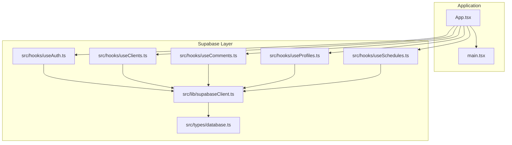
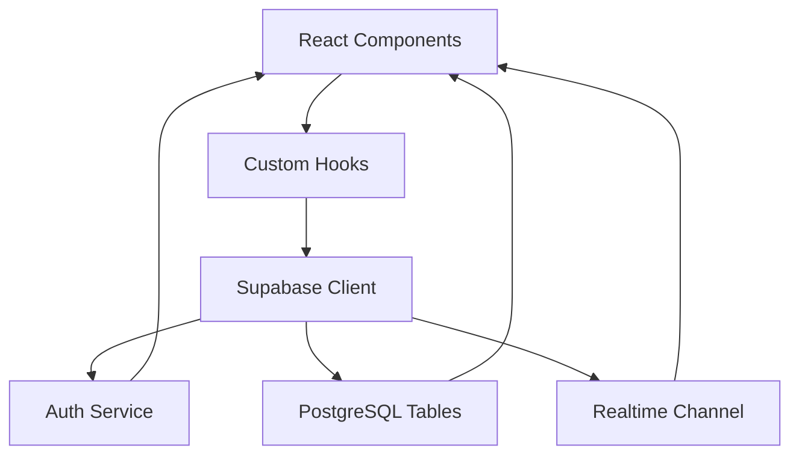
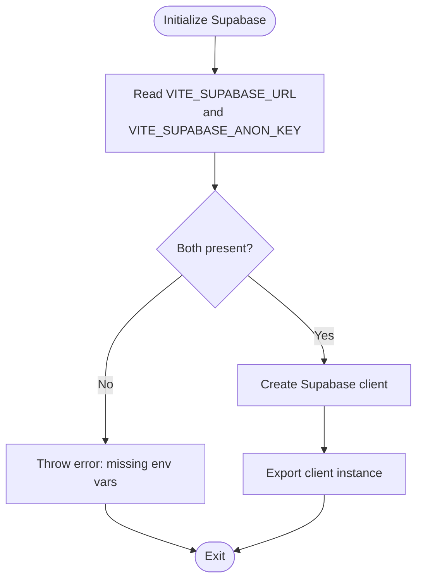
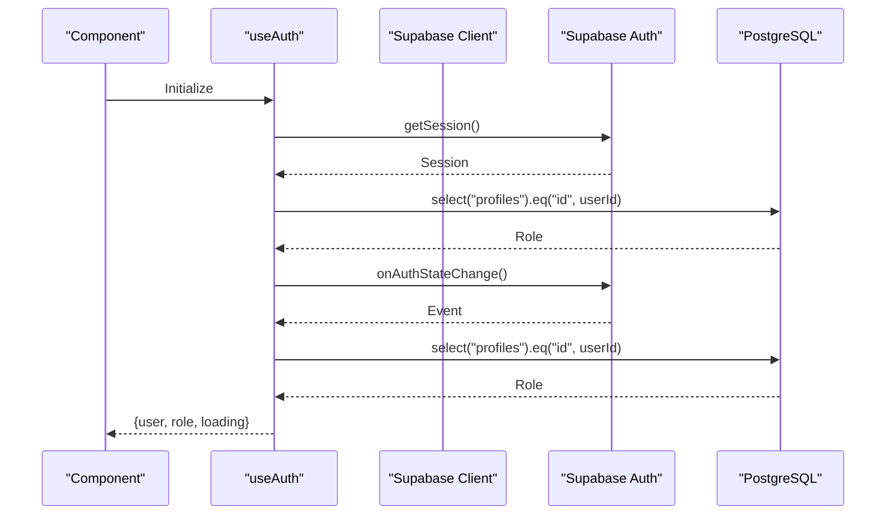
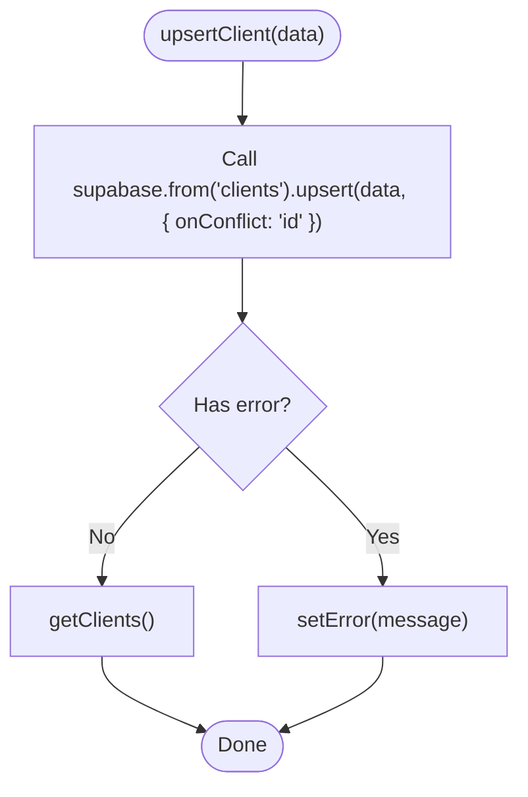
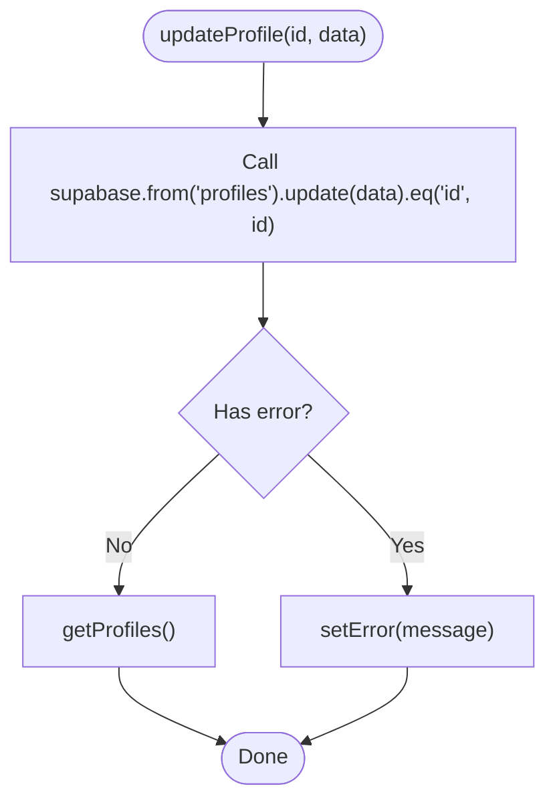
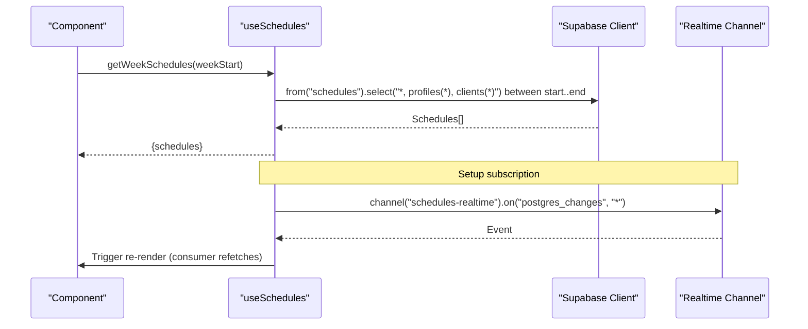
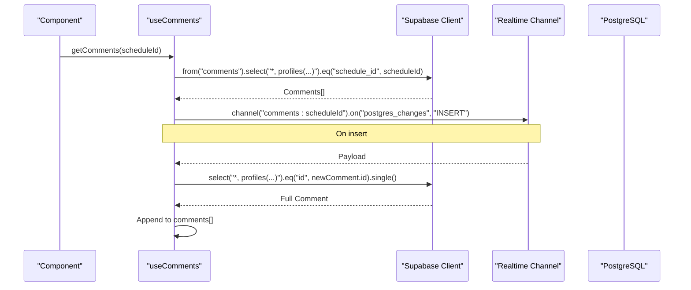
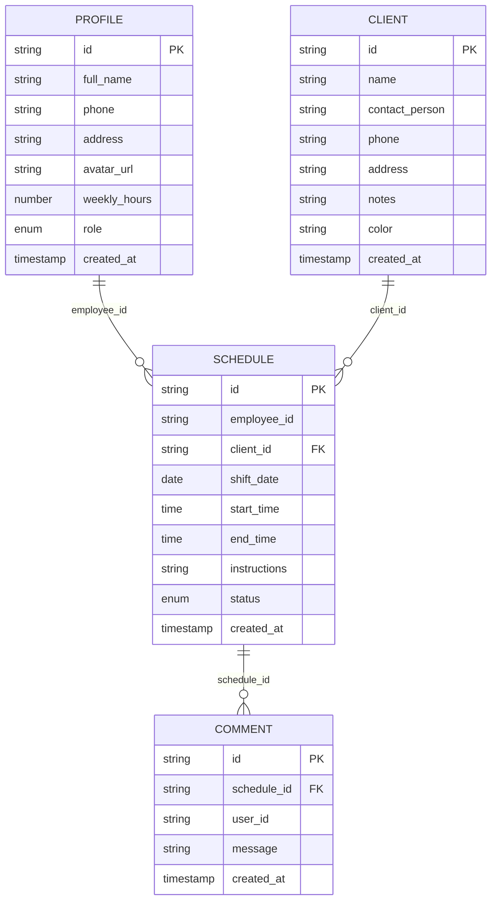
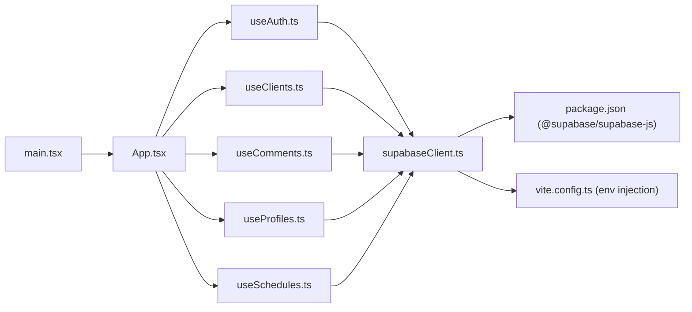

# Supabase Integration

<cite>
**Referenced Files in This Document**
- [supabaseClient.ts](file://src/lib/supabaseClient.ts)
- [useAuth.ts](file://src/hooks/useAuth.ts)
- [useClients.ts](file://src/hooks/useClients.ts)
- [useComments.ts](file://src/hooks/useComments.ts)
- [useProfiles.ts](file://src/hooks/useProfiles.ts)
- [useSchedules.ts](file://src/hooks/useSchedules.ts)
- [database.ts](file://src/types/database.ts)
- [App.tsx](file://src/App.tsx)
- [main.tsx](file://src/main.tsx)
- [package.json](file://package.json)
- [vite.config.ts](file://vite.config.ts)
</cite>

## Table of Contents
1. [Introduction](#introduction)
2. [Project Structure](#project-structure)
3. [Core Components](#core-components)
4. [Architecture Overview](#architecture-overview)
5. [Detailed Component Analysis](#detailed-component-analysis)
6. [Dependency Analysis](#dependency-analysis)
7. [Performance Considerations](#performance-considerations)
8. [Troubleshooting Guide](#troubleshooting-guide)
9. [Conclusion](#conclusion)
10. [Appendices](#appendices)

## Introduction
This document explains how Supabase is integrated across the M_Sharif application. It covers the centralized client initialization, authentication integration patterns, and Realtime subscriptions for live updates. It also documents how Supabase services (Auth, Database, Realtime) are consumed via React hooks and components, including concrete examples of database operations, subscription management, and real-time synchronization. Security considerations, configuration options, environment variable setup, performance optimization, and best practices are included.

## Project Structure
The Supabase integration is organized around a small set of focused modules:
- Centralized client initialization in a dedicated module
- Domain-specific React hooks encapsulating Supabase operations and subscriptions
- Strongly typed database models for type-safe development
- Minimal Vite configuration enabling environment variable injection

**Diagram sources**
- [supabaseClient.ts:1-14](file://src/lib/supabaseClient.ts#L1-L14)
- [useAuth.ts:1-81](file://src/hooks/useAuth.ts#L1-L81)
- [useClients.ts:1-74](file://src/hooks/useClients.ts#L1-L74)
- [useComments.ts:1-113](file://src/hooks/useComments.ts#L1-L113)
- [useProfiles.ts:1-63](file://src/hooks/useProfiles.ts#L1-L63)
- [useSchedules.ts:1-153](file://src/hooks/useSchedules.ts#L1-L153)
- [database.ts:1-55](file://src/types/database.ts#L1-L55)
- [App.tsx:1-123](file://src/App.tsx#L1-L123)
- [main.tsx:1-11](file://src/main.tsx#L1-L11)

**Section sources**
- [supabaseClient.ts:1-14](file://src/lib/supabaseClient.ts#L1-L14)
- [useAuth.ts:1-81](file://src/hooks/useAuth.ts#L1-L81)
- [useClients.ts:1-74](file://src/hooks/useClients.ts#L1-L74)
- [useComments.ts:1-113](file://src/hooks/useComments.ts#L1-L113)
- [useProfiles.ts:1-63](file://src/hooks/useProfiles.ts#L1-L63)
- [useSchedules.ts:1-153](file://src/hooks/useSchedules.ts#L1-L153)
- [database.ts:1-55](file://src/types/database.ts#L1-L55)
- [App.tsx:1-123](file://src/App.tsx#L1-L123)
- [main.tsx:1-11](file://src/main.tsx#L1-L11)

## Core Components
- Centralized Supabase client: Initializes the Supabase client using Vite’s environment variable injection and validates required variables at startup.
- Authentication hook: Provides user session state, role resolution, sign-in/out, and auth state change subscriptions.
- Domain hooks:
  - Clients: CRUD operations on the clients table with conflict handling and optimistic updates.
  - Profiles: Employee listing and profile updates.
  - Schedules: Weekly schedule retrieval with joins, CRUD operations, and Realtime subscriptions for live updates.
  - Comments: Threaded comments with Realtime subscriptions scoped by schedule ID and joined profile data.
- Database types: Strongly typed interfaces for profiles, clients, schedules, comments, and auth state.

**Section sources**
- [supabaseClient.ts:1-14](file://src/lib/supabaseClient.ts#L1-L14)
- [useAuth.ts:15-81](file://src/hooks/useAuth.ts#L15-L81)
- [useClients.ts:14-74](file://src/hooks/useClients.ts#L14-L74)
- [useProfiles.ts:16-63](file://src/hooks/useProfiles.ts#L16-L63)
- [useSchedules.ts:39-153](file://src/hooks/useSchedules.ts#L39-L153)
- [useComments.ts:13-113](file://src/hooks/useComments.ts#L13-L113)
- [database.ts:3-55](file://src/types/database.ts#L3-L55)

## Architecture Overview
The application follows a layered architecture:
- Presentation layer: React components render UI and call hooks.
- Hooks layer: Encapsulates Supabase operations and subscriptions.
- Supabase client layer: Centralized client creation and environment validation.
- Database types layer: Shared TypeScript interfaces for data contracts.

**Diagram sources**
- [supabaseClient.ts:1-14](file://src/lib/supabaseClient.ts#L1-L14)
- [useAuth.ts:15-81](file://src/hooks/useAuth.ts#L15-L81)
- [useSchedules.ts:117-141](file://src/hooks/useSchedules.ts#L117-L141)
- [useComments.ts:63-109](file://src/hooks/useComments.ts#L63-L109)

## Detailed Component Analysis

### Centralized Supabase Client
- Creates the Supabase client using Vite’s environment variable injection.
- Validates presence of required environment variables and throws a descriptive error if missing.
- Exports a singleton client instance for use across the app.

**Diagram sources**
- [supabaseClient.ts:3-13](file://src/lib/supabaseClient.ts#L3-L13)

**Section sources**
- [supabaseClient.ts:1-14](file://src/lib/supabaseClient.ts#L1-L14)

### Authentication Integration Pattern
- Uses Supabase Auth to manage sessions and roles.
- Subscribes to auth state changes to keep UI in sync.
- Resolves user role by querying the profiles table.
- Provides sign-in, sign-out, and session retrieval utilities.

**Diagram sources**
- [useAuth.ts:51-77](file://src/hooks/useAuth.ts#L51-L77)
- [useAuth.ts:20-27](file://src/hooks/useAuth.ts#L20-L27)

**Section sources**
- [useAuth.ts:15-81](file://src/hooks/useAuth.ts#L15-L81)

### Database Operations: Clients
- Retrieves clients ordered by name.
- Upserts client records with conflict handling on id.
- Deletes clients and updates local state optimistically.

**Diagram sources**
- [useClients.ts:35-51](file://src/hooks/useClients.ts#L35-L51)

**Section sources**
- [useClients.ts:14-74](file://src/hooks/useClients.ts#L14-L74)

### Database Operations: Profiles
- Lists employees by role and orders by full name.
- Updates profile attributes and refreshes the list.

**Diagram sources**
- [useProfiles.ts:38-59](file://src/hooks/useProfiles.ts#L38-L59)

**Section sources**
- [useProfiles.ts:16-63](file://src/hooks/useProfiles.ts#L16-L63)

### Database Operations: Schedules
- Computes ISO week boundaries and retrieves schedules within a date range.
- Supports insert, update, delete, and filters by joins.
- Subscribes to Realtime events on the schedules table to trigger refetches.

**Diagram sources**
- [useSchedules.ts:45-64](file://src/hooks/useSchedules.ts#L45-L64)
- [useSchedules.ts:117-141](file://src/hooks/useSchedules.ts#L117-L141)

**Section sources**
- [useSchedules.ts:39-153](file://src/hooks/useSchedules.ts#L39-L153)

### Realtime Subscriptions: Comments
- Manages a Realtime channel scoped by schedule ID.
- Subscribes to INSERT events filtered by schedule_id.
- On insert, fetches the full row with joined profile data and appends to the list.

**Diagram sources**
- [useComments.ts:20-37](file://src/hooks/useComments.ts#L20-L37)
- [useComments.ts:74-99](file://src/hooks/useComments.ts#L74-L99)

**Section sources**
- [useComments.ts:13-113](file://src/hooks/useComments.ts#L13-L113)

### Data Models
- Strongly typed interfaces for profiles, clients, schedules, comments, and auth state.
- Joins are represented via optional fields in schedule and comment types.

**Diagram sources**
- [database.ts:3-48](file://src/types/database.ts#L3-L48)

**Section sources**
- [database.ts:1-55](file://src/types/database.ts#L1-L55)

## Dependency Analysis
- The hooks depend on the centralized Supabase client module.
- The client depends on environment variables injected by Vite.
- The application bootstraps via main.tsx rendering App.tsx.

**Diagram sources**
- [main.tsx:1-11](file://src/main.tsx#L1-L11)
- [App.tsx:1-123](file://src/App.tsx#L1-L123)
- [useAuth.ts:1-3](file://src/hooks/useAuth.ts#L1-L3)
- [useClients.ts:1-3](file://src/hooks/useClients.ts#L1-L3)
- [useComments.ts:1-3](file://src/hooks/useComments.ts#L1-L3)
- [useProfiles.ts:1-3](file://src/hooks/useProfiles.ts#L1-L3)
- [useSchedules.ts:1-3](file://src/hooks/useSchedules.ts#L1-L3)
- [supabaseClient.ts:1-14](file://src/lib/supabaseClient.ts#L1-L14)
- [package.json:12-16](file://package.json#L12-L16)
- [vite.config.ts:1-8](file://vite.config.ts#L1-L8)

**Section sources**
- [package.json:12-16](file://package.json#L12-L16)
- [vite.config.ts:1-8](file://vite.config.ts#L1-L8)
- [supabaseClient.ts:1-14](file://src/lib/supabaseClient.ts#L1-L14)
- [useAuth.ts:1-3](file://src/hooks/useAuth.ts#L1-L3)
- [useClients.ts:1-3](file://src/hooks/useClients.ts#L1-L3)
- [useComments.ts:1-3](file://src/hooks/useComments.ts#L1-L3)
- [useProfiles.ts:1-3](file://src/hooks/useProfiles.ts#L1-L3)
- [useSchedules.ts:1-3](file://src/hooks/useSchedules.ts#L1-L3)
- [main.tsx:1-11](file://src/main.tsx#L1-L11)
- [App.tsx:1-123](file://src/App.tsx#L1-L123)

## Performance Considerations
- Minimize Realtime subscriptions: Use targeted channels and filters to reduce bandwidth and CPU overhead.
- Efficient queries: Select only required columns and apply filters early to reduce payload sizes.
- Debounce or batch UI updates: Avoid frequent re-renders by consolidating updates from Realtime events.
- Optimize joins: Prefer selective joins and limit rows to reduce network and parsing costs.
- Caching and optimistic updates: Update UI immediately on mutation and reconcile with server responses to improve perceived performance.
- Environment variable handling: Ensure environment variables are injected at build time to avoid runtime checks.

[No sources needed since this section provides general guidance]

## Troubleshooting Guide
- Missing environment variables:
  - Symptom: Application fails to initialize Supabase client.
  - Resolution: Ensure VITE_SUPABASE_URL and VITE_SUPABASE_ANON_KEY are set in the environment and available to the client.
- Auth state not updating:
  - Symptom: UI does not reflect logged-in/logged-out state.
  - Resolution: Verify auth state subscription is active and role fetching occurs after user session resolves.
- Realtime not receiving updates:
  - Symptom: Live updates do not appear in comments or schedules.
  - Resolution: Confirm channel name and filter match the active schedule ID; ensure subscription lifecycle is managed (cleanup on unmount).
- Error propagation:
  - Symptom: Errors from database operations are not surfaced.
  - Resolution: Check that error messages are captured and displayed; ensure loading states are toggled appropriately during operations.

**Section sources**
- [supabaseClient.ts:6-11](file://src/lib/supabaseClient.ts#L6-L11)
- [useAuth.ts:51-77](file://src/hooks/useAuth.ts#L51-L77)
- [useComments.ts:63-109](file://src/hooks/useComments.ts#L63-L109)
- [useSchedules.ts:117-141](file://src/hooks/useSchedules.ts#L117-L141)

## Conclusion
The M_Sharif application integrates Supabase through a clean, modular architecture:
- A centralized client ensures consistent configuration and environment validation.
- React hooks encapsulate Supabase operations and Realtime subscriptions, providing predictable state management.
- Strong typing improves developer confidence and reduces runtime errors.
- Realtime subscriptions enable live collaboration and responsive UI updates.
Adhering to the best practices outlined here will help maintain a secure, performant, and scalable Supabase integration.

[No sources needed since this section summarizes without analyzing specific files]

## Appendices

### Configuration Options and Environment Variables
- Required environment variables:
  - VITE_SUPABASE_URL: Supabase project URL
  - VITE_SUPABASE_ANON_KEY: Supabase anonymous API key
- Vite configuration:
  - Environment variables are injected at build time and prefixed with VITE_.

**Section sources**
- [supabaseClient.ts:3-13](file://src/lib/supabaseClient.ts#L3-L13)
- [vite.config.ts:1-8](file://vite.config.ts#L1-L8)

### Security Considerations
- Use Supabase Auth for session management and enforce row-level security policies on the database.
- Avoid exposing sensitive keys in client-side code; use the anonymous key for client apps and restrict permissions via RLS.
- Validate and sanitize inputs on the client and server to prevent injection attacks.
- Monitor Realtime subscriptions for unexpected filters or broad scopes.

[No sources needed since this section provides general guidance]

### Best Practices for Supabase in React Applications
- Centralize client initialization and export a singleton instance.
- Encapsulate Supabase logic in custom hooks to promote reuse and testability.
- Manage Realtime subscriptions with cleanup to prevent memory leaks.
- Use strong typing for database models to catch errors early.
- Implement optimistic updates with reconciliation to improve responsiveness.

[No sources needed since this section provides general guidance]