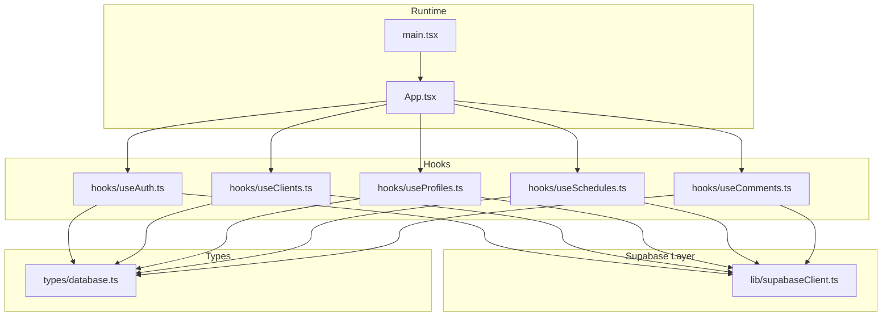
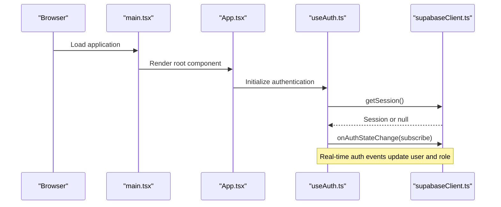
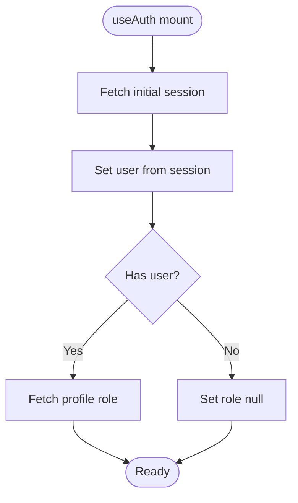
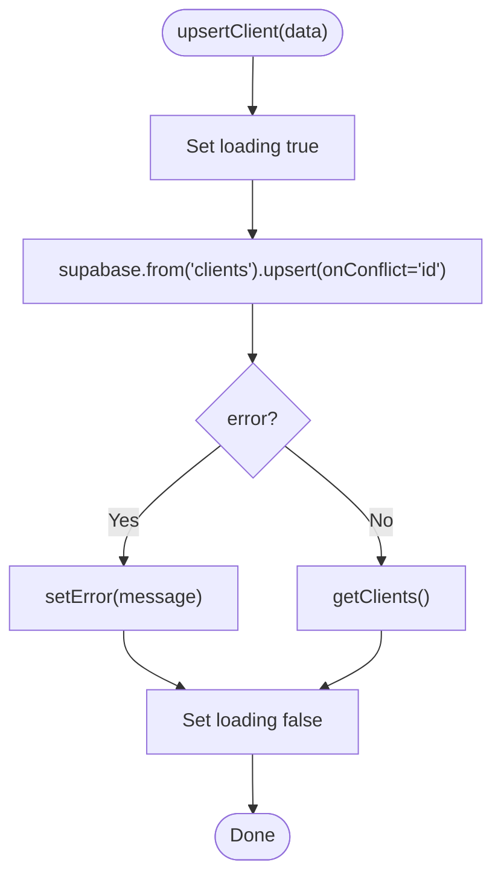
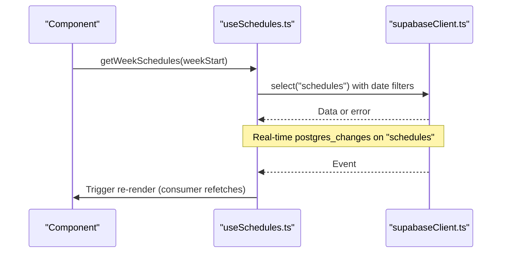
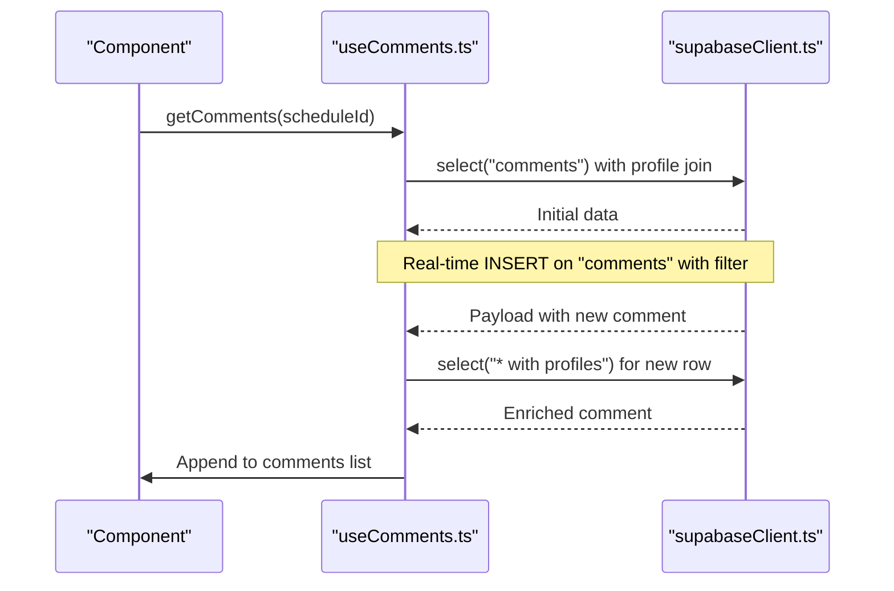
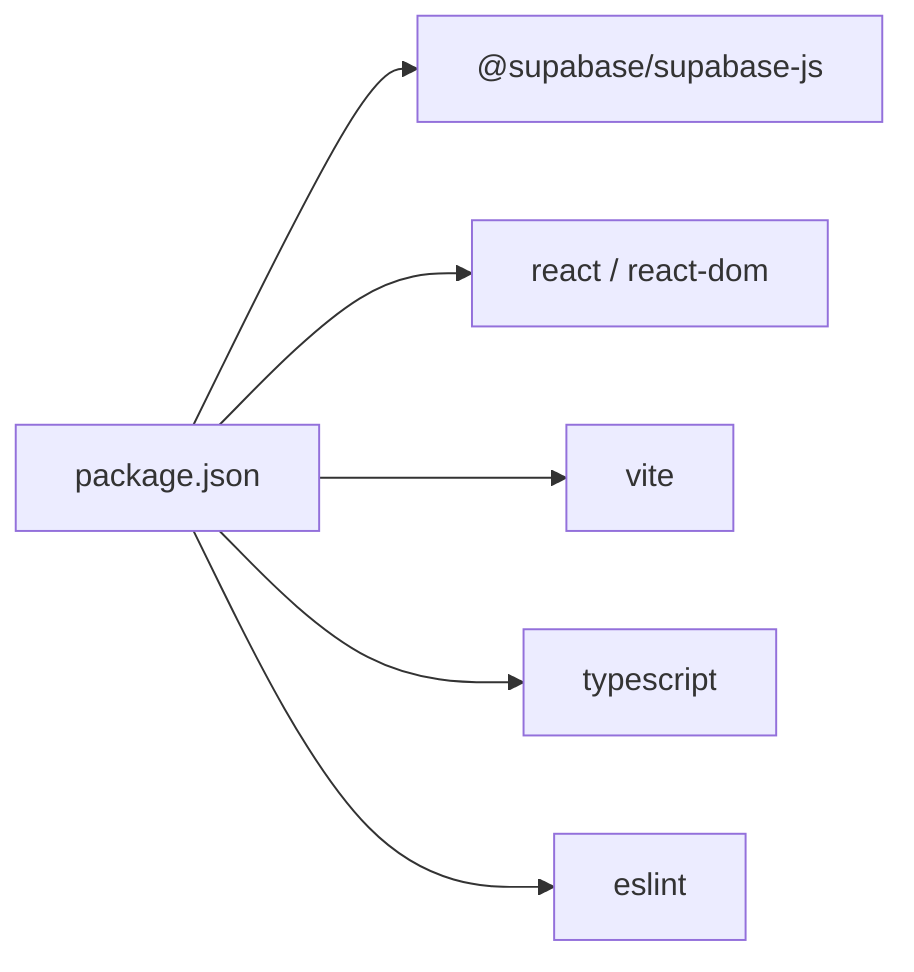

# Troubleshooting and FAQ

<cite>
**Referenced Files in This Document**
- [README.md](file://README.md)
- [package.json](file://package.json)
- [vite.config.ts](file://vite.config.ts)
- [tsconfig.json](file://tsconfig.json)
- [src/lib/supabaseClient.ts](file://src/lib/supabaseClient.ts)
- [src/hooks/useAuth.ts](file://src/hooks/useAuth.ts)
- [src/hooks/useClients.ts](file://src/hooks/useClients.ts)
- [src/hooks/useComments.ts](file://src/hooks/useComments.ts)
- [src/hooks/useProfiles.ts](file://src/hooks/useProfiles.ts)
- [src/hooks/useSchedules.ts](file://src/hooks/useSchedules.ts)
- [src/types/database.ts](file://src/types/database.ts)
- [src/App.tsx](file://src/App.tsx)
- [src/main.tsx](file://src/main.tsx)
</cite>

## Table of Contents
1. [Introduction](#introduction)
2. [Project Structure](#project-structure)
3. [Core Components](#core-components)
4. [Architecture Overview](#architecture-overview)
5. [Detailed Component Analysis](#detailed-component-analysis)
6. [Dependency Analysis](#dependency-analysis)
7. [Performance Considerations](#performance-considerations)
8. [Troubleshooting Guide](#troubleshooting-guide)
9. [Migration and Compatibility](#migration-and-compatibility)
10. [FAQ](#faq)
11. [Conclusion](#conclusion)

## Introduction
This document provides a comprehensive troubleshooting and FAQ guide for M_Sharif. It focuses on diagnosing and resolving common issues related to authentication, database connectivity, and real-time synchronization. It also covers debugging techniques for React hooks, TypeScript compilation errors, and Supabase integration problems. Guidance is grounded in the repository’s source files to ensure accuracy and actionable steps.

## Project Structure
M_Sharif is a React + TypeScript + Vite application with Supabase integration. The structure emphasizes:
- Supabase client initialization and environment validation
- Feature-focused React hooks encapsulating CRUD and real-time logic
- Strongly typed domain models for profiles, clients, schedules, and comments
- Minimal Vite configuration with React plugin

**Diagram sources**
- [src/main.tsx:1-11](file://src/main.tsx#L1-L11)
- [src/App.tsx:1-123](file://src/App.tsx#L1-L123)
- [src/lib/supabaseClient.ts:1-14](file://src/lib/supabaseClient.ts#L1-L14)
- [src/hooks/useAuth.ts:1-81](file://src/hooks/useAuth.ts#L1-L81)
- [src/hooks/useClients.ts:1-74](file://src/hooks/useClients.ts#L1-L74)
- [src/hooks/useProfiles.ts:1-63](file://src/hooks/useProfiles.ts#L1-L63)
- [src/hooks/useSchedules.ts:1-153](file://src/hooks/useSchedules.ts#L1-L153)
- [src/hooks/useComments.ts:1-113](file://src/hooks/useComments.ts#L1-L113)
- [src/types/database.ts:1-55](file://src/types/database.ts#L1-L55)

**Section sources**
- [vite.config.ts:1-8](file://vite.config.ts#L1-L8)
- [tsconfig.json:1-8](file://tsconfig.json#L1-L8)
- [package.json:1-32](file://package.json#L1-L32)

## Core Components
- Supabase client initialization validates required environment variables and throws early if missing.
- Authentication hook manages session retrieval, sign-in/sign-out, and role fetching.
- Data hooks encapsulate CRUD operations and real-time subscriptions for clients, profiles, schedules, and comments.
- Strongly typed domain models define the shape of data exchanged with Supabase.

Key implementation references:
- Supabase client creation and environment checks
- Authentication state management and real-time listener lifecycle
- Real-time channels for comments and schedules
- Typed domain models for profiles, clients, schedules, and comments

**Section sources**
- [src/lib/supabaseClient.ts:1-14](file://src/lib/supabaseClient.ts#L1-L14)
- [src/hooks/useAuth.ts:15-81](file://src/hooks/useAuth.ts#L15-L81)
- [src/hooks/useComments.ts:63-113](file://src/hooks/useComments.ts#L63-L113)
- [src/hooks/useSchedules.ts:117-153](file://src/hooks/useSchedules.ts#L117-L153)
- [src/types/database.ts:1-55](file://src/types/database.ts#L1-L55)

## Architecture Overview
The runtime initializes the React app and mounts the root component. Hooks orchestrate Supabase operations and manage local state. Real-time subscriptions keep UI synchronized with backend changes.

**Diagram sources**
- [src/main.tsx:1-11](file://src/main.tsx#L1-L11)
- [src/App.tsx:1-123](file://src/App.tsx#L1-L123)
- [src/hooks/useAuth.ts:51-77](file://src/hooks/useAuth.ts#L51-L77)
- [src/lib/supabaseClient.ts:1-14](file://src/lib/supabaseClient.ts#L1-L14)

## Detailed Component Analysis

### Authentication Hook (useAuth)
Common issues:
- Missing or invalid Supabase credentials cause immediate initialization failure.
- Auth state changes require proper subscription cleanup to avoid stale listeners.
- Role lookup depends on a joined profiles table; missing rows or permissions can lead to null roles.

Debugging checklist:
- Verify environment variables are present during build and runtime.
- Confirm auth state subscription is registered and unsubscribed on unmount.
- Inspect returned user and role values and ensure downstream components handle nulls.

**Diagram sources**
- [src/hooks/useAuth.ts:51-77](file://src/hooks/useAuth.ts#L51-L77)
- [src/hooks/useAuth.ts:20-27](file://src/hooks/useAuth.ts#L20-L27)

**Section sources**
- [src/hooks/useAuth.ts:15-81](file://src/hooks/useAuth.ts#L15-L81)
- [src/lib/supabaseClient.ts:1-14](file://src/lib/supabaseClient.ts#L1-L14)

### Clients Hook (useClients)
Common issues:
- Network errors during select/upsert/delete operations surface as error messages.
- Loading flags help coordinate UI state but must be reset after each operation.

Debugging checklist:
- Capture and log the error message returned by Supabase operations.
- Ensure loading flags are toggled around async calls.
- Verify conflict resolution strategy for upsert operations.

**Diagram sources**
- [src/hooks/useClients.ts:35-51](file://src/hooks/useClients.ts#L35-L51)

**Section sources**
- [src/hooks/useClients.ts:14-74](file://src/hooks/useClients.ts#L14-L74)

### Profiles Hook (useProfiles)
Common issues:
- Filtering by role requires the profiles table to include a role column with expected values.
- Updates must target the correct record ID.

Debugging checklist:
- Confirm the role filter matches backend schema expectations.
- Validate update payloads exclude immutable fields.

**Section sources**
- [src/hooks/useProfiles.ts:16-63](file://src/hooks/useProfiles.ts#L16-L63)
- [src/types/database.ts:3-12](file://src/types/database.ts#L3-L12)

### Schedules Hook (useSchedules)
Common issues:
- Real-time subscription triggers refetch signals; consumers must re-call the week function to refresh data.
- ISO week calculation ensures consistent date range boundaries.

Debugging checklist:
- Ensure the real-time channel is created and cleaned up on unmount.
- Verify date formatting and boundary conditions for week queries.

**Diagram sources**
- [src/hooks/useSchedules.ts:45-64](file://src/hooks/useSchedules.ts#L45-L64)
- [src/hooks/useSchedules.ts:117-141](file://src/hooks/useSchedules.ts#L117-L141)

**Section sources**
- [src/hooks/useSchedules.ts:39-153](file://src/hooks/useSchedules.ts#L39-L153)

### Comments Hook (useComments)
Common issues:
- Real-time channel filtering relies on the schedule_id column; mismatched filters prevent updates.
- Profile joins enrich comment data; missing joins can cause unexpected shapes.

Debugging checklist:
- Confirm channel filter matches the active schedule ID.
- Validate that new comment inserts occur after user session retrieval.

**Diagram sources**
- [src/hooks/useComments.ts:20-37](file://src/hooks/useComments.ts#L20-L37)
- [src/hooks/useComments.ts:74-99](file://src/hooks/useComments.ts#L74-L99)

**Section sources**
- [src/hooks/useComments.ts:13-113](file://src/hooks/useComments.ts#L13-L113)

## Dependency Analysis
External dependencies and their roles:
- @supabase/supabase-js: Backend SDK for authentication, database, and real-time.
- react and react-dom: UI framework runtime.
- vite: Build tool and dev server.
- typescript and eslint: Type checking and linting.

Internal relationships:
- All hooks depend on the shared Supabase client.
- Domain types are shared across hooks and components.

**Diagram sources**
- [package.json:12-30](file://package.json#L12-L30)

**Section sources**
- [package.json:1-32](file://package.json#L1-L32)

## Performance Considerations
- Real-time subscriptions: Ensure channels are created and removed appropriately to avoid redundant updates and memory retention.
- Loading flags: Use granular loading states per operation to prevent UI thrashing.
- Refetch strategies: For schedules, rely on consumer-triggered refetches after real-time events to keep data fresh without over-fetching.
- Environment validation: Fail fast on missing environment variables to prevent silent failures and wasted cycles.

[No sources needed since this section provides general guidance]

## Troubleshooting Guide

### Authentication Problems
Symptoms:
- Application fails to initialize Supabase client.
- Sign-in/sign-out does not update UI state.
- Role remains null after successful login.

Common causes and resolutions:
- Missing environment variables:
  - Cause: VITE_SUPABASE_URL or VITE_SUPABASE_ANON_KEY are undefined.
  - Resolution: Add both variables to the environment and rebuild.
  - Reference: [src/lib/supabaseClient.ts:6-11](file://src/lib/supabaseClient.ts#L6-L11)
- Auth state listener not cleaning up:
  - Cause: Subscription remains active after component unmount.
  - Resolution: Ensure subscription.unsubscribe() is called in cleanup.
  - Reference: [src/hooks/useAuth.ts:74-77](file://src/hooks/useAuth.ts#L74-L77)
- Role fetch failing:
  - Cause: Missing profile row or insufficient permissions.
  - Resolution: Verify profile exists for the user and has a valid role value.
  - Reference: [src/hooks/useAuth.ts:20-27](file://src/hooks/useAuth.ts#L20-L27)

Step-by-step resolution procedure:
1. Confirm environment variables are present and correct.
2. Verify Supabase client initialization completes without throwing.
3. Check auth state subscription logs and confirm unsubscribe on unmount.
4. Inspect profile role retrieval and handle null cases in UI.

**Section sources**
- [src/lib/supabaseClient.ts:1-14](file://src/lib/supabaseClient.ts#L1-L14)
- [src/hooks/useAuth.ts:15-81](file://src/hooks/useAuth.ts#L15-L81)

### Database Connectivity Issues
Symptoms:
- Select/upsert/delete operations return error messages.
- UI remains in loading state indefinitely.

Common causes and resolutions:
- Network errors or rate limits:
  - Cause: Temporary network issues or service throttling.
  - Resolution: Retry after backoff; inspect error.message for details.
  - References: [src/hooks/useClients.ts:27-32](file://src/hooks/useClients.ts#L27-L32), [src/hooks/useProfiles.ts:30-36](file://src/hooks/useProfiles.ts#L30-L36)
- Incorrect table/column names:
  - Cause: Typo in table names or missing columns.
  - Resolution: Align with schema and types.
  - Reference: [src/types/database.ts:14-48](file://src/types/database.ts#L14-L48)
- Conflicting upsert keys:
  - Cause: onConflict strategy mismatch.
  - Resolution: Ensure onConflict matches unique constraints.
  - Reference: [src/hooks/useClients.ts:41](file://src/hooks/useClients.ts#L41)

Step-by-step resolution procedure:
1. Log the error message from Supabase operations.
2. Validate table/column names against types.
3. Confirm upsert conflict resolution strategy.
4. Retry after addressing underlying constraint or permission issues.

**Section sources**
- [src/hooks/useClients.ts:14-74](file://src/hooks/useClients.ts#L14-L74)
- [src/hooks/useProfiles.ts:16-63](file://src/hooks/useProfiles.ts#L16-L63)
- [src/types/database.ts:1-55](file://src/types/database.ts#L1-L55)

### Real-Time Synchronization Challenges
Symptoms:
- Comments or schedules do not update automatically.
- Excessive reloads or stale data.

Common causes and resolutions:
- Channel filter mismatch:
  - Cause: Filter does not match active schedule ID.
  - Resolution: Ensure filter uses the current schedule_id and channel name is consistent.
  - References: [src/hooks/useComments.ts:74-83](file://src/hooks/useComments.ts#L74-L83), [src/hooks/useSchedules.ts:120](file://src/hooks/useSchedules.ts#L120)
- Missing cleanup:
  - Cause: Old channel retained after schedule change.
  - Resolution: Remove previous channel before creating a new one.
  - References: [src/hooks/useComments.ts:66-69](file://src/hooks/useComments.ts#L66-L69), [src/hooks/useSchedules.ts:135-140](file://src/hooks/useSchedules.ts#L135-L140)
- Consumer refetch responsibility:
  - Cause: Misunderstanding of who triggers refetch after real-time events.
  - Resolution: Keep real-time as a safety net; let consumers refetch on events.
  - Reference: [src/hooks/useSchedules.ts:124-129](file://src/hooks/useSchedules.ts#L124-L129)

Step-by-step resolution procedure:
1. Verify channel creation and filter correctness.
2. Ensure channel removal on schedule change or component unmount.
3. Implement consumer-side refetch after receiving real-time events.

**Section sources**
- [src/hooks/useComments.ts:63-113](file://src/hooks/useComments.ts#L63-L113)
- [src/hooks/useSchedules.ts:117-153](file://src/hooks/useSchedules.ts#L117-L153)

### React Hooks Debugging Techniques
Techniques:
- UseEffect cleanup: Always unsubscribe or remove channels in the return function.
- Loading flags: Toggle around async operations to reflect progress.
- Error propagation: Surface error.message to UI for actionable feedback.

References:
- [src/hooks/useAuth.ts:74-77](file://src/hooks/useAuth.ts#L74-L77)
- [src/hooks/useComments.ts:103-109](file://src/hooks/useComments.ts#L103-L109)
- [src/hooks/useSchedules.ts:135-140](file://src/hooks/useSchedules.ts#L135-L140)

**Section sources**
- [src/hooks/useAuth.ts:51-77](file://src/hooks/useAuth.ts#L51-L77)
- [src/hooks/useComments.ts:63-113](file://src/hooks/useComments.ts#L63-L113)
- [src/hooks/useSchedules.ts:117-153](file://src/hooks/useSchedules.ts#L117-L153)

### TypeScript Compilation Errors
Common causes:
- Type mismatches with Supabase responses.
- Missing or incorrect generic constraints in hooks.

Guidance:
- Align hook return types with Supabase response shapes.
- Use strict type-checked ESLint configurations for better diagnostics.

References:
- [README.md:16-44](file://README.md#L16-L44)
- [src/types/database.ts:1-55](file://src/types/database.ts#L1-L55)

**Section sources**
- [README.md:16-44](file://README.md#L16-L44)
- [src/types/database.ts:1-55](file://src/types/database.ts#L1-L55)

### Supabase Integration Problems
Common causes:
- Environment variable misconfiguration.
- Missing real-time permissions or policies.
- Schema mismatches between client types and database.

Resolutions:
- Validate environment variables at startup.
- Confirm real-time replication and publication settings.
- Keep types synchronized with database schema.

References:
- [src/lib/supabaseClient.ts:1-14](file://src/lib/supabaseClient.ts#L1-L14)
- [src/types/database.ts:1-55](file://src/types/database.ts#L1-L55)

**Section sources**
- [src/lib/supabaseClient.ts:1-14](file://src/lib/supabaseClient.ts#L1-L14)
- [src/types/database.ts:1-55](file://src/types/database.ts#L1-L55)

## Migration and Compatibility
- Version updates:
  - Review breaking changes in Supabase client releases and adjust hooks accordingly.
  - Update TypeScript and ESLint configurations to maintain type safety.
- Backwards compatibility:
  - Keep domain types aligned with database schema to avoid runtime errors.
  - Preserve real-time channel names and filters to prevent silent failures.

References:
- [package.json:12-30](file://package.json#L12-L30)
- [tsconfig.json:1-8](file://tsconfig.json#L1-8)

**Section sources**
- [package.json:1-32](file://package.json#L1-L32)
- [tsconfig.json:1-8](file://tsconfig.json#L1-L8)

## FAQ
Q: Why does the app fail to start with a Supabase error?
A: Likely due to missing VITE_SUPABASE_URL or VITE_SUPABASE_ANON_KEY. Ensure these are set and restart the dev server.

Q: How do I fix authentication state not updating?
A: Confirm the auth state subscription is registered and cleaned up. Also verify profile role retrieval succeeds.

Q: Comments are not appearing in real-time. What should I check?
A: Verify the channel filter matches the active schedule ID and that the channel is removed and recreated on schedule changes.

Q: How do I resolve TypeScript errors in hooks?
A: Align hook return types with Supabase response shapes and enable strict type-checked lint rules.

Q: What should I do if schedules are not refreshing after edits?
A: Rely on the real-time safety net to trigger a re-render; ensure consumers refetch data after receiving events.

**Section sources**
- [src/lib/supabaseClient.ts:1-14](file://src/lib/supabaseClient.ts#L1-L14)
- [src/hooks/useAuth.ts:51-77](file://src/hooks/useAuth.ts#L51-L77)
- [src/hooks/useComments.ts:74-99](file://src/hooks/useComments.ts#L74-L99)
- [src/hooks/useSchedules.ts:124-129](file://src/hooks/useSchedules.ts#L124-L129)
- [README.md:16-44](file://README.md#L16-L44)

## Conclusion
This guide consolidates practical troubleshooting steps and debugging techniques for M_Sharif. By validating environment configuration, managing real-time subscriptions carefully, and aligning types with the database schema, most issues can be resolved quickly. For ongoing stability, keep dependencies updated, enforce strict type checking, and follow the cleanup patterns demonstrated in the hooks.