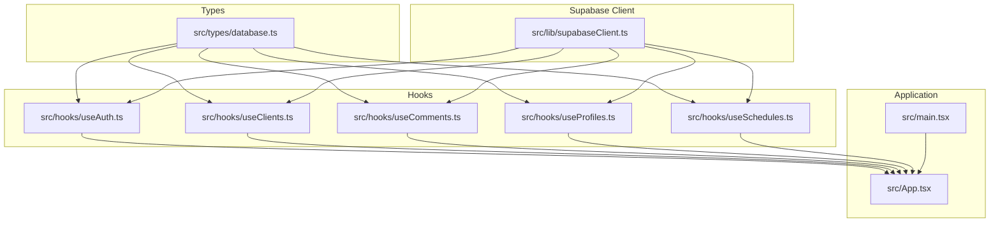
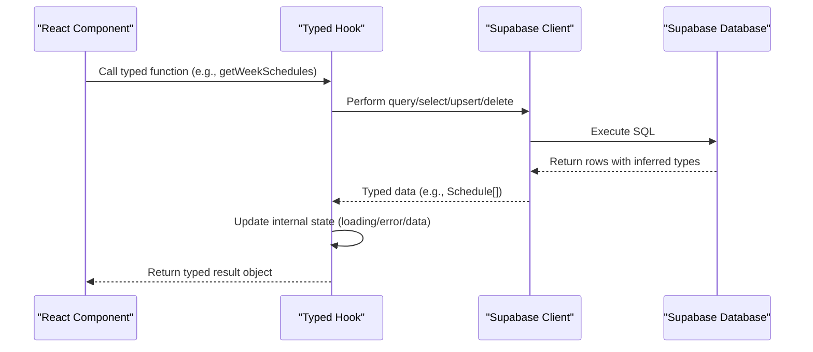
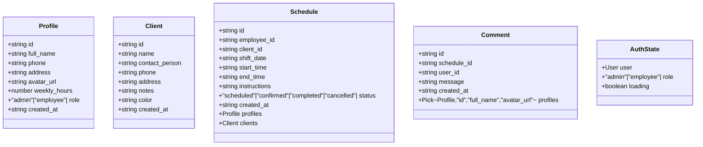
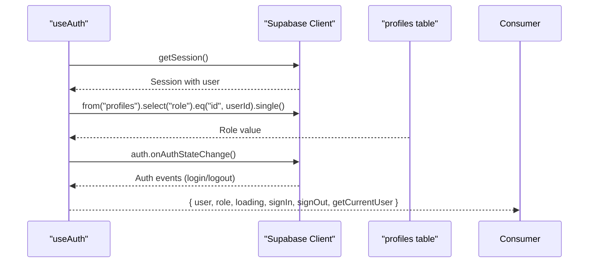
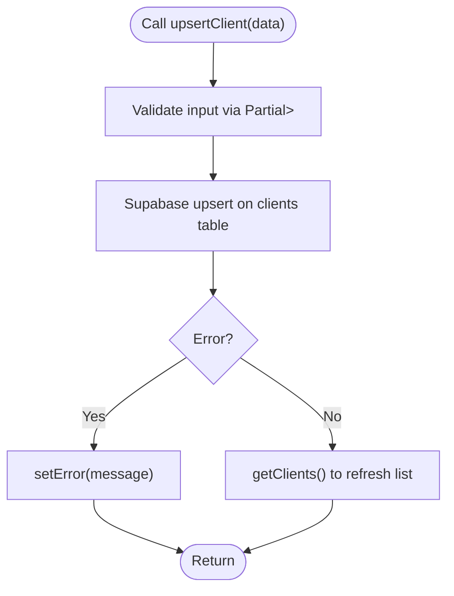
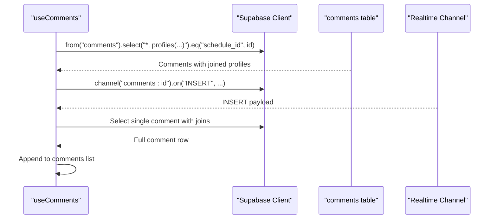
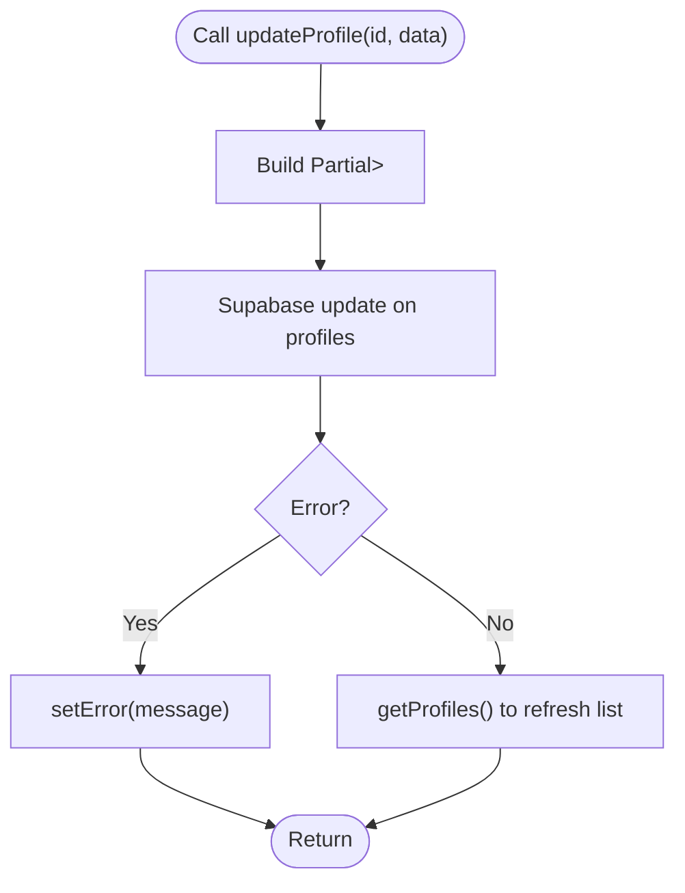
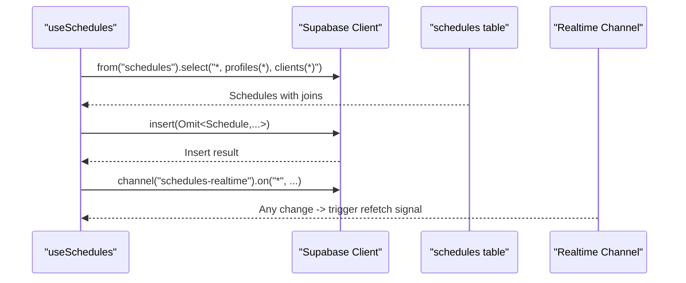
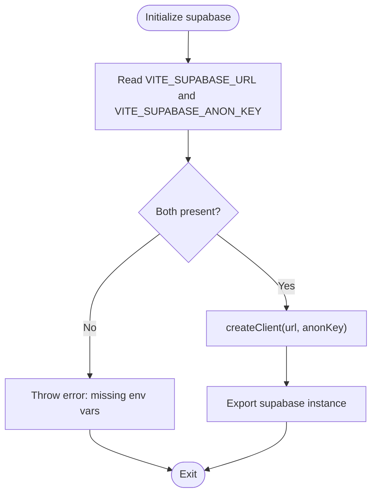
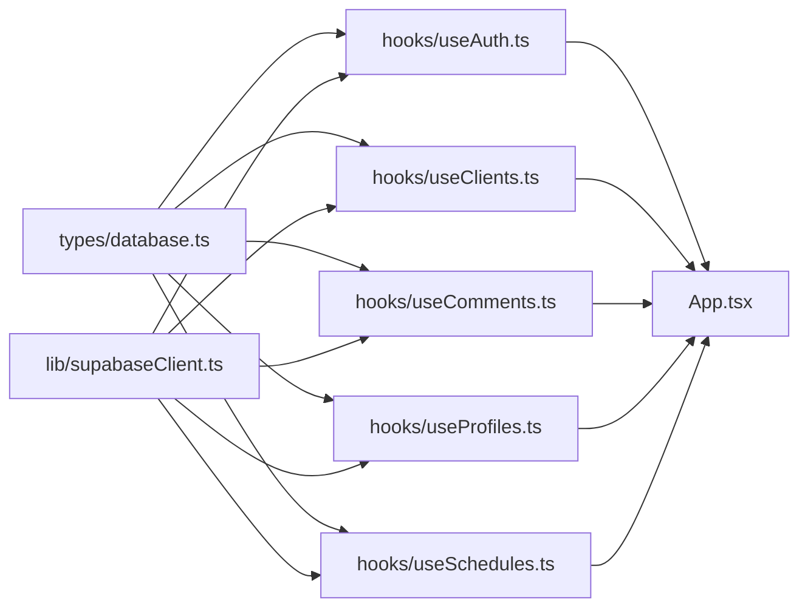

# TypeScript Implementation

<cite>
**Referenced Files in This Document**
- [src/types/database.ts](file://src/types/database.ts)
- [src/lib/supabaseClient.ts](file://src/lib/supabaseClient.ts)
- [src/hooks/useAuth.ts](file://src/hooks/useAuth.ts)
- [src/hooks/useClients.ts](file://src/hooks/useClients.ts)
- [src/hooks/useComments.ts](file://src/hooks/useComments.ts)
- [src/hooks/useProfiles.ts](file://src/hooks/useProfiles.ts)
- [src/hooks/useSchedules.ts](file://src/hooks/useSchedules.ts)
- [src/App.tsx](file://src/App.tsx)
- [src/main.tsx](file://src/main.tsx)
- [tsconfig.json](file://tsconfig.json)
- [tsconfig.app.json](file://tsconfig.app.json)
- [tsconfig.node.json](file://tsconfig.node.json)
- [package.json](file://package.json)
</cite>

## Table of Contents
1. [Introduction](#introduction)
2. [Project Structure](#project-structure)
3. [Core Components](#core-components)
4. [Architecture Overview](#architecture-overview)
5. [Detailed Component Analysis](#detailed-component-analysis)
6. [Dependency Analysis](#dependency-analysis)
7. [Performance Considerations](#performance-considerations)
8. [Troubleshooting Guide](#troubleshooting-guide)
9. [Conclusion](#conclusion)
10. [Appendices](#appendices)

## Introduction
This document explains the TypeScript implementation in M_Sharif, focusing on type safety strategies, interface definitions for database models, and generic type patterns used across the application. It demonstrates how TypeScript interfaces provide compile-time type checking for Supabase data, React Hook return types, and component props. Concrete examples are provided via file references and code snippet paths, along with best practices for maintaining type safety, handling optional properties, and extending types for new features. Common TypeScript patterns present in the codebase are highlighted, and guidance is included for debugging type-related issues.

## Project Structure
M_Sharif organizes TypeScript code into focused areas:
- Types: Centralized database model interfaces under a dedicated module.
- Hooks: Domain-specific React hooks that encapsulate Supabase operations and expose typed return values.
- Supabase client: Environment-driven initialization of the Supabase client with runtime validation.
- Application entry: Minimal React application bootstrap with strict mode.

**Diagram sources**
- [src/types/database.ts:1-55](file://src/types/database.ts#L1-L55)
- [src/lib/supabaseClient.ts:1-14](file://src/lib/supabaseClient.ts#L1-L14)
- [src/hooks/useAuth.ts:1-81](file://src/hooks/useAuth.ts#L1-L81)
- [src/hooks/useClients.ts:1-74](file://src/hooks/useClients.ts#L1-L74)
- [src/hooks/useComments.ts:1-113](file://src/hooks/useComments.ts#L1-L113)
- [src/hooks/useProfiles.ts:1-63](file://src/hooks/useProfiles.ts#L1-L63)
- [src/hooks/useSchedules.ts:1-153](file://src/hooks/useSchedules.ts#L1-L153)
- [src/App.tsx:1-123](file://src/App.tsx#L1-L123)
- [src/main.tsx:1-11](file://src/main.tsx#L1-L11)

**Section sources**
- [src/types/database.ts:1-55](file://src/types/database.ts#L1-L55)
- [src/lib/supabaseClient.ts:1-14](file://src/lib/supabaseClient.ts#L1-L14)
- [src/hooks/useAuth.ts:1-81](file://src/hooks/useAuth.ts#L1-L81)
- [src/hooks/useClients.ts:1-74](file://src/hooks/useClients.ts#L1-L74)
- [src/hooks/useComments.ts:1-113](file://src/hooks/useComments.ts#L1-L113)
- [src/hooks/useProfiles.ts:1-63](file://src/hooks/useProfiles.ts#L1-L63)
- [src/hooks/useSchedules.ts:1-153](file://src/hooks/useSchedules.ts#L1-L153)
- [src/App.tsx:1-123](file://src/App.tsx#L1-L123)
- [src/main.tsx:1-11](file://src/main.tsx#L1-L11)

## Core Components
This section outlines the core type safety mechanisms and patterns used in the application.

- Centralized database interfaces define the shape of rows returned by Supabase queries. These interfaces are used across hooks to ensure compile-time guarantees for data access and mutation.
- React hooks expose typed return objects that describe the state, callbacks, and errors associated with domain operations. This pattern ensures consumers receive strongly-typed props and return values.
- Supabase client initialization validates environment variables at startup and creates a typed client instance used by all hooks.
- TypeScript compiler configuration enforces strictness and lint-like checks to catch potential type issues early.

Key type safety strategies:
- Use of union literal types for constrained fields (for example, roles and statuses).
- Optional properties for nullable database columns.
- Generic utility types to derive partial/upsert/update shapes from base interfaces.
- Type inference from Supabase select statements and realtime channels.
- Environment variable typing with explicit casts and runtime guards.

Concrete examples (paths):
- Database interfaces: [src/types/database.ts:3-48](file://src/types/database.ts#L3-L48)
- Hook return types: [src/hooks/useAuth.ts:6-13](file://src/hooks/useAuth.ts#L6-L13), [src/hooks/useClients.ts:5-12](file://src/hooks/useClients.ts#L5-L12), [src/hooks/useComments.ts:5-11](file://src/hooks/useComments.ts#L5-L11), [src/hooks/useProfiles.ts:5-14](file://src/hooks/useProfiles.ts#L5-L14), [src/hooks/useSchedules.ts:5-20](file://src/hooks/useSchedules.ts#L5-L20)
- Supabase client typing: [src/lib/supabaseClient.ts:1-14](file://src/lib/supabaseClient.ts#L1-L14)
- Compiler options: [tsconfig.app.json:2-22](file://tsconfig.app.json#L2-L22), [tsconfig.node.json:2-21](file://tsconfig.node.json#L2-L21)

**Section sources**
- [src/types/database.ts:1-55](file://src/types/database.ts#L1-L55)
- [src/hooks/useAuth.ts:1-81](file://src/hooks/useAuth.ts#L1-L81)
- [src/hooks/useClients.ts:1-74](file://src/hooks/useClients.ts#L1-L74)
- [src/hooks/useComments.ts:1-113](file://src/hooks/useComments.ts#L1-L113)
- [src/hooks/useProfiles.ts:1-63](file://src/hooks/useProfiles.ts#L1-L63)
- [src/hooks/useSchedules.ts:1-153](file://src/hooks/useSchedules.ts#L1-L153)
- [src/lib/supabaseClient.ts:1-14](file://src/lib/supabaseClient.ts#L1-L14)
- [tsconfig.app.json:1-26](file://tsconfig.app.json#L1-L26)
- [tsconfig.node.json:1-25](file://tsconfig.node.json#L1-L25)

## Architecture Overview
The architecture leverages TypeScript interfaces to connect the UI layer (React components) with data access (Supabase) through typed hooks. The Supabase client is initialized with environment variables and validated at startup. Hooks encapsulate CRUD operations and realtime subscriptions, returning typed state and callbacks.

**Diagram sources**
- [src/hooks/useSchedules.ts:39-152](file://src/hooks/useSchedules.ts#L39-L152)
- [src/lib/supabaseClient.ts:1-14](file://src/lib/supabaseClient.ts#L1-L14)
- [src/types/database.ts:25-38](file://src/types/database.ts#L25-L38)

**Section sources**
- [src/hooks/useSchedules.ts:1-153](file://src/hooks/useSchedules.ts#L1-L153)
- [src/lib/supabaseClient.ts:1-14](file://src/lib/supabaseClient.ts#L1-L14)
- [src/types/database.ts:1-55](file://src/types/database.ts#L1-L55)

## Detailed Component Analysis

### Database Model Interfaces
The centralized model interfaces define the canonical shape of database records. They enforce:
- Non-null identifiers and timestamps.
- Optional fields for nullable database columns.
- Literal unions for constrained enumerations (roles, statuses).
- Optional joined fields for related entities.

**Diagram sources**
- [src/types/database.ts:3-54](file://src/types/database.ts#L3-L54)

**Section sources**
- [src/types/database.ts:1-55](file://src/types/database.ts#L1-L55)

### Authentication Hook (useAuth)
The authentication hook exposes a typed return object with user, role, loading state, and functions to manage sessions. It fetches the user’s role from the profiles table and listens to Supabase auth state changes.

**Diagram sources**
- [src/hooks/useAuth.ts:15-80](file://src/hooks/useAuth.ts#L15-L80)
- [src/lib/supabaseClient.ts:1-14](file://src/lib/supabaseClient.ts#L1-L14)
- [src/types/database.ts:3-12](file://src/types/database.ts#L3-L12)

**Section sources**
- [src/hooks/useAuth.ts:1-81](file://src/hooks/useAuth.ts#L1-L81)
- [src/types/database.ts:50-54](file://src/types/database.ts#L50-L54)

### Clients Hook (useClients)
The clients hook manages a list of clients, exposing loading, error, and CRUD operations. It uses a generic Partial<Omit<...>> pattern to accept partial updates excluding immutable fields.

**Diagram sources**
- [src/hooks/useClients.ts:35-51](file://src/hooks/useClients.ts#L35-L51)
- [src/types/database.ts:14-23](file://src/types/database.ts#L14-L23)

**Section sources**
- [src/hooks/useClients.ts:1-74](file://src/hooks/useClients.ts#L1-L74)
- [src/types/database.ts:14-23](file://src/types/database.ts#L14-L23)

### Comments Hook (useComments)
The comments hook fetches comments for a schedule and supports adding new comments. It subscribes to Supabase realtime events and augments incoming rows with joined profile data.

**Diagram sources**
- [src/hooks/useComments.ts:20-112](file://src/hooks/useComments.ts#L20-L112)
- [src/lib/supabaseClient.ts:1-14](file://src/lib/supabaseClient.ts#L1-L14)
- [src/types/database.ts:40-48](file://src/types/database.ts#L40-L48)

**Section sources**
- [src/hooks/useComments.ts:1-113](file://src/hooks/useComments.ts#L1-L113)
- [src/types/database.ts:40-48](file://src/types/database.ts#L40-L48)

### Profiles Hook (useProfiles)
The profiles hook retrieves employees and updates profile attributes. It uses Partial<Omit<...>> to restrict updates to writable fields.

**Diagram sources**
- [src/hooks/useProfiles.ts:38-59](file://src/hooks/useProfiles.ts#L38-L59)
- [src/types/database.ts:3-12](file://src/types/database.ts#L3-L12)

**Section sources**
- [src/hooks/useProfiles.ts:1-63](file://src/hooks/useProfiles.ts#L1-L63)
- [src/types/database.ts:3-12](file://src/types/database.ts#L3-L12)

### Schedules Hook (useSchedules)
The schedules hook manages weekly schedules, including creation, updates, deletion, and realtime synchronization. It uses Omit and Partial to derive argument types for inserts and updates while excluding immutable fields and joined relations.

**Diagram sources**
- [src/hooks/useSchedules.ts:45-151](file://src/hooks/useSchedules.ts#L45-L151)
- [src/lib/supabaseClient.ts:1-14](file://src/lib/supabaseClient.ts#L1-L14)
- [src/types/database.ts:25-38](file://src/types/database.ts#L25-L38)

**Section sources**
- [src/hooks/useSchedules.ts:1-153](file://src/hooks/useSchedules.ts#L1-L153)
- [src/types/database.ts:25-38](file://src/types/database.ts#L25-L38)

### Supabase Client Initialization
The Supabase client is created from environment variables with runtime validation. This ensures type-safe access to Supabase APIs and prevents undefined behavior at runtime.

**Diagram sources**
- [src/lib/supabaseClient.ts:3-13](file://src/lib/supabaseClient.ts#L3-L13)

**Section sources**
- [src/lib/supabaseClient.ts:1-14](file://src/lib/supabaseClient.ts#L1-L14)

## Dependency Analysis
The application exhibits low coupling and high cohesion around types and hooks:
- All hooks depend on the shared database interfaces, ensuring consistent typing across the app.
- The Supabase client is a singleton dependency injected into hooks.
- React components consume typed hook return values, minimizing prop mismatches.

**Diagram sources**
- [src/types/database.ts:1-55](file://src/types/database.ts#L1-L55)
- [src/lib/supabaseClient.ts:1-14](file://src/lib/supabaseClient.ts#L1-L14)
- [src/hooks/useAuth.ts:1-81](file://src/hooks/useAuth.ts#L1-L81)
- [src/hooks/useClients.ts:1-74](file://src/hooks/useClients.ts#L1-L74)
- [src/hooks/useComments.ts:1-113](file://src/hooks/useComments.ts#L1-L113)
- [src/hooks/useProfiles.ts:1-63](file://src/hooks/useProfiles.ts#L1-L63)
- [src/hooks/useSchedules.ts:1-153](file://src/hooks/useSchedules.ts#L1-L153)
- [src/App.tsx:1-123](file://src/App.tsx#L1-L123)

**Section sources**
- [src/types/database.ts:1-55](file://src/types/database.ts#L1-L55)
- [src/lib/supabaseClient.ts:1-14](file://src/lib/supabaseClient.ts#L1-L14)
- [src/hooks/useAuth.ts:1-81](file://src/hooks/useAuth.ts#L1-L81)
- [src/hooks/useClients.ts:1-74](file://src/hooks/useClients.ts#L1-L74)
- [src/hooks/useComments.ts:1-113](file://src/hooks/useComments.ts#L1-L113)
- [src/hooks/useProfiles.ts:1-63](file://src/hooks/useProfiles.ts#L1-L63)
- [src/hooks/useSchedules.ts:1-153](file://src/hooks/useSchedules.ts#L1-L153)
- [src/App.tsx:1-123](file://src/App.tsx#L1-L123)

## Performance Considerations
- Prefer selective column queries and joins to reduce payload sizes and improve parsing performance.
- Use realtime channels judiciously; subscribe only when necessary and unsubscribe on cleanup to avoid memory leaks.
- Keep generic type transformations (Partial, Omit) close to boundaries (hook arguments) to minimize recomputation.
- Leverage TypeScript’s strict mode and unused local checks to catch inefficiencies and dead code early.

## Troubleshooting Guide
Common type-related issues and resolutions:
- Unexpected nulls or undefined fields: Ensure optional properties are handled with nullish checks or default fallbacks before rendering.
- Type assertion pitfalls: Avoid overusing type assertions (e.g., casting to unknown then to a specific type). Prefer narrowing and validation steps.
- Generic type inference failures: When Supabase returns generic data, explicitly annotate the expected type in the hook to guide inference.
- Environment variable typing: If the Supabase client throws a missing environment error, confirm that VITE_SUPABASE_URL and VITE_SUPABASE_ANON_KEY are set in the environment and not empty.
- Realtime payload typing: When subscribing to changes, cast payload.new/payload.old to the expected interface to ensure accurate typing downstream.

Debugging tips:
- Enable strict TypeScript checks and unused local/parameter warnings to surface latent type issues.
- Use incremental builds and IDE diagnostics to catch type errors quickly during development.
- Add defensive logging around hook callbacks to inspect runtime values and compare against expected interface shapes.

**Section sources**
- [src/lib/supabaseClient.ts:6-11](file://src/lib/supabaseClient.ts#L6-L11)
- [src/hooks/useComments.ts:84-96](file://src/hooks/useComments.ts#L84-L96)
- [tsconfig.app.json:18-22](file://tsconfig.app.json#L18-L22)

## Conclusion
M_Sharif’s TypeScript implementation centers on a small set of well-defined database interfaces and a consistent pattern of typed React hooks. By leveraging union literal types, optional properties, and generic utility types, the application achieves strong compile-time guarantees for Supabase data, hook return types, and component props. The Supabase client initialization and compiler configuration further reinforce type safety. Following the best practices and troubleshooting guidance outlined here will help maintain and extend type safety across the application.

## Appendices

### Best Practices for Maintaining Type Safety
- Keep database interfaces close to the data layer and import them into hooks and components.
- Use Partial<Omit<T, K>> for updates and Partial for upserts to prevent accidental mutations of immutable fields.
- Prefer union literal types for constrained enums to prevent invalid values.
- Handle optional properties explicitly to avoid runtime errors.
- Extend interfaces incrementally and consistently across related hooks and components.
- Regularly review compiler options and enable strictness to catch subtle type issues early.

### Extending Types for New Features
- Define a new interface in the types module mirroring the database schema.
- Import the interface into relevant hooks and update their return types accordingly.
- Adjust generic argument types (Omit, Partial) to reflect new write/update semantics.
- Add or refine realtime subscriptions and payload handling to align with the new schema.

**Section sources**
- [src/types/database.ts:1-55](file://src/types/database.ts#L1-L55)
- [src/hooks/useSchedules.ts:66-79](file://src/hooks/useSchedules.ts#L66-L79)
- [src/hooks/useProfiles.ts:38-59](file://src/hooks/useProfiles.ts#L38-L59)
- [src/hooks/useClients.ts:35-51](file://src/hooks/useClients.ts#L35-L51)